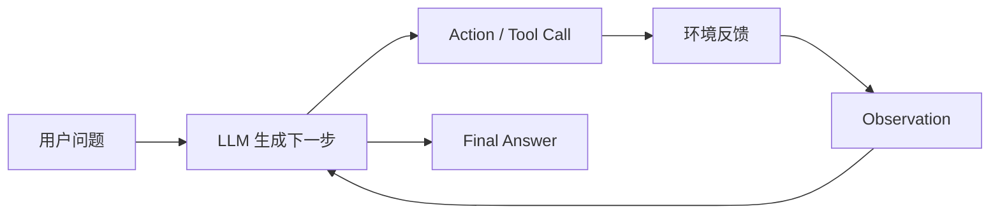

这个 topic 收集 agent 相关的文章和论文笔记。它的主线不是“列出所有 agent 名词”，而是回答一个更基础的问题：

> 当语言模型不再只回答一次，而是要在环境里反复行动时，系统需要哪些额外结构？

## Topic Map

## Articles

| Article | 解决的问题 |
| --- | --- |
| [Agent 基本概念](../topics/agent-basics.md) | 为什么 agent 不是一次性问答，而是 `Thought -> Action -> Observation` 循环。 |
| [实现与 provider 边界](../topics/implementation-boundaries.md) | 换模型 provider 时，哪些是模型适配，哪些是 runtime 边界。 |
| [长期记忆](../topics/long-term-memory.md) | memory、session、compact、持久化状态到底有什么区别。 |

## Papers

| Paper | 读它是为了什么 |
| --- | --- |
| [ReAct](../papers/react.md) | 理解推理和行动为什么要交替。 |
| [SWE-agent](../papers/swe-agent.md) | 理解 coding agent 为什么需要专门的 Agent-Computer Interface。 |

## 下一步

如果你是第一次读，先读 [Agent 基本概念](../topics/agent-basics.md)，再读 [ReAct](../papers/react.md)。如果你已经在写 agent runtime，直接看 [实现与 provider 边界](../topics/implementation-boundaries.md)。
