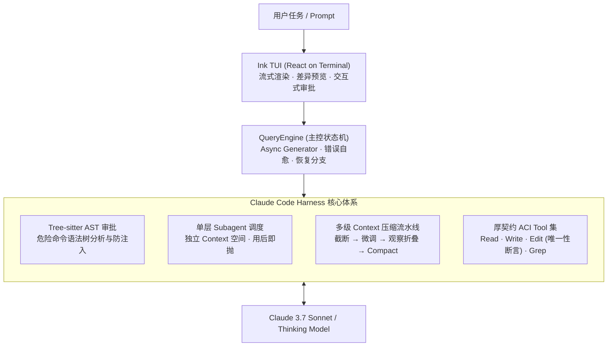
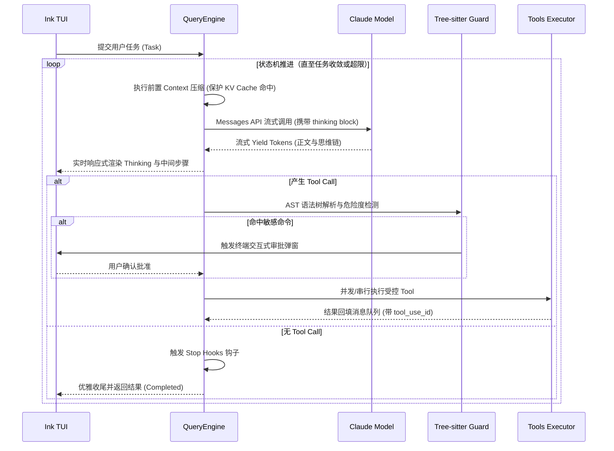
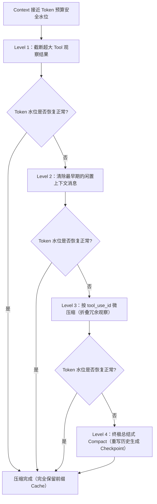
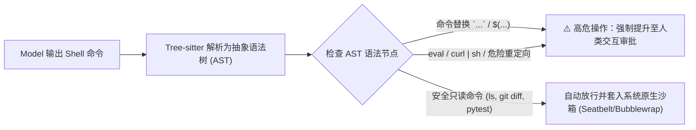
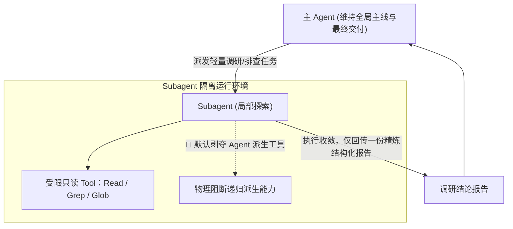

# Claude Code 架构深度解析

**Claude Code** 是 Anthropic 官方打造的生产级命令行编码 Agent，采用 TypeScript 构建，底层依托 Anthropic Messages API（原生支持 Tool Call 与 Extended Thinking）。

在 Harness 工程体系中，Claude Code 代表了**「客户端重度掌控（Client-heavy Control）」**的设计典范：不把推理与状态完全托付给远端托管运行时，而是在本地客户端建立严密的响应式事件流、多级 Cache 友好压缩流水线、语法树安全拦截与单层 Subagent 隔离体系。

---

## 1. 核心循环与流程控制：`QueryEngine`

Claude Code 的主循环并非朴素的轮询机制，而是一个基于 TypeScript **Async Generator (`while(true)`)** 的响应式状态机：

### 关键设计哲学

1. **将错误视为正常状态流（Error as State）**：
   - **Token 截断恢复**：当 Model 输出达到最大长度导致截断时，状态机自动升档发起续写，而非向用户报错。
   - **HTTP 413 反应式自愈**：遇到 Payload 过大错误时，立即在内存中触发紧急 Context 压缩并透明重试。
   - **工具异常回填**：命令执行失败或路径不存在时，统一封装为 `<tool_use_error>` 消息回传给 Model，引导其在下一 Turn 主动自纠。
2. **否定模型自报，依托行为真值**：
   - 循环是否继续推进**完全不依赖 Model 返回的 `stop_reason`**，而是严格以当前 Turn 是否产生了实际的 Tool Call 作为唯一判据。

---

## 2. 交互与可观测性：Ink TUI (React on Terminal)

为什么长程编码 Agent 必须是**事件驱动（Event-Driven）**架构？因为解决真实软件工程缺陷是一个**长耗时、高异步、随时可打断且需要人类在关键分歧点参与决策**的过程。

- **思维链全透明（Visible Thinking）**：将 `thinking` 作为一个明文 content block 实时以流式方式渲染，使用户对 Model 的推理假设与决策链条建立确定性心智。
- **结构化差异预览（Unified Diff View）**：在文件落地修改前生成高亮色彩的 Git 风格 Diff 预览，并提供实时的终端交互式按键审批。
- **超大输出隔离降噪**：终端命令输出超出安全阈值时，自动落盘至临时文件，仅在 Context 中保留头部摘要与行数提示，引导 Model 使用 `Read` 按需分页定位。

---

## 3. Context 工程与 KV Cache 治理

在大 Model 的调用成本与延迟模型中，**KV Cache 命中率直接决定了 50% 以上的 API 费用与首字延迟（TTFT）**。Claude Code 设计了严格保护稳定前缀的**多级渐进压缩流水线**：

> [!TIP]
> **设计取舍**：全局总结式 Compact 会彻底破坏已缓存的 Prompt 历史，导致后续所有请求的 KV Cache 从改写点全面击穿。因此，Claude Code 优先执行局部的“观察剪枝”，万不得已才进行全局重写。

---

## 4. 安全边界：Tree-sitter 语法树拦截与沙箱

传统的正则表达式黑白名单极易被复杂的 Shell 语法特性（反引号子 Shell、环境变量拼接、管道注入）所绕过。Claude Code 在客户端集成了 **Tree-sitter** 进行深度 AST 分析：

同时，文件系统层面配置了不可绕过的**系统调用级防护**：
- 严格禁止写入 `.claude/`、项目根级配置与系统敏感目录。
- 文件读写系统调用强制携带 `O_NOFOLLOW` 标志，从操作系统底层杜绝利用软链接（Symlink）逃逸出工作区。

---

## 5. 任务分解：单层用后即抛的 Subagent

在多 Agent 协同体系中，最容易失控的 failure mode 是**无限递归派生与 Context 爆炸**。Claude Code 采用了优雅的**结构性单层封顶**策略：

- **噪声强隔离**：Subagent 在代码库内翻找文件、尝试失败路径时产生的数百行中间输出全部封印在子 Context 内，随着 Subagent 结束直接被垃圾回收。
- **类型系统级防死锁**：在组装 Subagent 的 Tool 清单时物理剔除 `Agent` 工具本身，从根源上杜绝了无限派生导致的死循环与资源耗尽。

