# Codex 的 Agent 设计

**Codex** 是 OpenAI 的命令行编码 [agent](https://www.aihero.dev/ai-coding-dictionary/agent),核心用 Rust 实现、走 OpenAI 的 **Responses API**(一种把 **Reasoning** 与 [tool call](https://www.aihero.dev/ai-coding-dictionary/tool-call) 收进一个 loop 的 **LLM API**)。本文围绕 8 个问题——分成 [agent](https://www.aihero.dev/ai-coding-dictionary/agent) 的**核心功能**(5 个)与 **[tool](https://www.aihero.dev/ai-coding-dictionary/tool) calling**(3 个)——梳理 Codex 的设计,末尾与 **Claude Code** 对照。

> 这 8 个角度既是从源码里提炼、供学习的**设计参考**,也刚好串起 [agent](https://www.aihero.dev/ai-coding-dictionary/agent) 的一批基本机制。写法偏概念、不涉及源码符号,复杂处交给图;术语冲突以 OpenAI 的说法为准。

先用一张图看懂 Codex 的一个 [turn](https://www.aihero.dev/ai-coding-dictionary/turn) 怎么转——这就是它的 **[agent](https://www.aihero.dev/ai-coding-dictionary/agent) Loop**:

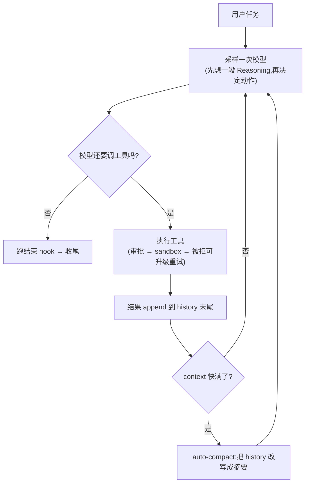

---

## 1. 核心功能

### 1.1 task scheduling 拆分

Codex 不采用「先规划、后执行」的两段式,而是边想边做:[model](https://www.aihero.dev/ai-coding-dictionary/model) 每个 [turn](https://www.aihero.dev/ai-coding-dictionary/turn) 里的 [tool call](https://www.aihero.dev/ai-coding-dictionary/tool-call) 就是「下一步」。它提供的 `update_plan` 只是一张给用户看的 TODO checklist(**Planning** 的轻量形态),不驱动 control flow;另有 **Plan Mode**——先只读地探索 codebase、产出方案,用户切出 mode 即默许批准。真正的并行拆分靠 **[subagent](https://www.aihero.dev/ai-coding-dictionary/subagent)**:[model](https://www.aihero.dev/ai-coding-dictionary/model) 主动 spawn 出只读的 explorer(可多个并行)或可写的 worker(须分派互不重叠的文件);由于 [subagent](https://www.aihero.dev/ai-coding-dictionary/subagent) 本身又是完整 [agent](https://www.aihero.dev/ai-coding-dictionary/agent)、还能再往下 spawn,构成 **Multi-Agent** 编排,Codex 用 depth 与数量两道上限防止无限派生。

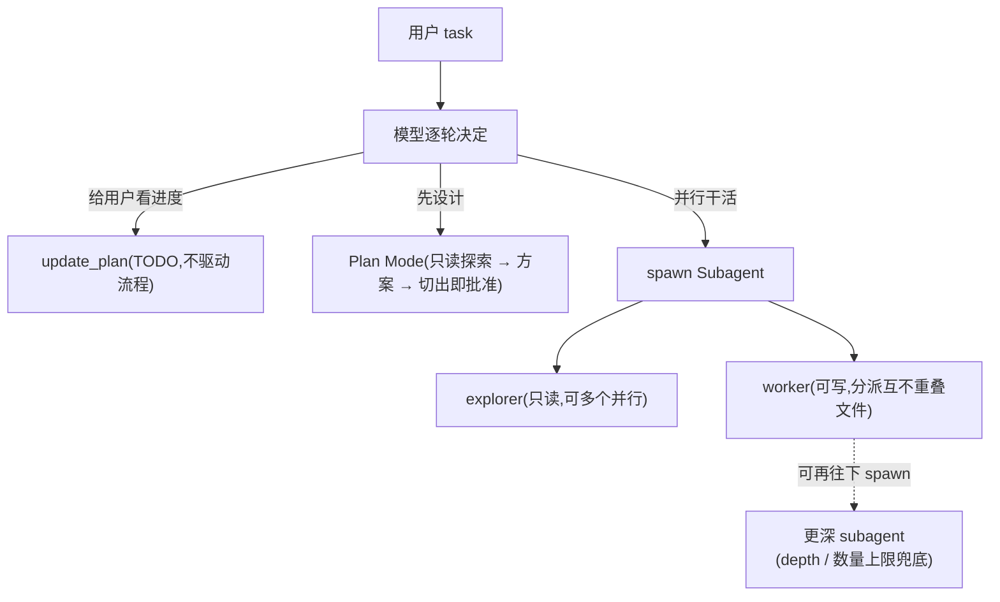

#### 如何实现 multi agent

Codex 的 **Multi-Agent** 是「主 [agent](https://www.aihero.dev/ai-coding-dictionary/agent) 把 **[subagent](https://www.aihero.dev/ai-coding-dictionary/subagent)** 当 [tool](https://www.aihero.dev/ai-coding-dictionary/tool) 用」的 manager 模式:主 [agent](https://www.aihero.dev/ai-coding-dictionary/agent) 始终掌控全局、保留最终答案,遇到能并行或需要隔离 [context](https://www.aihero.dev/ai-coding-dictionary/context) 的活儿,就派一个 [subagent](https://www.aihero.dev/ai-coding-dictionary/subagent) 去干、拿回结果再综合(而不是把控制权整个交出去)。给 [model](https://www.aihero.dev/ai-coding-dictionary/model) 的是一组管 [subagent](https://www.aihero.dev/ai-coding-dictionary/subagent) 的 [tool](https://www.aihero.dev/ai-coding-dictionary/tool)——`spawn_agent`(派生,可指定角色、给它多少父 [context](https://www.aihero.dev/ai-coding-dictionary/context)、甚至覆盖 [model](https://www.aihero.dev/ai-coding-dictionary/model) / [effort](https://www.aihero.dev/ai-coding-dictionary/effort))、`wait_agent`(等结果)、`send_input`(追加输入)、`close_agent`(结束)——[subagent](https://www.aihero.dev/ai-coding-dictionary/subagent) 的**生命周期被显式管理**。要不要主动派,由一个三档开关控制(禁用 / 仅当用户明确要求 / 主动)。

每个 [subagent](https://www.aihero.dev/ai-coding-dictionary/subagent) 本身是一个**完整的子 Codex thread**,有独立 [context](https://www.aihero.dev/ai-coding-dictionary/context)、也还能再往下 spawn,所以 Codex 用**两道计数闸门**兜底:**depth 上限**(防无限递归)+ **[session](https://www.aihero.dev/ai-coding-dictionary/session) 级并发/总数上限**(超了就拒绝、让 [model](https://www.aihero.dev/ai-coding-dictionary/model) 自己干)。角色分工很关键:**explorer** 只读、鼓励多个并行去查代码;**worker** 可写、但必须被分派**互不重叠的文件范围**。编排上还有一条纪律:**别急着 `wait`**——[subagent](https://www.aihero.dev/ai-coding-dictionary/subagent) 跑着时,主 [agent](https://www.aihero.dev/ai-coding-dictionary/agent) 该去做**不重叠的**别的活,才真正吃到并行的收益。

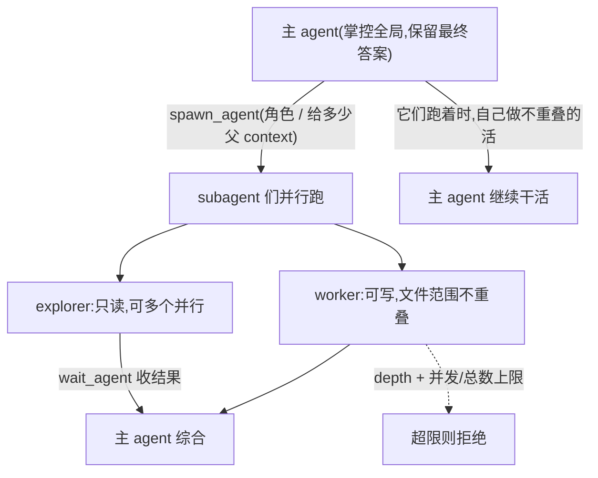

### 1.2 loop 和流程控制

主循环就是开头那张图,即 Codex 的 **[agent](https://www.aihero.dev/ai-coding-dictionary/agent) Loop**。它一个显著选择是**不设 max turns**——不靠轮数封顶,而靠 [context](https://www.aihero.dev/ai-coding-dictionary/context) 快满时的 [autocompact](https://www.aihero.dev/ai-coding-dictionary/autocompact) 防止无限膨胀,这让它更适合 **超长程任务**。每个 [turn](https://www.aihero.dev/ai-coding-dictionary/turn),[model](https://www.aihero.dev/ai-coding-dictionary/model) 先产出一段 **Reasoning**(推理 [token](https://www.aihero.dev/ai-coding-dictionary/token))再决定动作;在 Codex 里 raw reasoning 是服务端的隐藏资产,client 只拿得到 summary,靠把加密原文回传来跨 [turn](https://www.aihero.dev/ai-coding-dictionary/turn) 复用推理。整个 run 在后台跑,可随时 cancel。

#### 如何更好控制整个 loop 和 workflow

「控制 loop」有几个抓手,Codex 各有取舍。**边界**就是前述的「不封顶、靠 [context](https://www.aihero.dev/ai-coding-dictionary/context) 预算 + [autocompact](https://www.aihero.dev/ai-coding-dictionary/autocompact)」(代价:没有「转够 N 轮就停」的硬护栏)。**中断**上,整个 [turn](https://www.aihero.dev/ai-coding-dictionary/turn) 跑在一个后台任务里、挂着一个 cancellation [token](https://www.aihero.dev/ai-coding-dictionary/token),Ctrl+C / abort 立刻取消它(→ [turn](https://www.aihero.dev/ai-coding-dictionary/turn) aborted);而且新任务会**抢占**旧任务(一提交新指令,旧的先被 abort)。

**转向(steering)**是个漂亮设计:用户在 [agent](https://www.aihero.dev/ai-coding-dictionary/agent) 跑着时**追加输入**、不必打断——外层循环会把这些 pending input 收进来,下一轮就带上,等于「边跑边改方向」。**收尾**也可控:当 [model](https://www.aihero.dev/ai-coding-dictionary/model) 想结束(不再调 [tool](https://www.aihero.dev/ai-coding-dictionary/tool))时,**stop hook** 可以拦一下、注入一条续写消息让它接着干。再加上**审批策略**在危险动作前把 loop 停下来问用户——**边界([context](https://www.aihero.dev/ai-coding-dictionary/context))、中断(cancel/抢占)、转向(pending input)、收尾(stop hook)、闸门(审批)**这几个面合起来,就是 Codex 控制整个 loop/workflow 的方式。

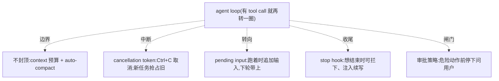

#### 如何做可视化、可观测性与 terminal UI

为什么 [agent](https://www.aihero.dev/ai-coding-dictionary/agent) 普遍 **event-driven**?因为它是个跑很久、异步、可打断、要人参与的过程,**价值在「过程」而非只在「结果」**——用事件流边跑边吐,用户才看得到实时进度、能中途打断/审批,core 也能和 UI 解耦(纯「调一个函数等它返回」一条都做不到)。Codex 的形式是一套**带类型的事件协议**——core 每有动静就发一条 `EventMsg`:计划更新、命令输出增量(区分 stdout/stderr)、reasoning 摘要增量、[token](https://www.aihero.dev/ai-coding-dictionary/token) 用量、审批请求……前端(TUI)订阅、逐类渲染。core 与 UI **解耦**,同一条流既能喂自家 TUI,也能给别的宿主(呼应它「能当 [MCP](https://www.aihero.dev/ai-coding-dictionary/mcp) server 被驱动」)。

「**哪些该给用户看**」是个产品判断,Codex 的取舍很有代表性:**给看**——它在**做什么**(命令、apply_patch)、**进度**(计划/TODO、命令输出边跑边流)、一份**可读的思考**(只给 reasoning **summary**,原始 reasoning 隐藏/加密、不外露)、**要你拍板时**(审批请求)、以及**花了多少**([token](https://www.aihero.dev/ai-coding-dictionary/token) 用量);**不硬塞**——原始 [tool](https://www.aihero.dev/ai-coding-dictionary/tool) 输出按预算截断。设计更合适的 terminal UI,关键就在这条**「只暴露 summary、动作、进度、决策点」**的信息取舍——这直接关系到**开发者体验**,而不是把内部机器全倒给用户。

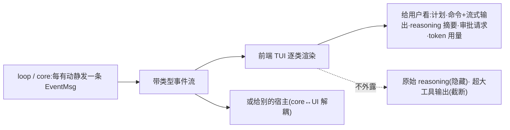

### 1.3 input 拼接 prompt

Codex 为每个 thread 维护单一的 history(一个 thread 就是 cache 与隔离的单位),每个 [turn](https://www.aihero.dev/ai-coding-dictionary/turn) 把它整体投影成本次 input;[tool](https://www.aihero.dev/ai-coding-dictionary/tool) 输出 append 到末尾,前面从不改写。这条「只增不改」很大程度是为了 **KV Cache**:只要 prefix 的字节不变,服务端就自动命中前缀 cache、省下大半 input 开销。系统提示是固化的前缀(**Prompt Engineering** 的落点),[tool](https://www.aihero.dev/ai-coding-dictionary/tool) 定义次之,volatile 的 history 放后。

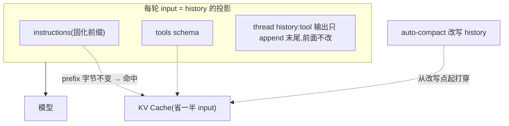

因此 **[context](https://www.aihero.dev/ai-coding-dictionary/context) Engineering** 里「何时压缩」本身就是 cache 命中与 [context](https://www.aihero.dev/ai-coding-dictionary/context) 预算之间的一次权衡——压缩改写 history 的那一刻,cache 必然从改写点失效。

#### 如何实现 long-term memory

除了当前 thread 的 history,Codex 还有一套跨 thread、跨 [session](https://www.aihero.dev/ai-coding-dictionary/session) 的 **[memory system](https://www.aihero.dev/ai-coding-dictionary/memory-system)**——一条**独立的后台 pipeline**,只在**根 [session](https://www.aihero.dev/ai-coding-dictionary/session)**(你直接启动的顶层 [session](https://www.aihero.dev/ai-coding-dictionary/session),不是内部 spawn 的 [subagent](https://www.aihero.dev/ai-coding-dictionary/subagent))启动时异步跑,不占当前对话的时间。它分两步:先**抽取**——回看最近、已经凉下来的历史 thread(落盘的完整记录叫 rollout),逐条让 [model](https://www.aihero.dev/ai-coding-dictionary/model) 蒸馏出一份记忆,并有一道很克制的 **no-op gate**(不值得记就什么都不写);再**巩固**——把攒下的记忆择优,交给一个内部子 [agent](https://www.aihero.dev/ai-coding-dictionary/agent) 更新磁盘上的记忆库。

记忆库落在磁盘、**分层组织**以实现**[progressive disclosure](https://www.aihero.dev/ai-coding-dictionary/progressive-disclosure)**(和 **Skills** 同源,也是 **[context](https://www.aihero.dev/ai-coding-dictionary/context) Engineering** 的手法):一份稠密索引**始终注入 prompt**,正文按需才读进来。[model](https://www.aihero.dev/ai-coding-dictionary/model) 用到某条记忆会留下一个「用过」的信号,回头喂给择优——**用得上的留、没人用的删**,形成自我强化的闭环。

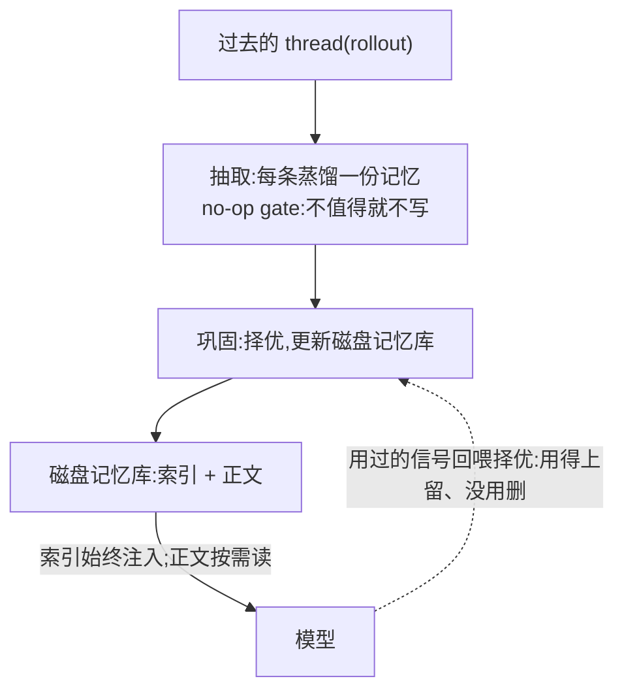

#### 如何实现 skills 和 plugins

**Skills** 和 **plugins** 都是「插入式 [context](https://www.aihero.dev/ai-coding-dictionary/context)」——把额外的能力/指令**按需插进 prompt**,靠**[progressive disclosure](https://www.aihero.dev/ai-coding-dictionary/progressive-disclosure)**控制驻留成本。一个 **[skill](https://www.aihero.dev/ai-coding-dictionary/skill)** 就是一份 `SKILL.md`(一套指令);Codex 只把每个 [skill](https://www.aihero.dev/ai-coding-dictionary/skill) 的 **name + description + 位置**列进 prompt(而不是正文),这份清单还受一个 **[context](https://www.aihero.dev/ai-coding-dictionary/context) 预算**(约 2% [context window](https://www.aihero.dev/ai-coding-dictionary/context-window))约束——[skill](https://www.aihero.dev/ai-coding-dictionary/skill) 太多,description 会被**截断**,并提示「关掉没用的 [skill](https://www.aihero.dev/ai-coding-dictionary/skill) / plugin 腾地方」。[model](https://www.aihero.dev/ai-coding-dictionary/model) 看到清单后,按触发规则(用户点名 `$SkillName`、或任务匹配某条 description)决定用哪个;真要用时,才把那份 `SKILL.md` **完整读进来**再照做。

**Plugin** 是更上一层的打包:一个 plugin 能 **bundle 一批能力**(skills、connectors、apps 等),可被 `@`-mention 显式点名,点名后它的指令才被注入进 prompt。所以 Codex 的可插拔 [context](https://www.aihero.dev/ai-coding-dictionary/context) 是一套**分层的[progressive disclosure](https://www.aihero.dev/ai-coding-dictionary/progressive-disclosure)**:轻量元数据([skill](https://www.aihero.dev/ai-coding-dictionary/skill) 名/描述、plugin 能力摘要)常驻、受预算约束;沉重正文([skill](https://www.aihero.dev/ai-coding-dictionary/skill).md、plugin 细节)按需才拉进来。这和前面 long-term [memory system](https://www.aihero.dev/ai-coding-dictionary/memory-system) 的「索引常驻 + 正文按需」、以及 **[MCP](https://www.aihero.dev/ai-coding-dictionary/mcp)** 的 deferred tools 是**同一个 [context](https://www.aihero.dev/ai-coding-dictionary/context) Engineering 母题**:驻留的越小越稳,越省 [context](https://www.aihero.dev/ai-coding-dictionary/context)、越不打穿 **KV Cache**。

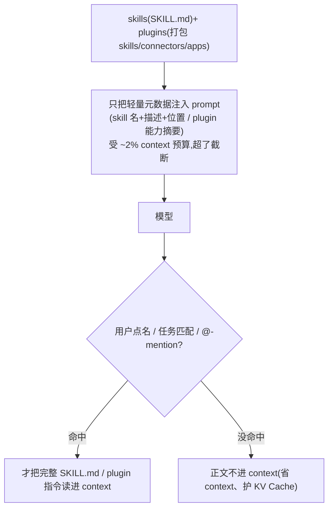

#### 如何做好 context auto compression

当 history 快撑满 [context](https://www.aihero.dev/ai-coding-dictionary/context) 时,Codex 触发 **[autocompact](https://www.aihero.dev/ai-coding-dictionary/autocompact)**——它一直盯着 input [token](https://www.aihero.dev/ai-coding-dictionary/token) 的用量基线,逼近预算就压。压的方式是一次**「[context](https://www.aihero.dev/ai-coding-dictionary/context) checkpoint [compaction](https://www.aihero.dev/ai-coding-dictionary/compaction)」**:让 [model](https://www.aihero.dev/ai-coding-dictionary/model) 把到目前为止的整段 history **总结成一份「[handoff](https://www.aihero.dev/ai-coding-dictionary/handoff) 摘要」**,目标是让**另一个 LLM 能无缝接着干**。所以「做好」的关键全在**摘要保留什么**:当前进度与关键决策、重要约束/用户偏好、**还剩什么没做(明确的 next steps)**、以及继续所需的关键数据/引用——而把探索、试错、[tool](https://www.aihero.dev/ai-coding-dictionary/tool) 原始输出这些噪声**丢掉**。

压完,Codex 用这份摘要**替换掉旧 history**(前面加一句「上一个 [model](https://www.aihero.dev/ai-coding-dictionary/model) 做到这儿、产出了这份摘要,你在此基础上继续、别重复劳动」),再把 initial [context](https://www.aihero.dev/ai-coding-dictionary/context) 重新注入,循环继续。这是一种**「一次性 checkpoint」**哲学:整段历史压成一份摘要,简单干净,但也**粗**——它改写了前缀,那一刻 **KV Cache** 从改写点被打穿(这正是「何时压缩」要权衡的原因)。相比之下,Claude Code 走的是**多级渐进压缩**(先删旧、再对 cache 友好地微压、折叠成摘要,最后才总结式 compact),尽量少动前缀、多保细节。

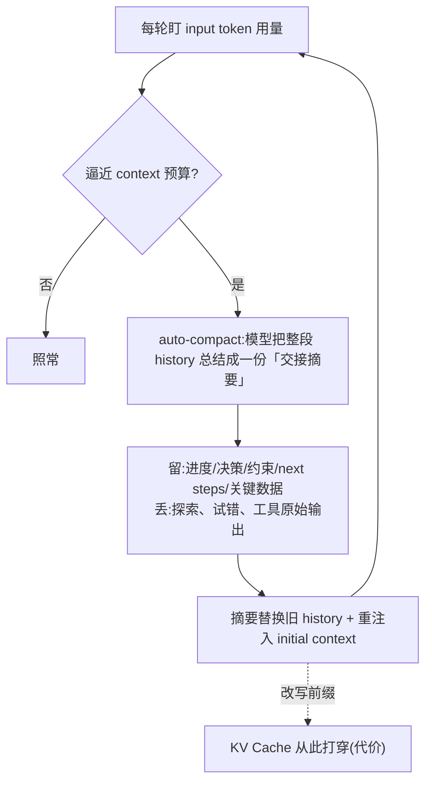

### 1.4 output parser

Codex 用 [model](https://www.aihero.dev/ai-coding-dictionary/model) 原生的 **[tool](https://www.aihero.dev/ai-coding-dictionary/tool) Use**(function/[tool](https://www.aihero.dev/ai-coding-dictionary/tool) calling),不去解析自由文本。[tool](https://www.aihero.dev/ai-coding-dictionary/tool) 的 arguments 先当作原始 JSON 收着,真正轮到执行时才反序列化成强类型;反序列化不成功,就把错误回喂给 [model](https://www.aihero.dev/ai-coding-dictionary/model) 让它自纠,而不是崩溃。某个 [turn](https://www.aihero.dev/ai-coding-dictionary/turn) 只产出文本、没有 [tool call](https://www.aihero.dev/ai-coding-dictionary/tool-call),就视为结束。

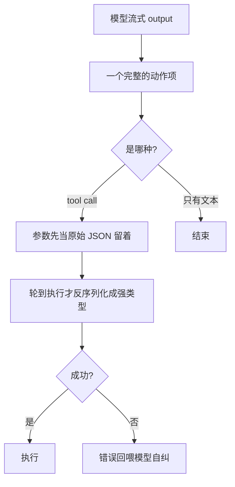

### 1.5 执行器 executor

[model](https://www.aihero.dev/ai-coding-dictionary/model) 发出 [tool call](https://www.aihero.dev/ai-coding-dictionary/tool-call) 后,普通 [tool](https://www.aihero.dev/ai-coding-dictionary/tool) 直接执行;但命令类、写文件类会先经过一个**统一的 orchestrator**——审批 → 选 [sandbox](https://www.aihero.dev/ai-coding-dictionary/sandbox) → 执行,被 [sandbox](https://www.aihero.dev/ai-coding-dictionary/sandbox) 拒绝了还能问用户要不要升级权限重试。这一层的设计正是 **[harness](https://www.aihero.dev/ai-coding-dictionary/harness) Engineering** 的核心。

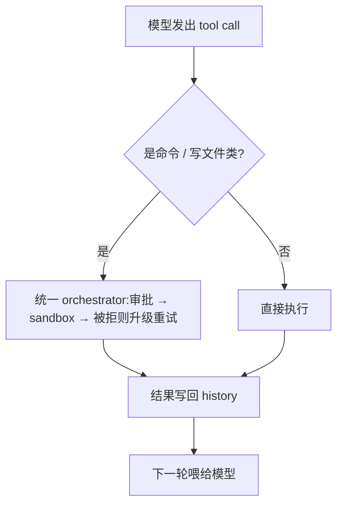

外部 [tool](https://www.aihero.dev/ai-coding-dictionary/tool) 通过 **[MCP](https://www.aihero.dev/ai-coding-dictionary/mcp)** 接入,而 Codex 比较特别的是**双向**:既能作为 [MCP](https://www.aihero.dev/ai-coding-dictionary/mcp) client 连别人的服务,也能把整个 runtime 作为 [MCP](https://www.aihero.dev/ai-coding-dictionary/mcp) server 供别的宿主驱动。能力还能通过 **Skills**(一个含 `SKILL.md` 说明书的目录)按需扩展——启动时只加载每个 [skill](https://www.aihero.dev/ai-coding-dictionary/skill) 的名字与描述,用到时才把正文读进 [context](https://www.aihero.dev/ai-coding-dictionary/context)。

#### 如何设计可以自由配置的 mcp

**[MCP](https://www.aihero.dev/ai-coding-dictionary/mcp)** 让外部 [tool](https://www.aihero.dev/ai-coding-dictionary/tool)**热插拔**进 tool-calling 回路。「可自由配置」的第一层是**声明式**:在一个配置文件(`~/.codex/config.toml`)里列出要连的 [MCP](https://www.aihero.dev/ai-coding-dictionary/mcp) server,每个 server 选**传输方式**——**STDIO**(本地起个进程,可带 env)或 **Streamable HTTP**(远端,配 bearer [token](https://www.aihero.dev/ai-coding-dictionary/token) 或走 OAuth 登录)。改配置就能增删 server,不用动 [agent](https://www.aihero.dev/ai-coding-dictionary/agent) 本身。

第二层是**控制这些 [tool](https://www.aihero.dev/ai-coding-dictionary/tool) 怎么进来**,而且都能配:每个 server 可以 **enabled_tools / disabled_tools** 筛掉不想要的;**审批模式**(auto / prompt / approve)决定要不要在调用前问人;[tool](https://www.aihero.dev/ai-coding-dictionary/tool) 名统一命名空间成 `mcp__<server>__<tool>`(并裁到 ≤64 字节)避免撞名。最关键的一条针对 **[context](https://www.aihero.dev/ai-coding-dictionary/context)**:一大批 [MCP](https://www.aihero.dev/ai-coding-dictionary/mcp) [tool](https://www.aihero.dev/ai-coding-dictionary/tool) 的 schema 会撑爆 prompt、打穿 **KV Cache**,所以 Codex 支持 **deferred tools**——默认不把它们的完整 schema 塞进 prompt,等 [model](https://www.aihero.dev/ai-coding-dictionary/model) 经 tool-search 需要时才展开。

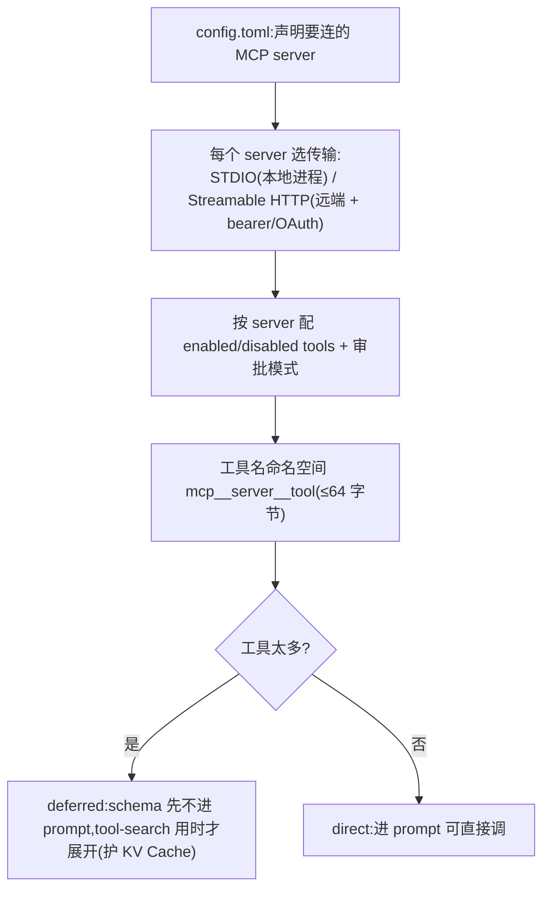

---

## 2. tool calling

### 2.1 terminal 执行

Codex 给 [model](https://www.aihero.dev/ai-coding-dictionary/model) 两类 terminal:普通的一次性命令,和一个**带 PTY 的 [stateful](https://www.aihero.dev/ai-coding-dictionary/stateful) [session](https://www.aihero.dev/ai-coding-dictionary/session)**(可对同一 [session](https://www.aihero.dev/ai-coding-dictionary/session) 反复写 stdin,适合驱动交互式程序)。命令都经过 shell,这里 **[tool](https://www.aihero.dev/ai-coding-dictionary/tool) Use** 被建模成 shell [tool](https://www.aihero.dev/ai-coding-dictionary/tool);安全交给 OS-level **[sandbox](https://www.aihero.dev/ai-coding-dictionary/sandbox)** 兜底(**[harness](https://www.aihero.dev/ai-coding-dictionary/harness) Engineering** 的一环),标志性做法是「先在 [sandbox](https://www.aihero.dev/ai-coding-dictionary/sandbox) 里跑,被拒了再问用户升级」。

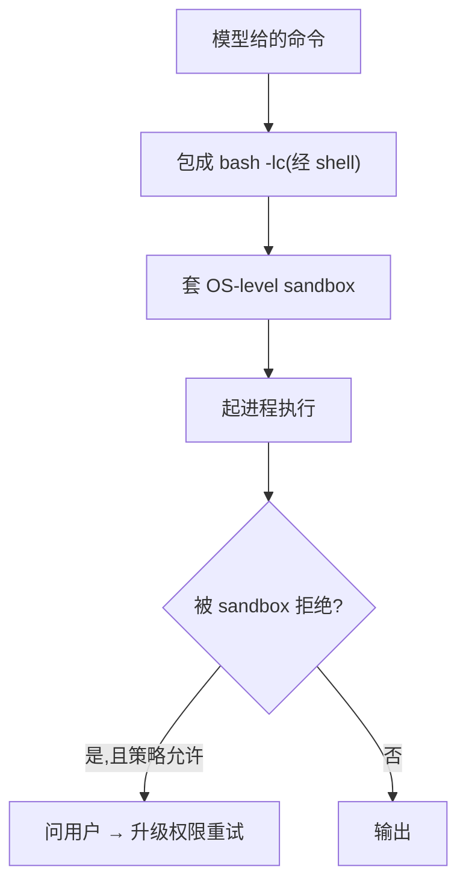

#### 如何控制 sandbox 环境

Codex 的 [sandbox](https://www.aihero.dev/ai-coding-dictionary/sandbox) 是**操作系统原生**的隔离(Linux 用 Landlock/seccomp、macOS 用 Seatbelt、Windows 用 Restricted [token](https://www.aihero.dev/ai-coding-dictionary/token)),不是在用户态自己拦。它的「控制旋钮」是一份**权限策略**,主要两个维度:**[filesystem](https://www.aihero.dev/ai-coding-dictionary/filesystem)**(整体 read-only,或指定若干可写根)和**网络**(默认关、按需开)。命令跑进去,越权的读写/联网会被**内核直接挡下**,不靠 [model](https://www.aihero.dev/ai-coding-dictionary/model) 自觉。

另一半控制是**审批策略(AskForApproval:Never / OnRequest / OnFailure / UnlessTrusted)**——决定「什么时候停下来问人」。两者配出 Codex 的标志做法:**先在收窄的 [sandbox](https://www.aihero.dev/ai-coding-dictionary/sandbox) 里跑,一旦因越权被拒,再按策略提示用户、升级权限重试(升级后不必重新审批)**;[model](https://www.aihero.dev/ai-coding-dictionary/model) 也能在单条命令上请求更高权限。所以它的思路是——**[sandbox](https://www.aihero.dev/ai-coding-dictionary/sandbox) 定技术硬边界,approval policy 定何时以及是否放宽**(官方原话:「[sandbox](https://www.aihero.dev/ai-coding-dictionary/sandbox) 定义能做什么,approval 决定何时停下来问」)。

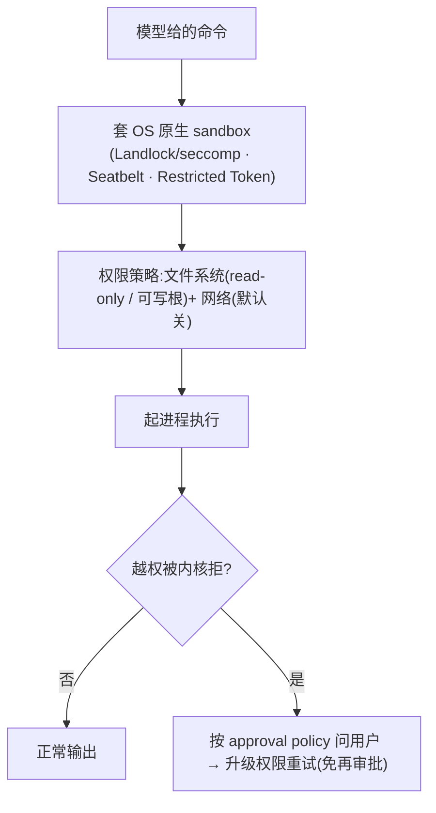

#### 如何管理 background tasks

Codex 没有一个独立的「后台任务」开关,它的 background 是那套 PTY [session](https://www.aihero.dev/ai-coding-dictionary/session) 机制的自然结果:[model](https://www.aihero.dev/ai-coding-dictionary/model) 用 `exec_command` 起一条命令,如果它在一个 **yield 窗口**(有上限,约 30s)内没跑完,Codex 就**主动 yield**、返回一个 **session_id**,让这个进程作为一个**后台 terminal 继续在跑**。之后 [model](https://www.aihero.dev/ai-coding-dictionary/model) 靠 **`write_stdin`(带 yield_time)**回到这个 [session](https://www.aihero.dev/ai-coding-dictionary/session):发点输入、或空写一下「探一探」,把这段时间新冒出来的 output 收回来。所以它是**「[model](https://www.aihero.dev/ai-coding-dictionary/model) 主动轮询」**的模式——不是 fire-and-forget,而是「先起,跑不完就先撂着,回头自己再 poll」。

这些后台 terminal 会被**统一登记**(能列出来看有哪些还在跑),并有一个**兜底超时**(默认约 5 分钟)防止无限挂着。好处是 [model](https://www.aihero.dev/ai-coding-dictionary/model) 对长跑进程有**细粒度的交互控制**(反复写 stdin、驱动交互式程序);代价是「什么时候回来看」得由 [model](https://www.aihero.dev/ai-coding-dictionary/model) 自己判断——它得**记得去 poll**,没有 [harness](https://www.aihero.dev/ai-coding-dictionary/harness) 主动来敲它「你的任务好了」。

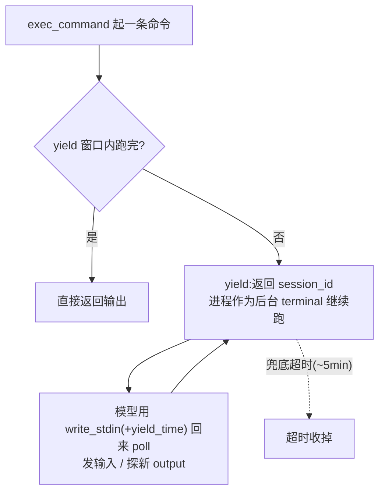

### 2.2 terminal 读 output

输出边读边流式回传给界面,回喂给 [model](https://www.aihero.dev/ai-coding-dictionary/model) 前按 [token](https://www.aihero.dev/ai-coding-dictionary/token) 预算做头尾截断——抢额度时**优先保留 stderr**(报错信息通常比正常 stdout 更值钱)。这是 **[context](https://www.aihero.dev/ai-coding-dictionary/context) Engineering** 的一处细节:大 output 是 [context](https://www.aihero.dev/ai-coding-dictionary/context) 预算的头号杀手。

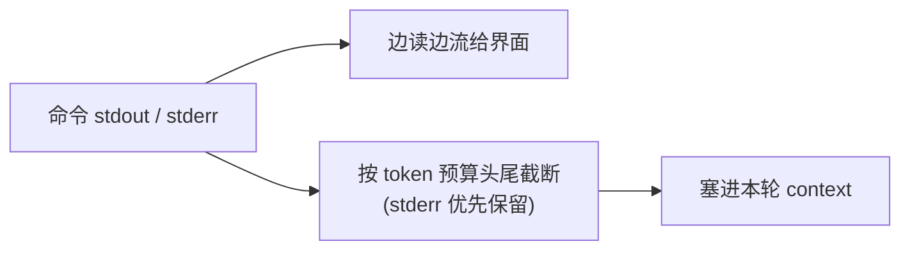

### 2.3 基本 file I/O（读、写、搜）

Codex 几乎不提供专门的文件 [tool](https://www.aihero.dev/ai-coding-dictionary/tool):**读文件、搜代码都是 [model](https://www.aihero.dev/ai-coding-dictionary/model) 自己在 shell 里跑 `cat`/`rg`**。唯一的例外是写,统一走 **`apply_patch`**(**[tool](https://www.aihero.dev/ai-coding-dictionary/tool) Use** 里一种自定义语法 [tool](https://www.aihero.dev/ai-coding-dictionary/tool))——[model](https://www.aihero.dev/ai-coding-dictionary/model) 产出一段结构化 patch,由 Codex 在进程内(经带 [sandbox](https://www.aihero.dev/ai-coding-dictionary/sandbox) 的文件抽象)应用,并给出 diff 预览。整体是「给 [model](https://www.aihero.dev/ai-coding-dictionary/model) 一个像样的 terminal + 一个像样的 patch 格式」的极简路线。

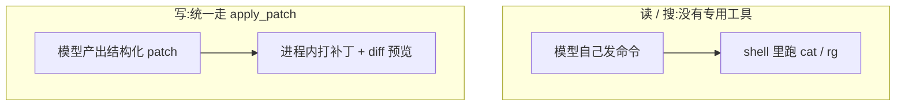

---

## 3. 与 Claude Code 的对照

Codex 和 Claude Code 骨架相同(都是 [model](https://www.aihero.dev/ai-coding-dictionary/model) + [harness](https://www.aihero.dev/ai-coding-dictionary/harness)、都走同一个 **[agent](https://www.aihero.dev/ai-coding-dictionary/agent) Loop**),但几乎每个问题上都做了相反的选择,而且各自都自洽:

| 问题               | Codex                                                                                                                                                                 | Claude Code                                                                                                                                                                     |
| ------------------ | --------------------------------------------------------------------------------------------------------------------------------------------------------------------- | ------------------------------------------------------------------------------------------------------------------------------------------------------------------------------- |
| task scheduling    | **[subagent](https://www.aihero.dev/ai-coding-dictionary/subagent)** 默认可**递归**,用 depth/数量上限兜底;plan mode 切出即默许                                        | **[subagent](https://www.aihero.dev/ai-coding-dictionary/subagent)** 单层用后即抛,靠不给递归 [tool](https://www.aihero.dev/ai-coding-dictionary/tool) 封顶;plan mode 要显式批准 |
| loop               | **不设 max turns**,靠 [autocompact](https://www.aihero.dev/ai-coding-dictionary/autocompact) 防膨胀;**Reasoning** 服务端隐藏、只回 summary                            | 有 **max turns** 兜底 + 恢复分支;**Reasoning** 是明文 thinking block                                                                                                            |
| input 拼接         | history **只增不改**,靠不动 prefix 让服务端**自动命中 KV Cache**                                                                                                      | history 多级压缩,靠**手工标 cache 断点**显式命中                                                                                                                                |
| output parser      | **[tool](https://www.aihero.dev/ai-coding-dictionary/tool) Use** + 强类型(反序列化成功即校验通过)                                                                     | **[tool](https://www.aihero.dev/ai-coding-dictionary/tool) Use** + Zod(结构 + 语义两段)                                                                                         |
| executor           | **[sandbox](https://www.aihero.dev/ai-coding-dictionary/sandbox) 优先**:审批/[sandbox](https://www.aihero.dev/ai-coding-dictionary/sandbox)/重试收进统一 orchestrator | **hook 优先**:每个 [tool](https://www.aihero.dev/ai-coding-dictionary/tool) 自带 concurrency/权限标记                                                                           |
| terminal 执行      | **[stateful](https://www.aihero.dev/ai-coding-dictionary/stateful) PTY [session](https://www.aihero.dev/ai-coding-dictionary/session)**,能跑交互式程序                | **[stateless](https://www.aihero.dev/ai-coding-dictionary/stateless) shell**(只保留目录)+ 后台任务,劝退 bash                                                                    |
| terminal 读 output | 按预算截断塞进本轮,**优先保 stderr**                                                                                                                                  | 太大就**落盘**,让 [model](https://www.aihero.dev/ai-coding-dictionary/model) 改用 Read 分页                                                                                     |
| file I/O           | **几乎没有专用 [tool](https://www.aihero.dev/ai-coding-dictionary/tool)**:读靠 shell、写靠 `apply_patch`                                                              | **Read/Write/Edit/Grep/Glob 一整套专用 [tool](https://www.aihero.dev/ai-coding-dictionary/tool)** + 硬约束                                                                      |

几处最能说明问题、也最值得琢磨的差异:

- **loop**:Codex 不封顶,赌「[autocompact](https://www.aihero.dev/ai-coding-dictionary/autocompact) 能一直把 [context](https://www.aihero.dev/ai-coding-dictionary/context) 压下去」,好处是**超长程任务**更顺,坏处是结束时机和成本不好向用户承诺;Claude Code 用 **max turns** 硬兜底,给出可预测的成本上限和停止点,代价是可能中途被切断。一个要放手的 autonomy,一个要 predictability。
- **cache**:**KV Cache** 直接是延迟和钱(命中能省一半 input 费),这不是小事。Codex「不动 prefix、让服务端自动命中」省心但粒度粗;Claude Code 自己摆 cache 断点能更精细,却也更脆——任何一处字节变了就失效,还得专门查「是谁打穿了 cache」。
- **安全边界**:Codex 把重量压在 **[sandbox](https://www.aihero.dev/ai-coding-dictionary/sandbox)**(默认安全、越界才问),Claude Code 压在权限 **hook**(每个 [tool](https://www.aihero.dev/ai-coding-dictionary/tool) 可拦截、可定制)。前者省心,后者可编程——对要把权限做成产品的人,这直接关系到**开发者体验**与对**失败场景**的把控。
- **file I/O**:Codex 极简(一个 terminal + 一个 patch 格式,接近人类工程师的干法),Claude Code 给一整套带约束的专用 [tool](https://www.aihero.dev/ai-coding-dictionary/tool)(先读后写、精确替换、禁裸 grep)。同样是「让 [agent](https://www.aihero.dev/ai-coding-dictionary/agent) 改代码」,[tool](https://www.aihero.dev/ai-coding-dictionary/tool) 接口的粗细直接决定了可控性、可观测性和**用户信任**——这一处对做产品的人尤其值得想。

一句话:**Codex 更信任平台、让服务端多做、给 [model](https://www.aihero.dev/ai-coding-dictionary/model) 一个像样的 terminal;Claude Code 更想在 client 掌控每一处、把每个危险动作做成显式可拦截的 [tool](https://www.aihero.dev/ai-coding-dictionary/tool)。** 没有更好,只有取向不同——一个偏 autonomy 与顺滑,一个偏可控与透明。

## 参见

- Codex 侧参考 OpenAI:《Reasoning models》《Prompt caching》《Function calling》《[agent](https://www.aihero.dev/ai-coding-dictionary/agent) orchestration》《Codex Prompting Guide》《[MCP](https://www.aihero.dev/ai-coding-dictionary/mcp) – Codex》《[agent](https://www.aihero.dev/ai-coding-dictionary/agent) Skills》
- Claude Code 侧的完整视角:[anthropic.md](anthropic.md)
