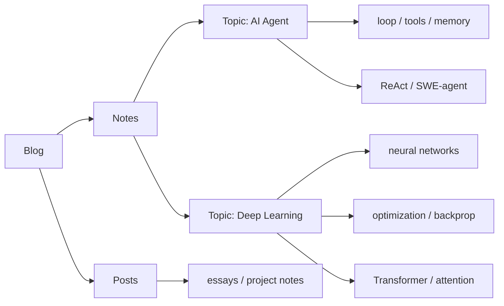

# Blog

<section class="home-hero" data-reveal>
  
AI notes, code, papers, and systems.

  

    这里记录我学 AI、写代码、读论文和折腾系统时留下的东西。短的会像笔记，长的会像文章；共同点是尽量把一个问题讲到以后还能重新捡起来。
  

  

    <a class="md-button md-button--primary" href="./notes/ai-agent/">开始阅读</a>
    <a class="md-button" href="#topics">查看 Topics</a>
  

</section>

<section class="home-section" id="topics" data-reveal>
  <h2>现在主要写什么</h2>
  

    我会把内容先按 topic 收起来，比如 AI Agent 和 Deep Learning；也会保留一些更随手的 blog posts。这里不追求每天更新，更在意一篇东西过几个月再看时，是否还能帮我继续往下想。
  

  

    <a class="home-topic-card" href="./notes/deep-learning/" data-reveal>
      Topic
      <strong>Deep Learning</strong>
      从神经网络、梯度下降、反向传播一路读到 Transformer 和注意力机制。
    </a>
    <a class="home-topic-card" href="./notes/ai-agent/" data-reveal>
      Topic
      <strong>AI Agent</strong>
      语言模型如何通过工具、环境反馈和 runtime loop 行动。
    </a>
  

</section>

<section class="home-section home-map" data-reveal>
  <h2>站点地图</h2>

</section>

<section class="home-section" data-reveal>
  <h2>怎么读论文</h2>
  

    

      <strong>先读出问题</strong>
      只看标题、摘要、引言、图表和结论，先答清“解决什么问题、方法叫什么、和已有做法差在哪”。
    

    

      <strong>抓方法和证据</strong>
      读方法、关键图、实验设置和主要结果，讲清主张和证据链，先不纠结附录。
    

    

      <strong>回到代码和失败模式</strong>
      再看 prompt、接口、parser、guardrails，带着“这个设计减少了哪种错误”去读。
    

    

      <strong>复习输出</strong>
      每篇只留三样：一句话贡献、一个关键机制、一个失败模式或边界。
    

  

</section>

<section class="home-section" data-reveal>
  <h2>写作原则</h2>
  

    

      <strong>First principles first</strong>
      先问这个概念为什么必须存在，再谈术语。
    

    

      <strong>Diagrams before prose</strong>
      能用图解释的地方，不堆长段文字。
    

    

      <strong>Code as notation</strong>
      用 PyTorch-like 代码替代一部分公式。
    

    

      <strong>Reusable notes</strong>
      笔记要能复习、引用和继续扩展。
    

  

</section>
