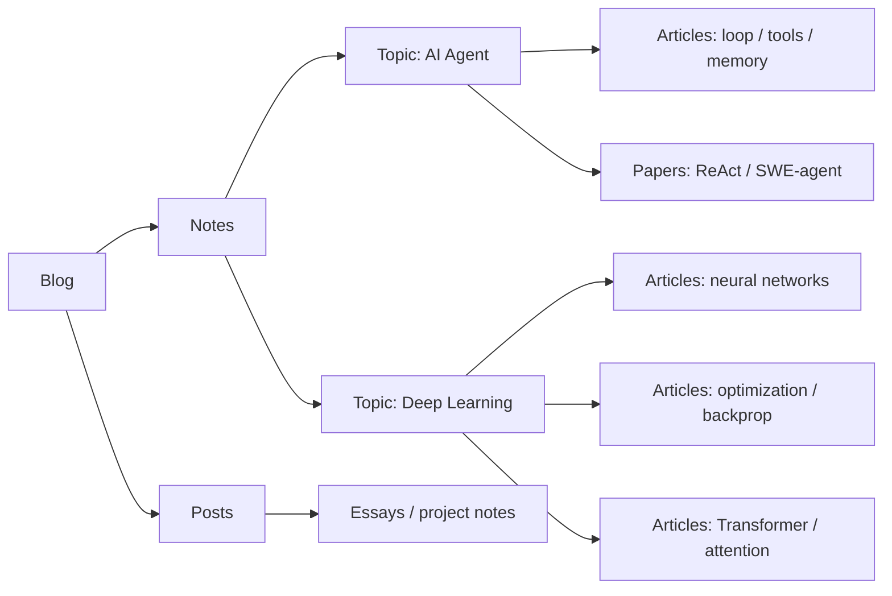

# Blog

这里记录我学 AI、写代码、读论文和折腾系统时留下的东西。短的会像笔记，长的会像文章；共同点是尽量把一个问题讲到以后还能重新捡起来。

[开始阅读](./notes/index.md){ .md-button .md-button--primary }
[查看 Topics](./notes/reading-route.md){ .md-button }

## 概述

我会把内容先按 topic 收起来，比如 AI Agent 和 Deep Learning；也会保留一些更随手的 blog posts。这里不追求每天更新，更在意一篇东西过几个月再看时，是否还能帮我继续往下想。

## 起点选择

| 起点 | 适合你在想什么 | 下一步 |
| --- | --- | --- |
| [AI Agent](./notes/ai-agent/index.md) | LLM 怎样通过工具、环境反馈和 runtime loop 行动。 | 从 agent loop 读到 ReAct 和 SWE-agent。 |
| [Deep Learning](./notes/deep-learning/index.md) | 神经网络为什么能训练，Transformer 和注意力到底在做什么。 | 从神经网络结构读到 GPT 和 attention。 |

## 写作原则

| 原则 | 含义 |
| --- | --- |
| First principles first | 先问这个概念为什么必须存在，再谈术语。 |
| Diagrams before prose | 能用图解释的地方，不堆长段文字。 |
| Code as notation | 用 PyTorch-like 代码替代一部分公式。 |
| Reusable notes | 笔记要能复习、引用和继续扩展。 |

## 路径选择

| 如果你想要... | 读这个 |
| --- | --- |
| 快速了解站点结构 | [快速开始：如何读这些笔记](./notes/reading-route.md) |
| 理解 agent 的基本循环 | [AI Agent Topic](./notes/ai-agent/index.md) |
| 从深度学习基础补到 Transformer | [Deep Learning Topic](./notes/deep-learning/index.md) |
| 看一篇具体论文笔记 | [ReAct](./notes/papers/react.md) |
