**Claude Code** 是 Anthropic 的命令行编码智能体(coding agent),用 TypeScript 实现、走 Anthropic 的 **Messages API**(一种支持 **Tool Use** 与 extended thinking 的 **LLM API**)。本文围绕 8 个问题——分成 agent 的**核心功能**(5 个)与 **tool calling**(3 个)——梳理 Claude Code 的设计,末尾与 **Codex** 对照。

> 这 8 个角度既是从源码里提炼、供学习的**设计参考**,也刚好串起 Agent 的一批基本机制。写法偏概念、不涉及源码符号,复杂处交给图;术语冲突以 Anthropic 的说法为准。

先用一张图看懂它的一个 turn——这就是它的 **Agent Loop**:

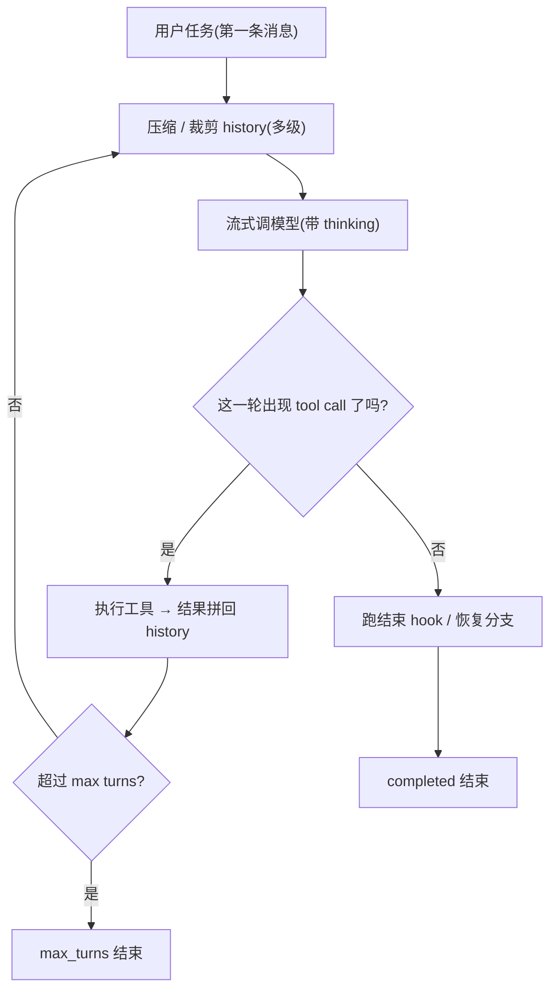

---

## 1. 核心功能

### 1.1 task scheduling 拆分

Claude Code 同样不做「先规划后执行」,走纯 ReAct——用户 task 直接进 loop,模型每个 turn 自己决定下一步。它靠三个由模型主动调用的工具来拆分:`TodoWrite`(一张可见的 TODO 清单,即 **Planning** 的落地,正迁往结构化的 Tasks API)、`Agent`(把 subtask 交给 **Subagent**)、以及可选的 plan mode(先只读 research、给出方案,**要显式批准才转执行**)。它的 subagent 是**单层、用后即抛**的:拿独立的 context 与受限的 tool 集,默认不给它再 spawn subagent 的工具,所以 recursion 天然封顶;真正持久的 **Multi-Agent** 协作(命名、可互发消息)得走另一条要专门开启的 coordinator 路径。

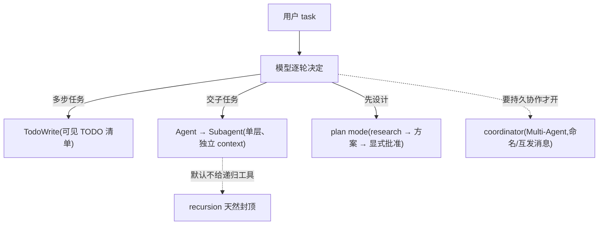

#### 如何实现 multi agent

Claude Code 的 **Multi-Agent** 主线也是「主 agent 把 **Subagent** 当工具用」的 manager 模式:主 agent 掌控全局、保留最终答案,遇到能并行或想隔离 context 的活儿,就用 `Agent` 工具派一个 subagent 去干、只拿回**一份简洁报告**再综合,而不是把控制权整个交出去。子代理由**同一套主循环递归**驱动,但拿的是**独立 context 与受限 tool 集**——它中间读文件、试错的噪声都留在自己的子上下文里,回到父这边只剩最终报告。这正是 subagent 的价值:省父的 context 预算、又把噪声隔离在外。

和 Codex「subagent 默认可递归、靠 depth 计数限流」不同,Claude Code 走**结构性单层封顶**:默认不把 `Agent` 这类递归工具放进子代理的 tool 集,子代理够不到派生能力,recursion 就天然到顶、不需要计数器。此外还有两条更重、需专门开启的路径:**fork**(省略 subagent_type 即「fork 自己」,继承父的完整 context、共享 prompt cache、后台跑完再通知)和 **coordinator / swarm**(主 agent 退成纯编排者,队友是持久、可命名、可互发消息的),两者互斥。

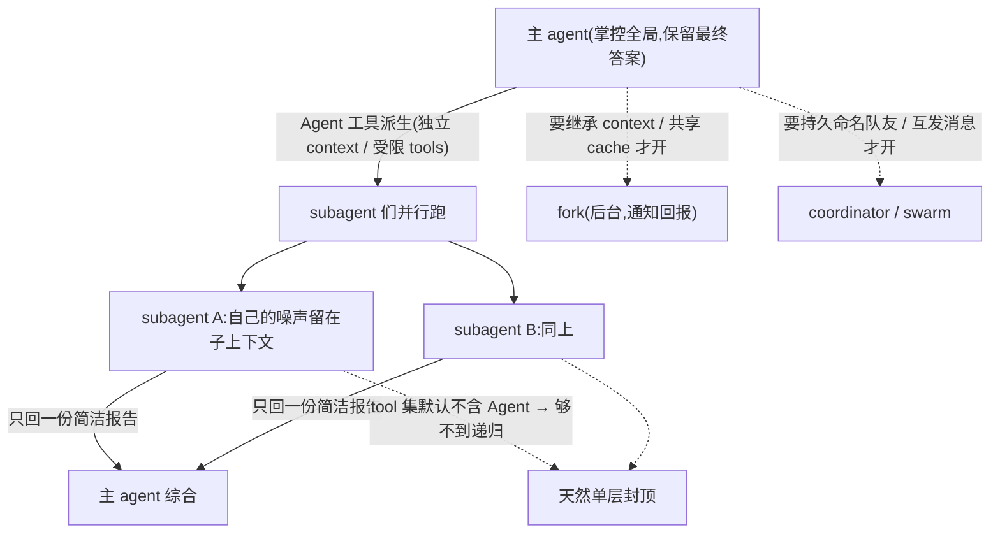

### 1.2 loop 和流程控制

主循环是一个 async generator 的 `while(true)`,即它的 **Agent Loop**——一边转一边用 yield 把每步产物(流式 token、消息、tool 结果)实时交给上层,所以「实时可见的 agent」很自然。它有 **max turns** 兜底,还有一整套「出错就恢复而非崩」的分支。判断要不要继续,它**不信任模型自报的 `stop_reason`,只看这一轮到底有没有 tool call**。**Reasoning** 走 extended thinking:`thinking` 是**明文的 content block**,直接放进消息 history、由 client 按严格规则原样携带回传。

#### 如何更好控制整个 loop 和 workflow

Claude Code 把 loop 控制做得**面很密**。**边界**上有 **max turns** 硬兜底(可预测),而且结束理由不止一个——completed、max_turns、被取消、被 hook 拦、上下文超限、token 预算耗尽,是一整套明确的终止分类。更有特色的是**恢复**:很多本来会「崩」的情况,它选择**不终止而恢复**——模型 output 被截断就升档重试,一轮请求太长(413)就先压缩再重试,stop hook 要求继续就追加一条消息再跑。等于把「出错」当成 loop 里的一种正常状态来接住。

**转向与拦截**主要靠 **hooks**:PreToolUse 能在工具执行前改参数或拦截,PostToolUse 能在之后追加/改写,**stop hook** 能在收尾时阻止结束;再加权限判定(allow/ask/deny)在每个工具前把关。**中断**靠一个 abort signal,一路传给模型调用与工具执行。所以 Claude Code 控制 loop 的方式是**「硬边界 + 丰富的终止/恢复分类 + hook 驱动的拦截转向」**——和 Codex 的「软边界(context)+ pending-input 转向 + stop-hook 续写」比,一个更像**可编程的事件系统**,一个更像**顺其自然、靠 context 预算和追加输入调节**。

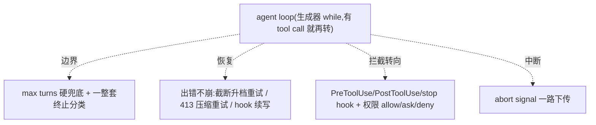

#### 如何做可视化、可观测性与 terminal UI

为什么 agent 普遍 **event-driven**?因为它是个跑很久、异步、可打断、要人参与的过程,**价值在「过程」而非只在「结果」**——用事件流边跑边吐,才能实时看到、能打断/审批、也能让 core 和 UI 解耦(纯请求-响应做不到)。Claude Code 的形式就是它那个**生成器 loop**:一边转一边 `yield` 出每步产物,所以「边跑边看」天然。前端是一个 **Ink(终端里的 React)** TUI,拿到这条流做**富渲染**:流式正文、tool call、文件改动的 **diff 预览**、TODO 清单、进度,以及需要你点头时的**审批对话框**。

「**哪些该给用户看**」上,Claude Code 比 Codex 更「敞开」:它把**明文的 thinking** 直接展示(你能看到模型在想什么),把工具做成**各自的富展示**(Edit 出 diff、Bash 出可折叠输出、TodoWrite 出清单),权限/审批做成**可交互的 TUI 组件**;而超大命令输出会**落盘**、只给回执(把噪声挪出视野)。它给的设计启发很直接:**streaming + 富渲染 + 交互式审批**让 agent「可读、可信、可控」,这正是产品岗看重的**开发者体验**。和 Codex 对照——一个是**解耦的类型事件协议 + 只露摘要**,一个是**紧耦合的富渲染 + 露明文思考**:前者更好被别的宿主复用,后者体验更沉浸。

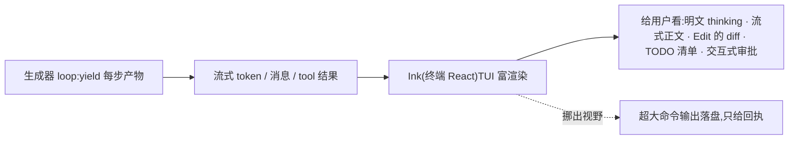

### 1.3 input 拼接 prompt

每个 turn 的 input 是「history + 本轮 assistant 消息 + tool 结果」拼起来,再在最前面插一条带 `CLAUDE.md`/目录结构的 `<system-reminder>`(**Prompt Engineering** 的落点)。真正复杂的是 history 的**多级压缩**,这是它 **Context Engineering** 的核心:删旧 → 微压缩(对 cache 友好)→ 折叠成摘要 → 必要时再总结式 compact,一层层把 history 压进预算、又尽量保住细节。

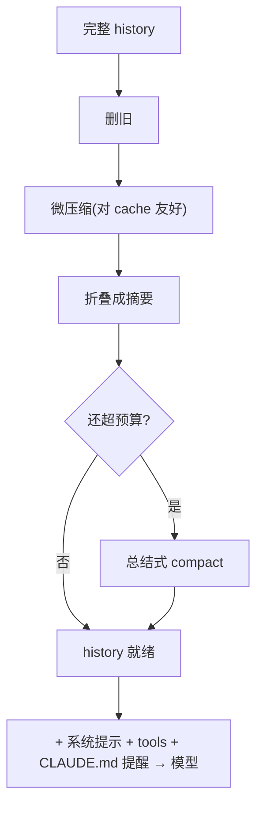

**KV Cache** 靠在消息上**手工标 cache 断点**显式命中,外加一套「谁打穿了 cache」的排查机制。

#### 如何实现 long-term memory

除了当前 thread 的 history,Claude Code 还有一套跨 session 的 **Memory(长期记忆)**,把「对未来 session 有用」的东西沉淀成磁盘文件。它和 Codex 正相反——不是启动时离线批处理,而是**在线增量**:每当一个 query loop 跑到头(模型给出不再调工具的终答),就地 **fork 一个 subagent** 从当前 session 的 transcript 里蒸馏出值得长期保留的记忆。这个 fork **共享父对话的 prompt cache**,所以读那一大段 transcript 几乎全命中 **KV Cache**、不必重新计费,「每轮都顺手记一笔」才便宜到能默认开着;它也很克制,只记真正对未来 session 有用的。

落盘是一套带分类(taxonomy)的文件:每条记忆一个独立 `.md`,之上有一份 `MEMORY.md` 索引。读取走**渐进披露**(和 **Skills** 同源,也是 **Context Engineering**):索引和 `CLAUDE.md` 一样**始终注入上下文**、让模型知道自己记过什么,正文则**按需才读**;索引刻意保持小、以护住那条 **KV Cache**。一个对**失败场景**敏感的细节:照记忆给建议前,得先确认里面提到的文件/函数还在(防 drift)。

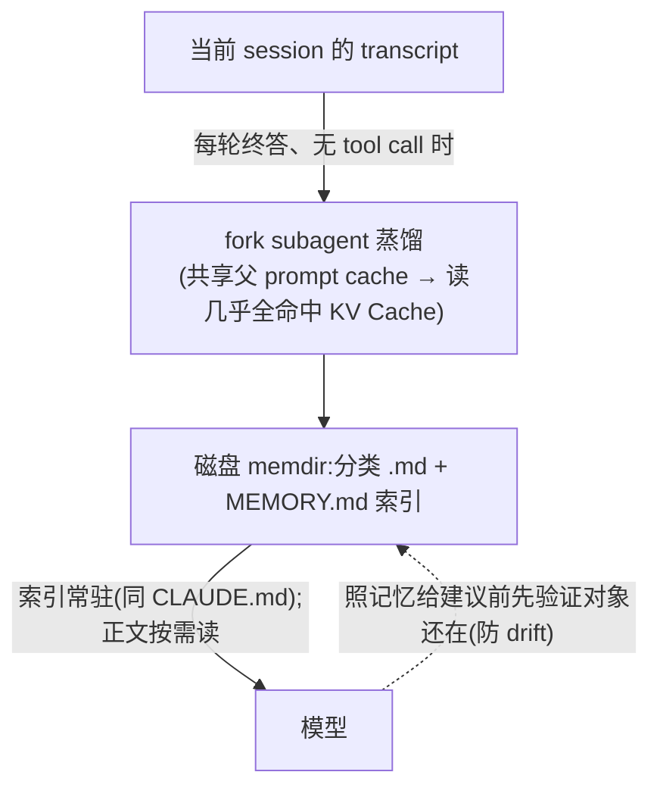

#### 如何实现 skills 和 plugins

**Skills** 和 **plugins** 都是「插入式 context」——把额外能力/指令按需插进 prompt,靠**渐进披露**控制驻留成本。一个 **skill** 是一个含 `SKILL.md`(YAML frontmatter:name、description 等)的目录,来源有个人目录、项目目录、plugin 和内置。它是**三级渐进披露**:第一级只把每个 skill 的**元数据(名 + 描述,约 100 token)常驻**系统提示;命中时(用户点名、或任务匹配描述)才走第二级——把 **`SKILL.md` 正文(通常 &lt;5k token)加载进 context**;第三级的脚本/资源**零 context 成本**(脚本只回 stdout、源码不进 context)。启动时只按 frontmatter 估 token,不载正文。

**Plugin** 是更粗粒度的打包:一个 plugin 能 **bundle 多种组件**——slash 命令、**Subagent**、**Skills**、hooks、**MCP** servers,从 **marketplace** 安装,装上后各组件被合并进对应的池子(命令进命令表、skills 进 skills、MCP 进工具池…)。所以 Claude Code 的可插拔 context 也是**分层渐进披露**:轻的元数据常驻、重的正文/能力按需插入——和本节 long-term memory 的「索引常驻 + 正文按需」、MCP 的 deferred 是**同一个 Context Engineering 母题**:驻留越小,越省 context、越护 **KV Cache**。相比 Codex(plugin 打包 skills/connectors/apps),Claude Code 的 plugin 打包的组件类型更多。

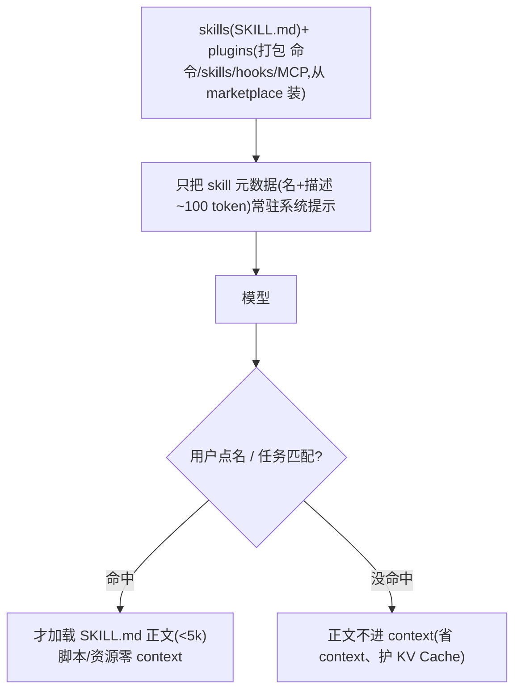

#### 如何做好 context auto compression

Claude Code 不是「一压到底」,而是一条**多级渐进压缩**流水线,原则是**能轻则轻、尽量护住 KV Cache**。快撑满时它按由轻到重依次尝试:先**截断超大的工具输出**(context 的头号杀手),再**删掉最旧的消息**,再做**微压缩**(按 tool_use_id 局部编辑、对 cache 友好、尽量不动前缀),再把旧段**折叠成摘要**;只有前面这些都压不下去,才动用最重的**总结式 compact**——像 Codex 那样让模型把历史总结成一份摘要。

这条流水线的讲究在**顺序**:折叠放在总结式 compact 之前,一旦折叠后就低于阈值,总结式压缩就空跑,从而**保住细粒度的上下文**。它还有**反应式**兜底——某轮请求运行时因太长被拒(413),就临时压一压再重试。整套设计都在一个取向上:**总结式压缩会改写前缀、打穿 KV Cache,所以尽量往后放**,先用便宜、cache 友好的手段扛。相比之下,Codex 是**一次性 checkpoint**(直接把历史压成一份交接摘要),简单干净但更粗;Claude Code 更细、更护 cache,但也更复杂。

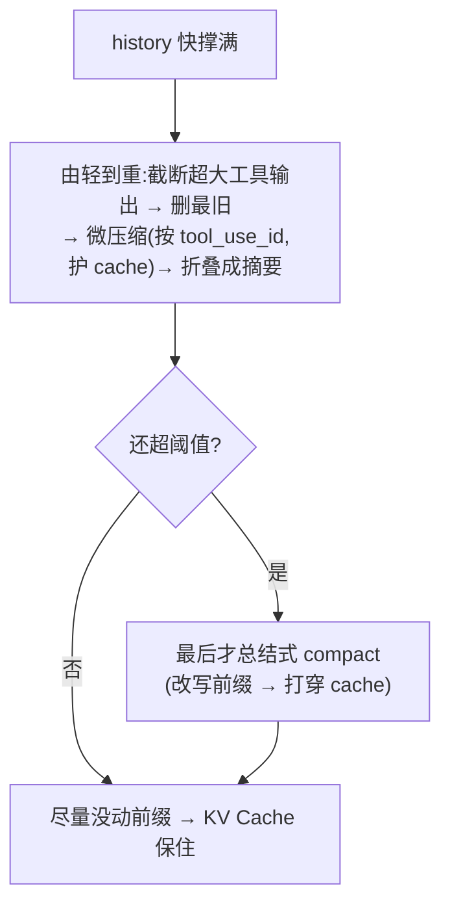

### 1.4 output parser

原生 **Tool Use**。流式时它把 tool 的 input 当作裸 JSON 字符串**一点点拼接**(避免大参数被攒着不发),block 结束才整体解析成对象。校验**分两段、都不抛异常中断**:先用 Zod 校验结构,再由工具自己校验语义(如路径是否存在);哪一步不过,就回一条 `<tool_use_error>` 让模型自纠。

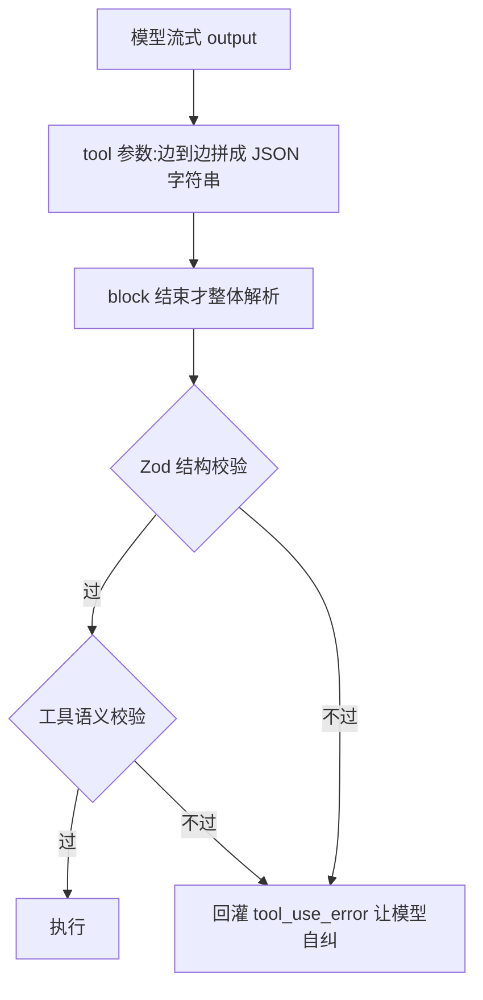

### 1.5 执行器 executor

工具排成一个数组,按名字(或别名)查找。执行走一条固定 pipeline:校验 → PreToolUse hook(可改参/拦截)→ 权限判定(allow/ask/deny)→ 真执行 → 结果回填 → PostToolUse hook。这套 hook + 权限事件面正是它 **Harness Engineering** 的重心。

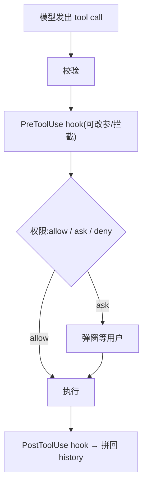

要不要并发,它**下放给每个工具自己的「是否 concurrency-safe」标记**——相邻的只读工具可以批量并行(默认上限 10)。外部工具通过 **MCP** 接入,支持的 transport 很宽(stdio/http/ws/sdk 等);能力还能通过 **Skills**(Agent Skills,一个含 `SKILL.md` 说明书的目录)按需扩展——启动只加载名字与描述,命中才把正文读进 context。

#### 如何设计可以自由配置的 mcp

**MCP** 让外部工具热插拔进来,Claude Code 的可配置性在**声明 + 传输**上很宽:在配置(如项目级 `.mcp.json`、用户设置)里列出 server,支持的 **transport** 很多——本地 **stdio**、远端 **http / sse**、**ws**、IDE 集成,以及 **sdk**(同进程,把工具直接跑在本进程里);远端可走 OAuth(经 mcp-proxy)。改配置就能增删,不用动 agent。

控制这些工具怎么进来也都能配:**server 级审批**——首次接一个项目 `.mcp.json` 里的 server 会弹窗让你批准;**deny 规则**能按 `mcp__<server>` 前缀**整台剔除**(在模型看到之前就过滤掉)。同样为护 **context / KV Cache**,每个 MCP 工具可用 **shouldDefer / alwaysLoad** 决定要不要首轮就进 prompt。工具名也命名空间成 `mcp__server__tool`;server 的 instructions 会拼进系统提示,还能消费 MCP 的 resources / prompts。和 Codex 对照:两者命名/defer 思路一致,但 Claude Code 的**传输矩阵更宽**(多了 ws、IDE、同进程 sdk),Codex 则**额外能反过来当 MCP server**。

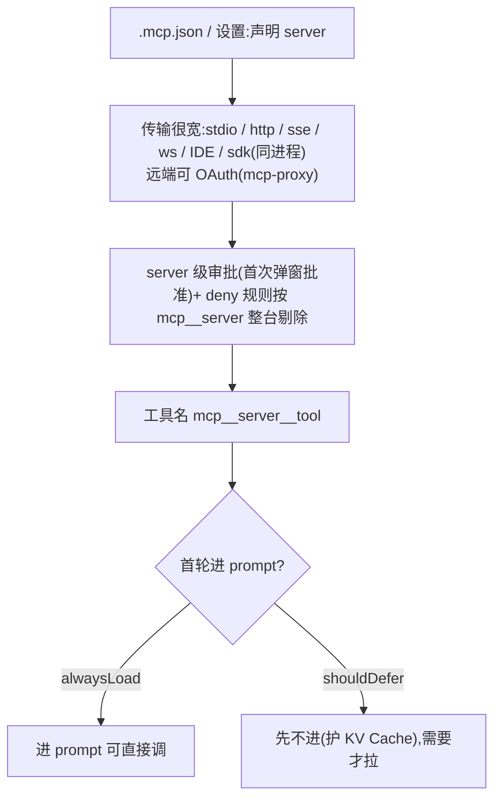

---

## 2. tool calling

### 2.1 terminal 执行

单一 **Bash** 工具(**Tool Use** 的一种),每条命令起一个新 shell,目录跨命令保留、但 shell 变量丢弃(**没有持久 session**)。审批用 **tree-sitter 把命令解析成语法树**来判断危险性(命令替换、`eval` 之类要确认),复合命令按子命令逐个判——这体现了对 **失败场景** 的敏感;sandbox 默认开启。而且它刻意把模型**从 bash 往专用工具引导**。

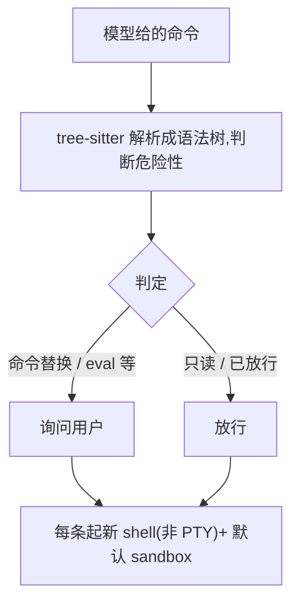

#### 如何控制 sandbox 环境

Claude Code 不自己实现 sandbox,而是**委托给一个外部的 sandbox runtime**(底层同样是 macOS 的 seatbelt、Linux 的 bubblewrap)。取向是**默认开、要显式关**:sandbox 默认套在每条命令上,只有明确加一个 `dangerouslyDisableSandbox` 逃生口才关(prompt 也提醒只在有明确证据时才用)。

「控制」主要靠**允许/拒绝清单**:网络给 allowedDomains / deniedDomains,文件系统给 allowWrite / denyWrite / denyRead。在这之上它还**内置一层自我加固**——无论如何禁止写 `settings.json`、`.claude/skills` 这些敏感配置,用 `O_NOFOLLOW` 防软链逃逸。和 Codex 对照:两者底层是同一批 OS 机制,但 **Codex 是内核原生 sandbox + 审批驱动的「先收窄、被拒再升级」**,**Claude Code 是外部 sandbox runtime + 默认开 + 声明式的允许/拒绝清单 + 自我加固**——一个偏「硬边界 + 动态放宽」,一个偏「安全默认 + 声明式配置」。

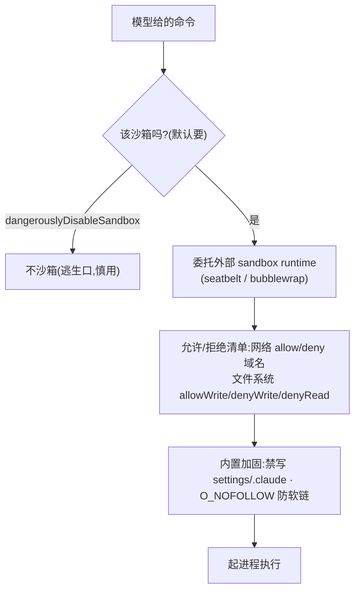

#### 如何管理 background tasks

Claude Code 的 background 有两个入口:模型显式带 `run_in_background` 起命令,或**长/阻塞命令被自动移到后台**(免得主 agent 干等)。进程作为后台任务**跨 turn 继续跑**。关键在回报方式:它是**「push 式」**的——不用模型自己盯着,任务**完成/失败时 harness 主动发一条 `<task-notification>`**(带状态和输出文件位置)注入对话流,模型下一轮就看到。prompt 也明说:起了后台任务**不用 poll**,等通知即可。

想主动看输出,可以用 **Read** 读通知指到的输出文件、**BashOutput** 按任务取 stdout、或 **Monitor** 把一条后台进程的输出**按行流式**取回(边跑边看);后台输出有体量上限,过大就收掉。这条**「harness 主动通知 + 流式回报」**和 Codex 的 pull 式恰成对照:Codex 让模型 yield 出 session 后自己回来 poll,而 Claude Code 把「什么时候好了」交给 harness 来敲门——让模型少操心调度、只在有事时被唤醒(**Harness Engineering** 的取向)。

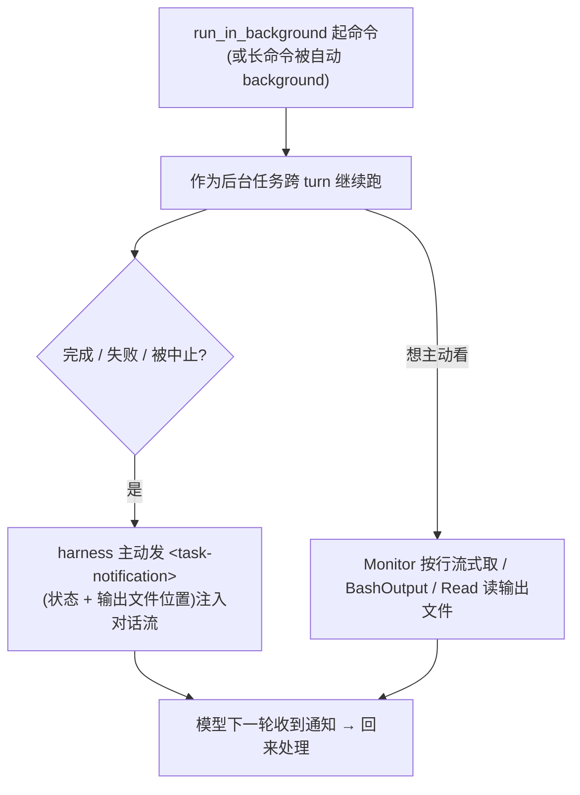

### 2.2 terminal 读 output

stdout 和 stderr 都写进**同一个文件**(按时间交错合并),界面每秒读文件尾实时显示。命令结束后只把**开头约 3 万字符**喂给模型;太大就把完整输出**落盘**,结果里只留一个「用 Read 分页」的回执,把大 output 移出 context——这是很典型的 **Context Engineering** 手法。

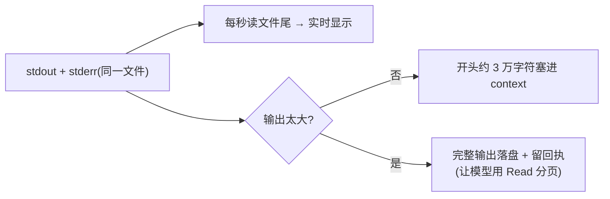

### 2.3 基本 file I/O（读、写、搜）

提供 **Read / Write / Edit / Grep / Glob 一整套专用工具**(**Tool Use** 的厚契约)。Read 带行号、分页;Edit **要求先 Read 过、`old_string` 必须唯一匹配**;搜索封装 **ripgrep**,并**禁止模型自己在 bash 里敲 grep/rg**。用这些硬约束把 file I/O 收进受控通道,可控性强、也更好向用户交代——这是很看重 **开发者体验** 的取向。

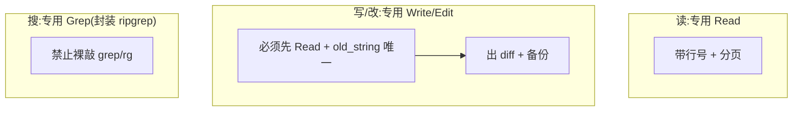

---

## 3. 与 Codex 的对照

Claude Code 和 Codex 骨架相同(都是 model + harness、都走同一个 **Agent Loop**),但几乎每个问题上都做了相反的选择,而且各自都自洽:

| 问题 | Claude Code | Codex |
|---|---|---|
| task scheduling | **Subagent** 单层用后即抛,靠不给递归工具封顶;plan mode 要显式批准 | **Subagent** 默认可**递归**,用 depth/数量上限兜底;plan mode 切出即默许 |
| loop | 有 **max turns** 兜底 + 恢复分支;**Reasoning** 是明文 thinking block;generator 实时流式 | **不设 max turns**,靠 auto-compact 防膨胀;**Reasoning** 服务端隐藏 |
| input 拼接 | history 多级压缩,靠**手工标 cache 断点**显式命中 **KV Cache** | history **只增不改**,靠不动 prefix 让服务端**自动命中** |
| output parser | **Tool Use** + Zod(结构 + 语义两段) | **Tool Use** + 强类型(反序列化成功即校验通过) |
| executor | **hook 优先**:每个工具自带 concurrency/权限标记 | **sandbox 优先**:审批/sandbox/重试收进统一 orchestrator |
| terminal 执行 | **无状态 shell**(只保留目录)+ tree-sitter 审批 + 后台任务 | **有状态 PTY session**,能跑交互式程序 |
| terminal 读 output | 太大就**落盘**,让模型改用 Read 分页 | 按预算截断塞进本轮,**优先保 stderr** |
| file I/O | **Read/Write/Edit/Grep/Glob 一整套专用工具** + 硬约束 | **几乎没有专用工具**:读靠 shell、写靠 `apply_patch` |

几处最能说明问题、也最值得琢磨的差异:

- **loop**:Claude Code 用 **max turns** 硬兜底,给出可预测的成本上限和停止点,代价是可能中途被切断;Codex 不封顶,赌「auto-compact 能一直把 context 压下去」,**超长程任务**更顺、但结束时机和成本不好向用户承诺。一个要 predictability,一个要放手的 autonomy。
- **cache**:**KV Cache** 直接是延迟和钱(命中能省一半 input 费)。Claude Code 自己手工摆 cache 断点,能更精细,却也更脆——任何一处字节变了就失效,所以它专门养了一套机制来查「是谁打穿了 cache」;Codex「不动 prefix、让服务端自动命中」省心但粒度粗。
- **安全边界**:Claude Code 把重量压在权限 **hook**(每个工具可拦截、可定制、可插桩),Codex 压在 **sandbox**(默认安全、越界才问)。前者可编程,后者省心——对要把权限做成产品的人,这直接关系到**开发者体验**与对**失败场景**的把控。
- **file I/O**:Claude Code 给一整套带约束的专用工具(先读后写、精确替换、禁裸 grep),把每个危险动作都做成显式、可拦截、可审计的;Codex 极简(一个 terminal + 一个 patch 格式)。同样是「让 agent 改代码」,tool 接口的粗细直接决定了可控性、可观测性和**用户信任**——这一处对做产品的人尤其值得想。

一句话:**Claude Code 更想在 client 掌控每一处、把每个危险动作做成显式可拦截的 tool;Codex 更信任平台、让服务端多做、给模型一个像样的 terminal。** 没有更好,只有取向不同——一个偏可控与透明,一个偏 autonomy 与顺滑。

## 参见

- Claude Code 侧参考 Anthropic:《Effective context engineering》《Extended thinking》《Tool use》《Agent Skills》《Subagents》
- Codex 侧的完整视角:[openai.md](../openai/)
