**Claude Code** 是 Anthropic 官方打造的生产级命令行编码 Agent，采用 TypeScript 构建，底层依托 Anthropic Messages API（原生支持 Tool Call 与 Extended Thinking）。

在 Harness 工程体系中，Claude Code 代表了**「客户端重度掌控（Client-heavy Control）」**的设计典范：不把推理与状态完全托付给远端托管运行时，而是在本地客户端建立严密的响应式事件流、多级 Cache 友好压缩流水线、语法树安全拦截与单层 Subagent 隔离体系。

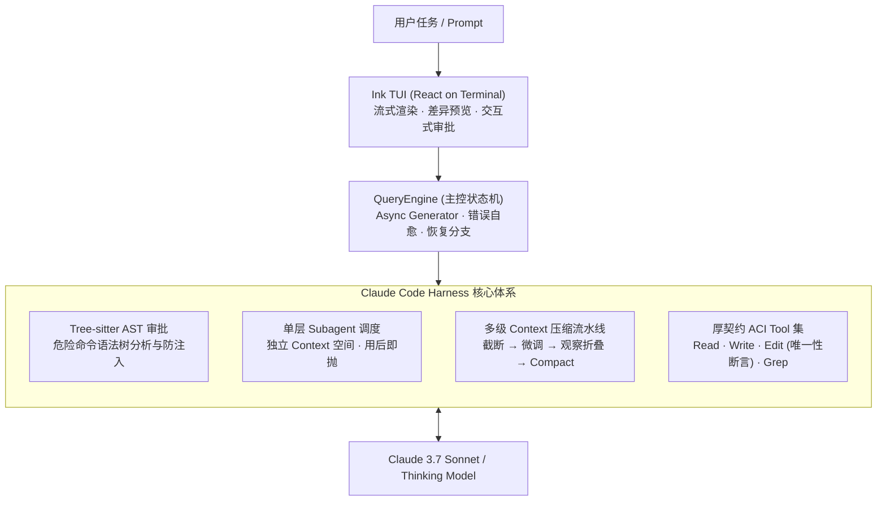

## 1. 核心功能

### 1.1 task scheduling 拆分

多 Agent 编排中最容易出现的灾难是无限递归派生与 Context 膨胀。Claude Code 采取了**结构性单层封顶**策略：默认不把 `Agent` 这类递归 Tool 放进子代理的工具集，子代理够不到派生能力，递归就天然到顶，无需额外的计数器。

#### 如何实现 multi agent

Claude Code 的 Multi-Agent 机制以**单层、用后即抛的 Subagent** 为核心：

- **主 Agent 全局视野**：主 Agent 掌控主线与最终答案，遇到独立探索或排查任务时，通过派生 Tool 启动 Subagent。
- **Context 噪声强隔离**：Subagent 在代码库中翻找文件、尝试失败路径产生的海量中间日志全部保留在子 Context 中，随运行结束直接销毁，只向主 Agent 回传一份精炼的结构化结论。
- **防死锁与资源保护**：在组装 Subagent 的 Tool 清单时物理剔除 `Agent` 工具自身，从根源上杜绝了无限派生导致的死循环与资源耗尽。
- **Fork 与 Swarm 机制**：支持省略 subagent_type 的 `fork`（继承父 Context、共享 Prompt Cache、后台执行完毕后通知）以及 `coordinator / swarm` 协作模式。

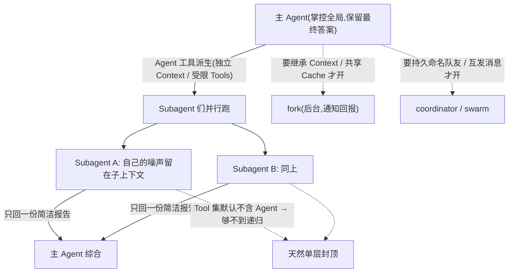

### 1.2 loop 和流程控制

主循环是一个基于 TypeScript Async Generator 的 `while(true)` 状态机，一边推进一边用 `yield` 把每步产物（流式 Token、消息、Tool 结果）实时交给上层界面。

#### 如何更好控制整个 loop 和 workflow

Claude Code 的 Loop 控制做到了严密且具备自愈能力：

1. **硬边界与终止分类**：具备明确的 max_turns 硬兜底、completed、被取消、被 Hook 拦截、Context 超限与 Token 预算耗尽等完整终止分类。
2. **将错误视为正常状态流（Error as State）**：
   - **Token 截断恢复**：Model 输出达到最大长度导致截断时，状态机自动升档发起续写。
   - **HTTP 413 反应式自愈**：遇到 Payload 过大错误时，立即触发紧急 Context 压缩并透明重试。
   - **工具异常自纠**：命令失败或路径错误统一封装为 `<tool_use_error>` 回传给 Model，引导下一 Turn 自纠。
3. **否定模型自报，依托行为真值**：循环是否继续推进完全不依赖 Model 返回的 `stop_reason`，而是严格以当前 Turn 是否产生了实际的 Tool Call 作为唯一判据。
4. **Hook 驱动的拦截与转向**：PreToolUse 在执行前改写参数或拦截，PostToolUse 在执行后追加，stop hook 在收尾时阻止结束。

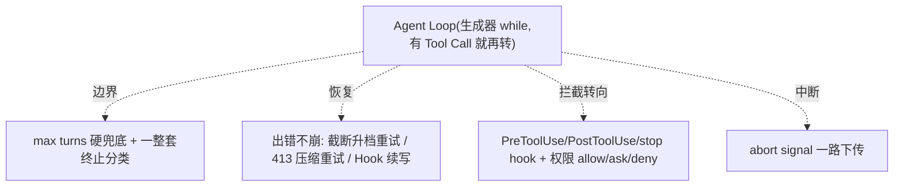

#### 如何做可视化、可观测性与 terminal UI

为什么长程编码 Agent 必须是**事件驱动（Event-Driven）**？因为 Agent 执行长程软件工程任务是一个耗时长、异步、随时可打断且需要人类在关键节点介入确认的过程。

- **Ink TUI 终端富渲染**：基于 Ink（终端里的 React）进行响应式渲染，呈现流式正文、Tool Call 进度、文件修改的高亮 Git Diff 预览与交互式审批对话框。
- **思维链全透明（Visible Thinking）**：将 `thinking` 作为一个明文 content block 实时以流式方式渲染，使用户随时理解 Model 当前的推理假设与决策链条。
- **超大输出隔离降噪**：终端命令输出超出安全阈值时，自动将全量日志持久化到临时文件，仅在 Context 中保留摘要与行数提示，引导 Model 使用 `Read` 工具按需分页查看。

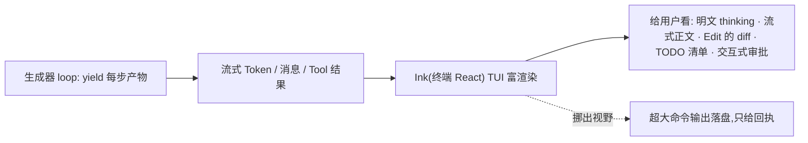

### 1.3 input 拼接 prompt

每个 Turn 的 input 由「历史消息 + 本轮 Assistant 消息 + Tool 结果」拼接而成，最前端动态注入 `<system-reminder>` 携带 `CLAUDE.md` 与目录结构。

#### 如何实现 long-term memory

除了当前 Thread 的短期历史，Claude Code 建立了一套跨 Session 的持久化 Memory System：

- **在线增量蒸馏**：每当一个 Query Loop 运行收敛（Model 给出不再调用 Tool 的终答），就地 **fork 一个 Subagent** 从当前 Session 的 Transcript 中蒸馏出值得长期保留的记忆。
- **共享 Cache 极低成本**：该 Fork 子任务共享父对话的 Prompt Cache，读取海量 Transcript 几乎 100% 命中 **KV Cache**，成本极低，因而可以默认开启。
- **渐进式揭示（Progressive Disclosure）**：磁盘上存储分类 `.md` 文件与 `MEMORY.md` 索引。索引像 `CLAUDE.md` 一样常驻 Context，正文则按需读取，时刻保护 KV Cache 前缀。

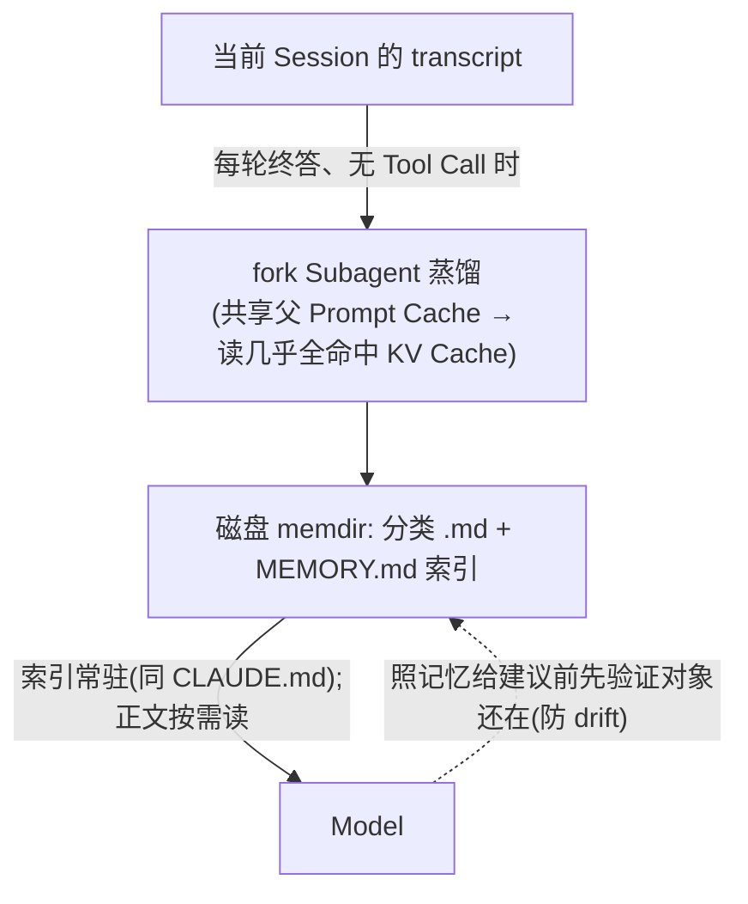

#### 如何实现 skills 和 plugins

Skills 与 Plugins 均遵循**渐进式揭示（Progressive Disclosure）**原则，严格控制常驻 Context 成本：

- **三级渐进揭示机制**：
  1. **第一级（元数据常驻）**：仅将各 Skill 的名称与描述（约 100 Token）常驻系统提示。
  2. **第二级（正文按需加载）**：任务匹配或用户显式调用时，才将 `SKILL.md` 正文（通常不到 5k Token）加载进 Context。
  3. **第三级（脚本零 Context 成本）**：辅助脚本执行仅返回 stdout，脚本源码不注入 Context。
- **Plugin 复合打包**：Plugin 能够打包 Slash 命令、Subagent、Skills、Hooks 与 MCP Servers，从 Marketplace 安装后分别并入对应模块池。

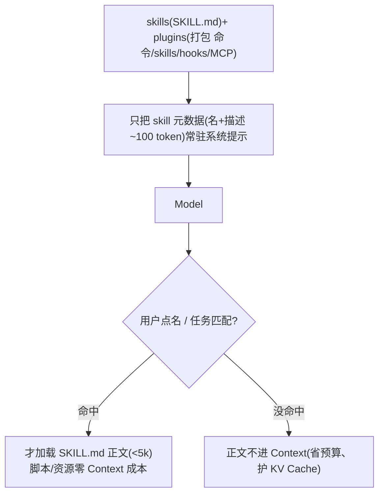

#### 如何做好 context auto compression

在大 Model 的调用成本与延迟模型中，KV Cache 命中率直接决定了 50% 以上的 API 费用与首字延迟（TTFT）。Claude Code 采用了严格保护稳定前缀的**多级渐进压缩流水线**：

1. **Level 1（截断超大 Tool 观察结果）**：首先对大命令输出进行截断，保护前缀 Cache。
2. **Level 2（清除早期无用上下文）**：剔除已过时的闲置消息。
3. **Level 3（观察折叠与微压缩）**：按 `tool_use_id` 折叠重复的观察输出。
4. **Level 4（总结式 Compact）**：只有在万不得已时才重写历史生成 Checkpoint 摘要。

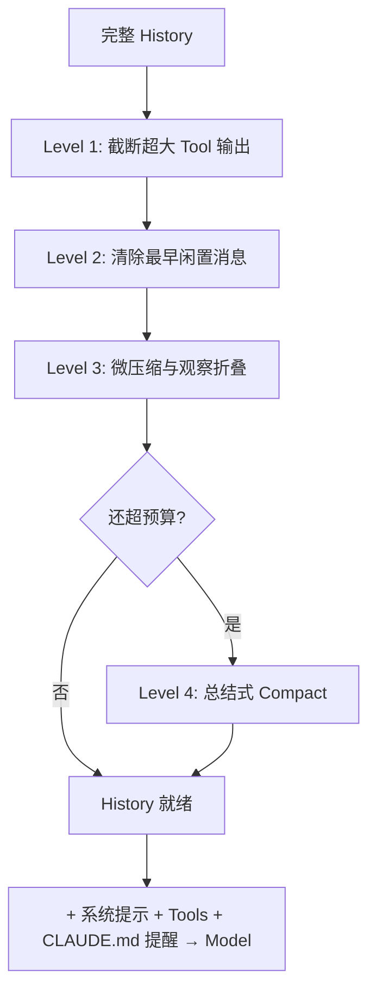

### 1.4 output parser

采用 **Tool Use + Zod 模式** 进行结构与语义的双段校验：
- 第一段验证 JSON Schema 结构合法性。
- 第二段通过 Zod 校验字段语义约束，确保参数完备。

### 1.5 执行器 executor

执行器负责协调并发与权限校验，将相邻的只读 Tool 进行安全的并发批处理（默认上限 10）。

#### 如何设计可以自由配置的 mcp

MCP（Model Context Protocol）让外部工具能够热插拔接入：

- **宽传输协议支持**：支持本地 stdio、远端 HTTP / SSE、WebSocket、IDE 集成以及同进程 SDK 嵌入。
- **Server 级审批与安全过滤**：首次接入项目 `.mcp.json` 时弹出交互审批；支持按 `mcp__<server>` 前缀配置 Deny 规则进行整台剔除。
- **Deferred 按需加载**：支持通过 `shouldDefer / alwaysLoad` 声明工具是否在首轮进入 Prompt，时刻捍卫 KV Cache。

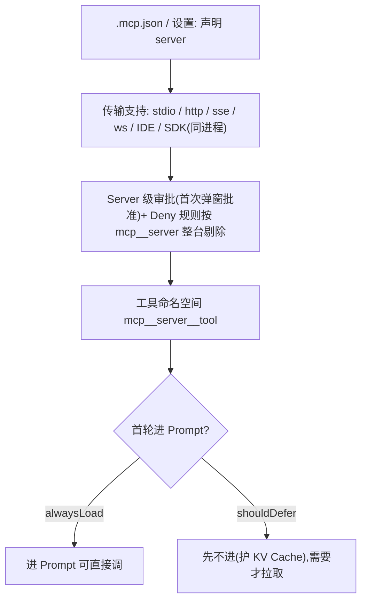

---

## 2. tool calling

### 2.1 terminal 执行

单一 **Bash** Tool，每条命令启动一个独立的子 Shell，保留当前工作目录但隔离局部 Shell 变量。

#### 如何控制 sandbox 环境

Claude Code 将命令执行委托给系统原生沙箱 Runtime（macOS Seatbelt、Linux Bubblewrap）：

- **安全默认**：沙箱默认开启，仅在配置 `dangerouslyDisableSandbox` 逃生口时显式关闭。
- **声明式配置清单**：网络层配置 `allowedDomains / deniedDomains`，文件系统配置 `allowWrite / denyWrite / denyRead`。
- **系统调用级加固**：严格禁止写入 `.claude/`、项目根级配置，文件操作强制携带 `O_NOFOLLOW` 杜绝软链接（Symlink）逃逸。

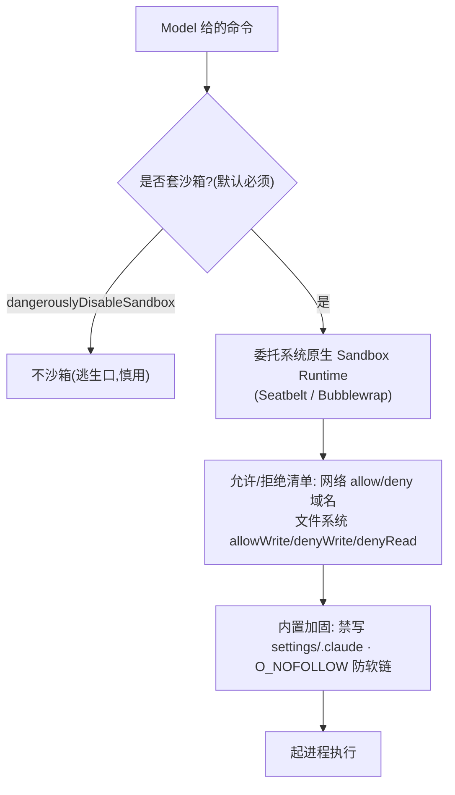

#### 如何管理 background tasks

Claude Code 采取了**「Harness 主动通知（Push 式）」**的管理模型：

- **后台移交**：Model 带 `run_in_background` 参数或阻塞式长命令被自动移交至后台持续执行。
- **主动通知（Push）**：任务完成或失败时，Harness 主动向对话流注入 `<task-notification>`（包含状态与输出日志文件路径），Model 无需主动轮询（Polling）。
- **流式监控**：提供 `Monitor` 工具按行流式取回输出，超大输出自动落盘。

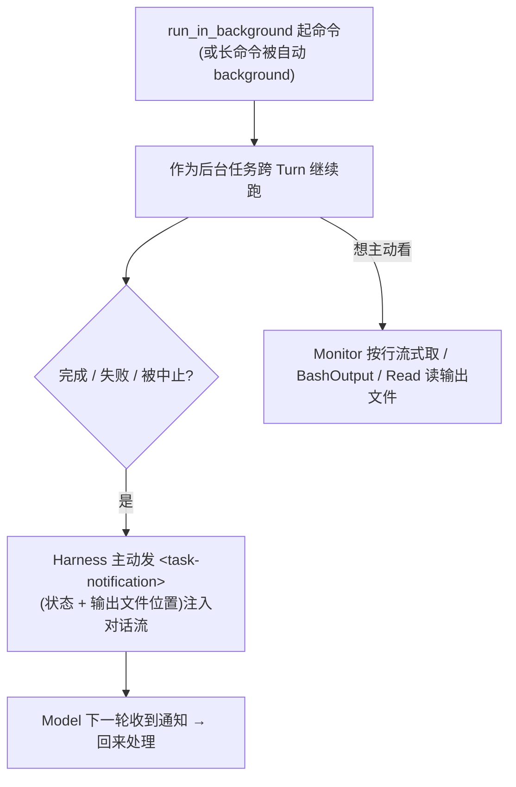

### 2.2 terminal 读 output

输出边读边流式回传给界面，回喂给 Model 前按 Token 预算做头尾截断，超大输出自动持久化至磁盘文件，仅保留摘要与行数引导 Model 按需分页查看。

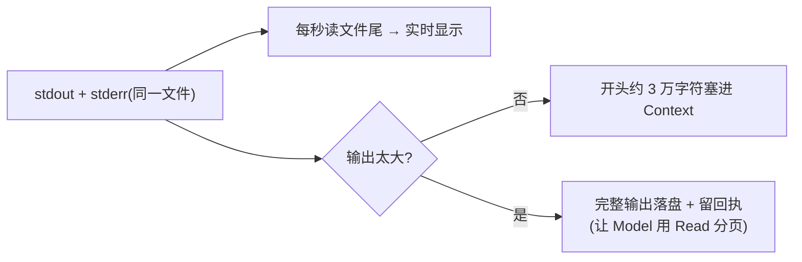

### 2.3 基本 file I/O（读、写、搜）

提供 **Read / Write / Edit / Grep / Glob 一整套厚契约专用 Tool**：
- `Read`：支持带行号与分页读取。
- `Edit`：**要求必须先 Read，`old_string` 必须在文件中全局唯一匹配**，提供 Diff 预览与自动备份。
- `Grep`：底层封装 `ripgrep`，禁止 Model 在终端直接裸跑 `grep/rg`，收敛至受控通道。

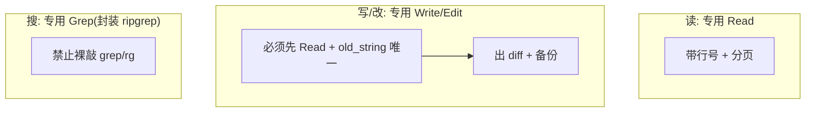

---

## 3. 与 DeepSeek-Harness / 通用 Harness 的对照

| 对比维度 | Claude Code (专有工业级) | DeepSeek-Harness / 通用 Harness |
| :--- | :--- | :--- |
| **task scheduling** | **Subagent** 单层用后即抛，不给派生 Tool 封顶；Plan 模式需显式审批 | 自动化管道单主循环，或通过 Shell 串联 |
| **loop** | 有 **max turns** 兜底 + 反应式自愈分支；**Reasoning** 为明文 thinking block | 标准循环，通过系统提示引导思维链 |
| **input 拼接** | History 多级渐进压缩，显式保护 **KV Cache** 前缀 | 动态 Prompt 组装与 Shell 环境变量注入 |
| **output parser** | **Tool Use** + Zod 结构与语义双段校验 | **Tool Use** + Pydantic 宽松容错解析 |
| **executor** | **Hook 优先**：每个 Tool 自带并发与权限标记 | **Shell 优先**：基于标准命令与 Heredoc/Base64 执行 |
| **terminal 执行** | **无状态 Shell**（只保留目录）+ AST 语法树深度检测 | **Unix Local 隔离沙箱** + 动态 PATH 注入 |
| **terminal 读 output** | 超大输出自动**落盘**，引导 Model 改用 `Read` 分页 | 预算截断，优先保留 stderr 报错信息 |
| **file I/O** | **Read/Write/Edit/Grep/Glob 专用厚契约 Tool** | 通用 Shell 驱动（`cat << 'EOF'` / `base64`） |

---

## 参见

- Anthropic 官方体系：Effective Context Engineering、Extended Thinking、Tool Use、Agent Skills、Subagents。
- 配套实战架构：[DeepSeek-Harness 实战与开源 Model 适配](/harness/deepseek/)。

