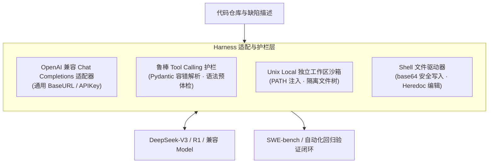
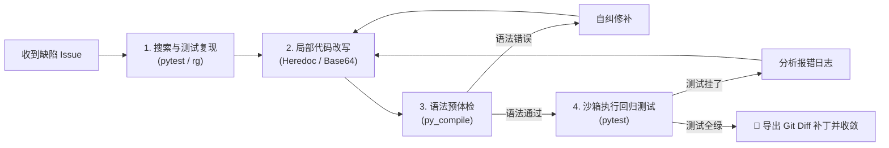
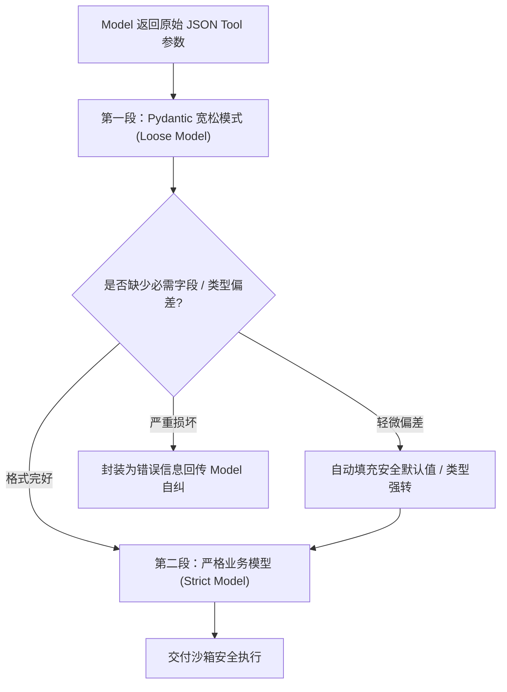
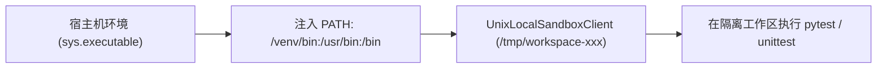
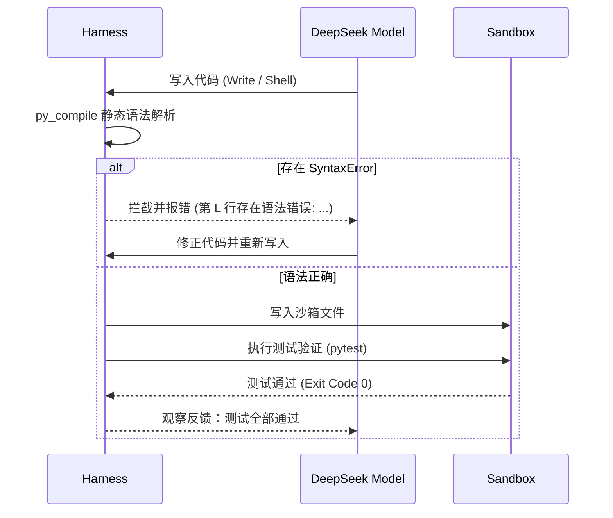
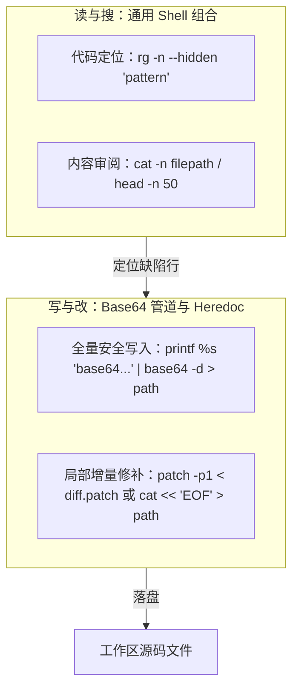

**DeepSeek-Harness** 是面向开源大语言 Model（如 DeepSeek-V3 / R1 等）构建的高可靠 Coding Agent 脚手架。

在闭源商业 Model（如 Claude / GPT）上行之有效的高阶特性（例如服务端托管的 Lark 补丁文法、专有 Responses API、强语义结构化输出），在面对开放 API 与开源端点时往往面临**协议不兼容、格式漂移或指令遵循能力差异**。DeepSeek-Harness 的设计初衷就是探索：**如何通过轻量、健壮且通用的客户端 Harness 设计，让开源大 Model 稳定完成代码修复与端到端评测？**



---

## 1. 核心功能

### 1.1 核心挑战与痛点剖析

开源大 Model 在对接工业级 Coding Harness 时主要面临以下四大挑战：

| 痛点场景 | 典型失效表现 | 传统闭源 Harness 的脆弱点 | DeepSeek-Harness 应对方案 |
| :--- | :--- | :--- | :--- |
| **1. 专有文法不支持** | Model 无法稳定输出特定 AST 补丁格式（如 `apply_patch`）。 | 专有文法深度依赖模型后训练微调与服务端专有解析器。 | **回退到通用 Shell 驱动**：通过标准 `cat > file << 'EOF'` 或 `patch` 改写文件。 |
| **2. 转义字符与语法破坏** | 在通过终端执行多行代码写入时，特殊符号与引号嵌套被 Shell 提前解析。 | 裸字符串拼接极易造成换行错乱与代码损坏。 | **Base64 编码注入**：用 `printf %s '...' \| base64 -d > path` 杜绝转义歧义。 |
| **3. 沙箱环境隔离盲区** | 纯隔离沙箱由于 PATH 被系统级净化，无法调用宿主解释器环境。 | 默认隔离环境缺失项目所需的特定依赖与工具链。 | **Manifest 动态 PATH 注入**：将宿主解释器目录显式透传进沙箱环境变量。 |
| **4. 参数类型幻觉与漂移** | Tool 参数类型微小不匹配或生成多余字段导致请求校验失败。 | 弱 Model 容易在复杂嵌套 JSON Schema 中产生细微格式错误。 | **双段 Pydantic 宽松校验 + 自纠回填机制**。 |

### 1.2 loop 和流程控制

#### 如何构建稳定的自动化修复循环

DeepSeek-Harness 采用基于 Python AsyncIO 的自动化流水线：
- **缺陷定位阶段**：引导 Model 执行测试或代码搜索，定位错误原因。
- **编辑重构阶段**：执行文件修改与静态语法预体检。
- **验证收敛阶段**：重新运行测试，根据 exit code 确定是否收敛退出。



### 1.3 input 拼接与 Prompt 适配

#### 如何适配通用 Chat Completions 接口

面向支持 OpenAI API 标准的开源端点，构造结构精简的系统 Prompt，重点明确 Tool Calling 格式约束与终端命令输出规范，不假设服务端具备专有扩展。

### 1.4 output parser

#### 如何处理参数类型漂移与容错校验

引入双段 Pydantic 容错解析机制，对微小的字段缺失或类型溢出提供默认值修补，大幅降低因格式漂移导致的崩溃：



---

## 2. tool calling

### 2.1 terminal 执行

#### 如何控制 sandbox 环境

为保证代码执行不污染真实工作区，Harness 将每一次运行隔离在临时目录，并通过 Manifest 动态注入 PATH：



```python
def sandbox_manifest() -> Manifest:
    """构造沙箱配置：注入当前解释器路径，保证沙箱内开箱即用运行测试。"""
    python_dir = os.path.dirname(sys.executable)
    path = f"{python_dir}:/usr/local/bin:/usr/bin:/bin"
    return Manifest(environment=Environment(value={"PATH": path}))
```

#### 如何安全执行 Shell 脚本

在 Python SDK 与 OpenAI Agents 体系中，`Filesystem().apply_patch` 属于服务端 Hosted Grammar 工具，开源端点无法支持。DeepSeek-Harness 采取**「以通用 Shell 为核心」**的极简抽象：

```python
def seed_command(path: str, content: str) -> str:
    """使用 Base64 编码构造无转义歧义的文件写入命令。"""
    b64 = b64encode(content.encode("utf-8")).decode("ascii")
    return f"printf %s '{b64}' | base64 -d > {path}"
```

### 2.2 静态语法预检与自纠

#### 如何利用 py_compile 降低失败轮次

在 Model 写入 Python 文件后、正式触发测试前，Harness 提供了一道轻量级的**静态语法预体检**：



这种本地轻量护栏能够大幅减少 Model 因为简单漏括号、缩进错误而在“跑测试 → 报错 → 重改”之间消耗的多余 Turn。

### 2.3 基本 file I/O（读、写、搜）

对于单文件或小模块编辑，Model 可直接在沙箱内使用标准的 Shell Heredoc 语法覆盖或利用 `patch` 局部修改。这种方式对任何支持标准终端的 LLM 均具有 100% 的通用性：



---

## 3. 与 Claude Code 的对照

| 对比维度 | Claude Code (专有工业级) | DeepSeek-Harness (开源通用级) |
| :--- | :--- | :--- |
| **主要定位** | 与 Anthropic 生态深度绑定的交互式 CLI Agent | 适配任意 OpenAI 兼容端点的通用全自动化修复 Harness |
| **语言与运行时** | TypeScript + Node.js (基于 Ink TUI) | Python + OpenAI Agents SDK (基于异步 AsyncIO) |
| **文件编辑哲学** | 厚契约专用 Tool（必须先 Read，`old_string` 唯一匹配替换） | 通用 Shell 驱动（Heredoc / Base64 / Patch 覆盖） |
| **安全机制** | 客户端 AST 语法树深度检测 + 内核级 Seatbelt 沙箱 | 临时目录隔离沙箱 + 环境变量净化 |
| **交互模式** | 用户交互式驱动（人机协同、实时审批） | 自动化管道（给定 Issue 自动搜索/修复/跑测试至通过） |

---

## 参见

- 配套体系分析：[Claude Code 架构深度解析](/harness/claude-code/)。
- 理论与架构总览：[Harness 核心篇](/harness/)。


