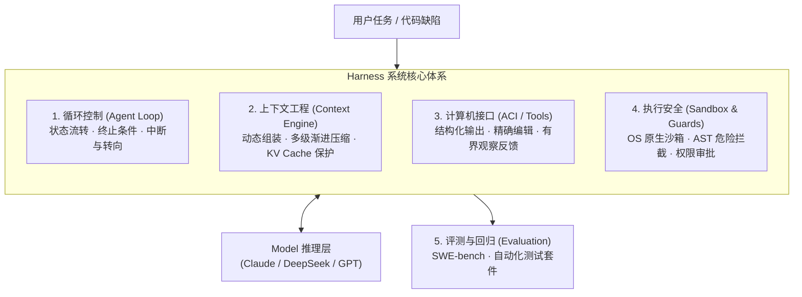
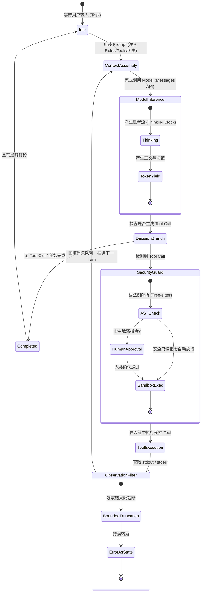
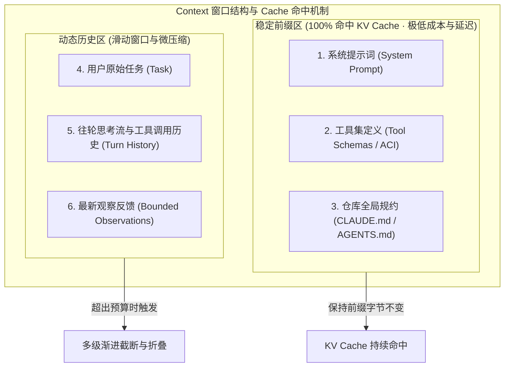

当 LLM 足够通用，Coding Agent 的难点往往不在 Model，而在包住它的脚手架——**Harness**。

```text
Agent = f(Model, Harness)
```

- **Model**：局部的模式匹配、推理与决策；它不能直接读写文件、起进程或感知真实时间。
- **Harness**：驱动主循环，暴露有界的计算机接口（ACI），管理 Context / KV Cache，做沙箱隔离，并接上测试与回归。

工业场景里，可靠性与安全边界，大多落在 Harness 的设计上。

## 体系全景



---

## 阅读顺序

建议按 **学术奠基 → 接口理论 → 工业实现 → 开源适配** 读：

1. **[ReAct 原文](/papers/react-paper/)**：Reasoning 与 Acting 交织，Agent Loop 的理论原点。
2. **[SWE-agent 原文](/papers/swe-agent-paper/)**：Agent-Computer Interface（ACI）与有界接口。
3. **[Claude Code 架构](/harness/claude-code/)**：流式响应、AST 危险拦截、Subagent 与 Cache 友好压缩。
4. **[DeepSeek-Harness 实战](/harness/deepseek/)**：开源大 Model（DeepSeek-V3/R1）上的生产级实践——Tool Calling 护栏、本地沙箱、Shell 驱动与 SWE-bench 回归。

## 运行时状态机

工业级 Coding Harness 的关键，是把不确定的 Model 推理收进确定性的有限状态机：



---

## 内存与上下文

Context 编排直接决定成本与时延。Harness 要像 OS 管内存页一样管 Token 窗口：



## Harness 设计的五项基本法则

| 法则 | 核心内涵 | 典型反模式 |
| :--- | :--- | :--- |
| **1. 观察反馈有界性** | 一切 Tool 返回的字符串必须设置明确的行数/字符数硬上限。 | 裸跑 `cat` 或 `grep` 导致数万行输出撑爆 Context。 |
| **2. 保护稳定前缀** | 静态指令与 Tool Schema 置于开头且保持不变，最大化命中 KV Cache。 | 每轮动态拼接随机 Prompt 导致 Cache 全面击穿。 |
| **3. 接口语义防错** | 为 Model 量身定制 ACI（如先读后写的唯一替换），而非直接抛给原始终端。 | 依赖 Model 手写正则或盲目全量覆盖文件。 |
| **4. 纵深防御沙箱** | 执行边界依赖 OS 内核级隔离（如 Seatbelt / bubblewrap），而非仅靠 Prompt 约束。 | 允许 Model 在裸机环境下执行任意 shell 命令。 |
| **5. 失败恢复优先** | 将 Context 超限、Tool 报错、输出截断作为正常控制流状态接住并重试。 | 遇到非 200 状态码或参数校验失败直接崩溃退出。 |


