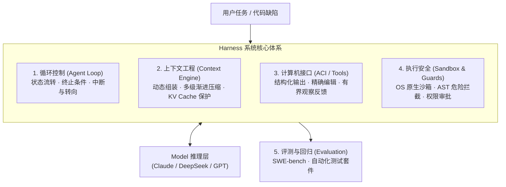
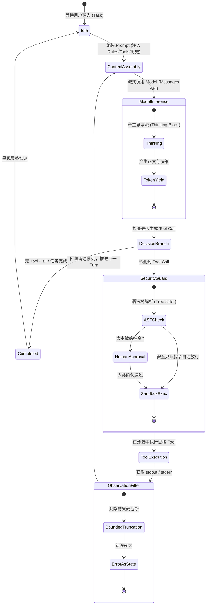

在大语言 Model（LLM）能力日益通用的今天，构建一个能够自主完成真实复杂任务的 Coding Agent，其核心工程挑战已经从 Model 本身转移到了包裹 Model 的脚手架——**Harness**。

```text
Agent = f(Model, Harness)
```

- **Model** 负责局部的模式匹配、推理与决策，它无法直接读写文件、执行系统进程或主动感知时间。
- **Harness** 负责驱动主循环、向 Model 暴露安全的计算机接口（ACI）、管理 Context 与 KV Cache 预算、施加沙箱隔离以及提供测试回归闭环。

一个 Agent 在工业级场景下的可靠性、确定性与安全性，几乎全部取决于 Harness 的架构设计。

---

## 体系全景



---

## 核心章节导航

建议按照 **「学术奠基 → 接口理论 → 专有工业级 → 开源通用级」** 的进阶顺序阅读：

1. **[ReAct 原始论文精读](/papers/react-paper/)**：Reasoning 与 Acting 的交织循环范式，理解 Agent Loop 的理论原点。
2. **[SWE-agent 原始论文精读](/papers/swe-agent-paper/)**：Agent-Computer Interface (ACI) 的提出与有界接口设计准则。
3. **[Claude Code 架构深度解析](/harness/claude-code/)**：Anthropic 官方编码 Agent 的客户端控制哲学——基于 Ink 的流式响应、Tree-sitter AST 语法树危险拦截、单层用后即抛 Subagent 与多级 Cache 友好压缩。
4. **[DeepSeek-Harness 实战与适配](/harness/deepseek/)**：针对开源大 Model（DeepSeek-V3/R1）的生产级 Harness 实践——弱推理 Model 的 Tool Calling 护栏、Unix Local 隔离沙箱、Shell 驱动与真实 SWE-bench 评测闭环。

---

---

## 运行时状态机：Agent 循环的微观流转

一个工业级 Coding Harness 的核心在于**将不确定的 Model 推理包裹在确定性的有限状态机（FSM）中**：



---

## 内存与上下文：KV Cache 前缀保护模型

在大 Model 交互中，Context 的编排直接决定了系统的成本与时延。Harness 必须像操作系统管理内存页一样管理 Token 窗口：


---

## Harness 设计的五项基本法则

| 法则 | 核心内涵 | 典型反模式 |
| :--- | :--- | :--- |
| **1. 观察反馈有界性** | 一切 Tool 返回的字符串必须设置明确的行数/字符数硬上限。 | 裸跑 `cat` 或 `grep` 导致数万行输出撑爆 Context。 |
| **2. 保护稳定前缀** | 静态指令与 Tool Schema 置于开头且保持不变，最大化命中 KV Cache。 | 每轮动态拼接随机 Prompt 导致 Cache 全面击穿。 |
| **3. 接口语义防错** | 为 Model 量身定制 ACI（如先读后写的唯一替换），而非直接抛给原始终端。 | 依赖 Model 手写正则或盲目全量覆盖文件。 |
| **4. 纵深防御沙箱** | 执行边界依赖 OS 内核级隔离（如 Seatbelt / bubblewrap），而非仅靠 Prompt 约束。 | 允许 Model 在裸机环境下执行任意 shell 命令。 |
| **5. 失败恢复优先** | 将 Context 超限、Tool 报错、输出截断作为正常控制流状态接住并重试。 | 遇到非 200 状态码或参数校验失败直接崩溃退出。 |


