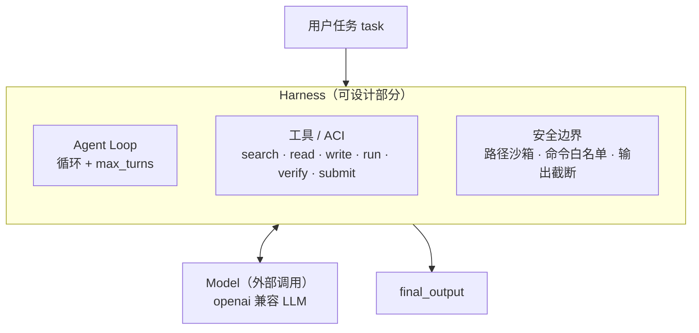
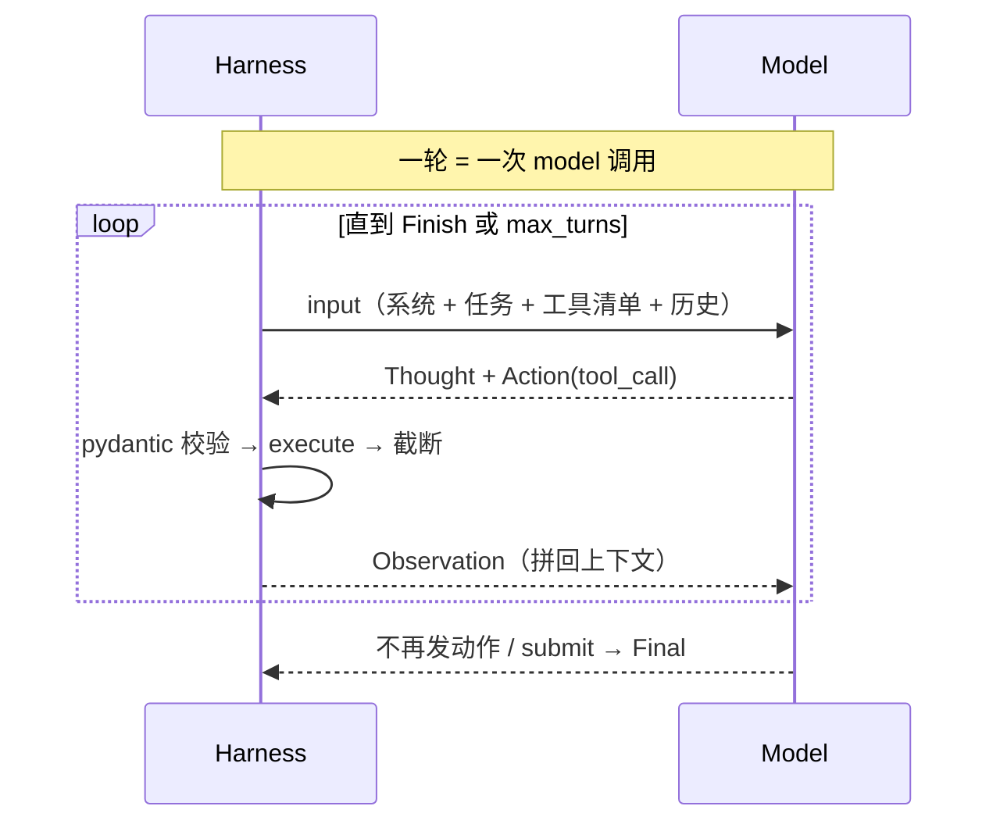
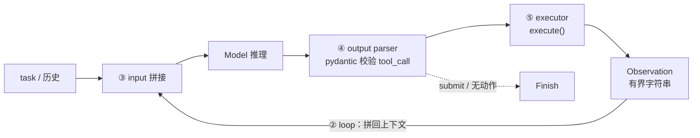
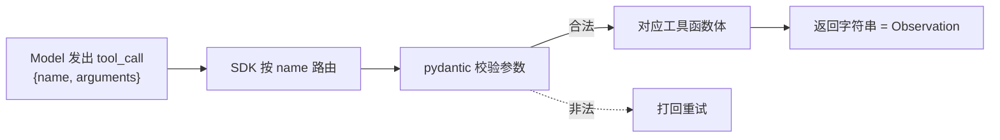
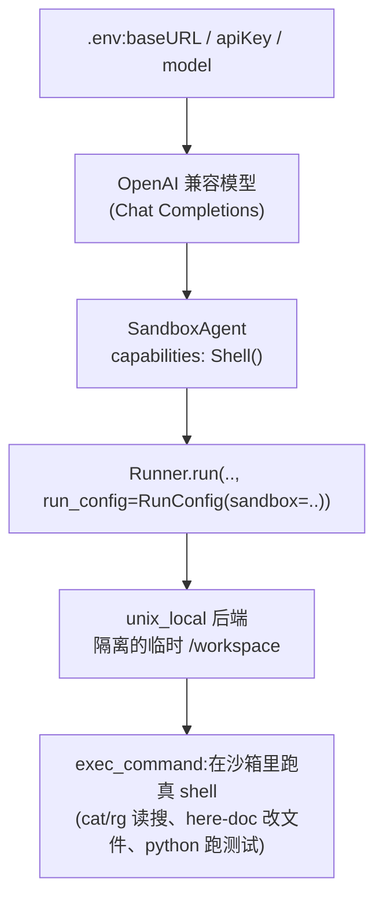

**minimal SWE [agent](https://www.aihero.dev/ai-coding-dictionary/agent)** 是一个用于教学目的的最小化软件工程[agent](https://www.aihero.dev/ai-coding-dictionary/agent) (SWE [agent](https://www.aihero.dev/ai-coding-dictionary/agent))实现,以单个 Python 文件(`main.py`)复现一个能够自主搜索、读写代码、运行测试并修复缺陷的 [agent](https://www.aihero.dev/ai-coding-dictionary/agent) 闭环。

该实现建立在 **[agent](https://www.aihero.dev/ai-coding-dictionary/agent) = [model](https://www.aihero.dev/ai-coding-dictionary/model) + [harness](https://www.aihero.dev/ai-coding-dictionary/harness)** 这一框架之上: [agent](https://www.aihero.dev/ai-coding-dictionary/agent) 由一个大语言[model](https://www.aihero.dev/ai-coding-dictionary/model) ([model](https://www.aihero.dev/ai-coding-dictionary/model))与包裹其外的脚手架([harness](https://www.aihero.dev/ai-coding-dictionary/harness))组成。前者负责推理与决策,后者负责循环控制、[tool](https://www.aihero.dev/ai-coding-dictionary/tool) 暴露、[context](https://www.aihero.dev/ai-coding-dictionary/context) 管理与安全边界。由于 [model](https://www.aihero.dev/ai-coding-dictionary/model) 是外部能力、不可更改, [agent](https://www.aihero.dev/ai-coding-dictionary/agent) 的行为差异几乎全部来自 [harness](https://www.aihero.dev/ai-coding-dictionary/harness) 的设计——因此「实现一个 [agent](https://www.aihero.dev/ai-coding-dictionary/agent) 」在工程上约等于「实现一个 [harness](https://www.aihero.dev/ai-coding-dictionary/harness)」。

在概念来源上,该实现综合了 Shunyu Yao 等人的两项工作:**ReAct** 提供「推理—行动—观察」交织的循环结构,**SWE-agent** 提供面向软件工程任务的 [agent](https://www.aihero.dev/ai-coding-dictionary/agent) —计算机接口(Agent-Computer Interface, ACI)。[model](https://www.aihero.dev/ai-coding-dictionary/model) 由一个 OpenAI 兼容的大语言[model](https://www.aihero.dev/ai-coding-dictionary/model) (LLM)提供;循环控制委托给 `openai-agents`(Python)运行时;其余 [tool](https://www.aihero.dev/ai-coding-dictionary/tool) 与安全逻辑由该文件自身实现。

本条目按[agent](https://www.aihero.dev/ai-coding-dictionary/agent) 的两个层次组织——**控制层**(任务拆分、循环、[context](https://www.aihero.dev/ai-coding-dictionary/context) 拼接、输出解析、执行器)与**执行层**(终端执行与文件读写搜索),并在末尾列出已覆盖与未覆盖的机制。前半部分的片段代码是示意性伪代码,后文单独嵌入当前 `main.py` 的核心代码。

当前仓库的 `main.py` 采用 §9 介绍的做法——把执行与安全交给 OpenAI Agents SDK 的 [sandbox](https://www.aihero.dev/ai-coding-dictionary/sandbox) 原语。而 §1–§8 先以**从零手写**的方式拆解 [harness](https://www.aihero.dev/ai-coding-dictionary/harness) 的每个部件以帮助理解机制(这一从零实现保留在 git 历史),§10 再把两种做法与 Codex / Claude Code 并排。

<details>
<summary>minimal-swe-agent/main.py</summary>

```python
"""minimal SWE agent(Python 版)

SandboxAgent(OpenAI Agents SDK)+ unix_local 沙箱 + Chat Completions API。
兼容任意 OpenAI 兼容端点的 LLM;配置从 .env 读:
OPENAI_BASE_URL / OPENAI_API_KEY / OPENAI_MODEL。
"""

from __future__ import annotations

import asyncio
import os
import sys
from base64 import b64encode

from dotenv import load_dotenv
from openai import AsyncOpenAI

from agents import (
    Runner,
    RunConfig,
    OpenAIChatCompletionsModel,
    set_default_openai_client,
    set_default_openai_api,
    set_tracing_disabled,
)
from agents.sandbox import SandboxAgent, SandboxRunConfig
from agents.sandbox.manifest import Manifest, Environment
from agents.sandbox.capabilities import Shell
from agents.sandbox.sandboxes.unix_local import UnixLocalSandboxClient

INSTRUCTIONS = """You are a minimal SWE agent working inside an isolated sandbox.
Use exec_command to inspect, run, and edit code — write files with the shell
(e.g. a here-doc: cat > file <<'EOF' ... EOF).
Verify your work by running the relevant command before you finish."""

DEFAULT_TASK = (
    "Write calc.py exporting add(a, b), add a unittest test in test_calc.py, "
    "run `python -m unittest`, and report the result."
)


def build_agent() -> SandboxAgent:
    """从 .env 读 OpenAI 兼容端点配置,构造一个走 Chat Completions 的 SandboxAgent。"""
    load_dotenv()
    api_key = os.environ.get("OPENAI_API_KEY")
    base_url = os.environ.get("OPENAI_BASE_URL")
    model = os.environ.get("OPENAI_MODEL")
    if not (api_key and base_url and model):
        raise RuntimeError(
            "请在 .env 配置 OPENAI_BASE_URL / OPENAI_API_KEY / OPENAI_MODEL"
        )
    client = AsyncOpenAI(api_key=api_key, base_url=base_url)
    set_default_openai_client(client)
    set_default_openai_api("chat_completions")  # 用 Chat Completions,兼容任意厂商
    set_tracing_disabled(True)
    return SandboxAgent(
        name="mini-swe",
        instructions=INSTRUCTIONS,
        model=OpenAIChatCompletionsModel(model, client),
        # 只用 Shell()→exec_command(跑命令 + 用 shell 改文件)。
        # Filesystem() 的 apply_patch 是 hosted grammar tool,Chat Completions 不支持;
        # 用 shell 改文件既兼容任意厂商,也是弱模型的实际行为。
        capabilities=[Shell()],
    )


def sandbox_manifest() -> Manifest:
    """沙箱默认 PATH 不含本机 python,注入当前解释器目录,保证沙箱里能跑 python。"""
    python_dir = os.path.dirname(sys.executable)
    path = f"{python_dir}:/usr/local/bin:/usr/bin:/bin"
    return Manifest(environment=Environment(value={"PATH": path}))


def seed_command(path: str, content: str) -> str:
    """用 base64 生成「把文本写进沙箱文件」的 shell 命令(规避 shell 转义)。"""
    b64 = b64encode(content.encode("utf-8")).decode("ascii")
    return f"printf %s '{b64}' | base64 -d > {path}"


async def main() -> None:
    """入口:把命令行任务交给 agent,在隔离沙箱里执行,打印结果。"""
    agent = build_agent()
    task = sys.argv[1] if len(sys.argv) > 1 else DEFAULT_TASK
    result = await Runner.run(
        agent,
        task,
        max_turns=20,
        run_config=RunConfig(
            sandbox=SandboxRunConfig(
                client=UnixLocalSandboxClient(),
                manifest=sandbox_manifest(),
            )
        ),
    )
    print(result.final_output)


if __name__ == "__main__":
    asyncio.run(main())
```

</details>

---

## 1. 概念框架:agent = model + harness

- **[model](https://www.aihero.dev/ai-coding-dictionary/model)** 指会「推理」的部分。给定[context](https://www.aihero.dev/ai-coding-dictionary/context),它输出「一段推理 + 一个动作」,本身不读文件、不执行命令、不维持循环。本实现使用一个 OpenAI 兼容的 LLM。
- **[harness](https://www.aihero.dev/ai-coding-dictionary/harness)** 指包裹 [model](https://www.aihero.dev/ai-coding-dictionary/model)、使其能够实际工作的全部脚手架,职责包括驱动循环、暴露 [tool](https://www.aihero.dev/ai-coding-dictionary/tool)、将结果回馈 [context](https://www.aihero.dev/ai-coding-dictionary/context)、施加安全边界以及决定终止条件。



整个实现中与 [model](https://www.aihero.dev/ai-coding-dictionary/model) 直接相关的仅有配置部分,其余均属 [harness](https://www.aihero.dev/ai-coding-dictionary/harness):

```python
def build_agent():
    client = AsyncOpenAI(api_key=..., base_url=...)   # LLM API 接入点(任意 openai 兼容端点)
    set_default_openai_api('responses')               # 从零手写版走 Responses API
    agent = Agent(
        instructions=PROMPT,                          # 系统提示词(见 §3.3)
        model=model,
        tools=[search, read_file, write_file, run_command, verify, submit],
    )
    return agent, runner
```

工程实践常将 [harness](https://www.aihero.dev/ai-coding-dictionary/harness) 进一步区分为三个由内而外的层次:

| 层次 | 关注点 | 在本实现中的体现 |
|---|---|---|
| Prompt Engineering | 单次提示词的写法 | `PROMPT`、各 [tool](https://www.aihero.dev/ai-coding-dictionary/tool) 的 `description` |
| [context](https://www.aihero.dev/ai-coding-dictionary/context) Engineering | [context window](https://www.aihero.dev/ai-coding-dictionary/context-window) 中放置什么(检索/压缩/截断) | 输出截断、读文件 240 行上限 |
| [harness](https://www.aihero.dev/ai-coding-dictionary/harness) Engineering | [model](https://www.aihero.dev/ai-coding-dictionary/model) 外围的整套系统(循环/ [tool](https://www.aihero.dev/ai-coding-dictionary/tool) /安全/评测) | 整个 `main.py` |

> **Q:** 为何说 [agent](https://www.aihero.dev/ai-coding-dictionary/agent) ≈ [harness](https://www.aihero.dev/ai-coding-dictionary/harness)?
> **A:** [model](https://www.aihero.dev/ai-coding-dictionary/model) 是外部能力、不可更改; [agent](https://www.aihero.dev/ai-coding-dictionary/agent) 的行为差异几乎都来自 [harness](https://www.aihero.dev/ai-coding-dictionary/harness)——循环如何驱动、提供哪些[tool](https://www.aihero.dev/ai-coding-dictionary/tool)、[tool](https://www.aihero.dev/ai-coding-dictionary/tool) 如何反馈、[context](https://www.aihero.dev/ai-coding-dictionary/context) 如何管理。SWE-agent 的实验已证明:同一[model](https://www.aihero.dev/ai-coding-dictionary/model) 更换 [harness](https://www.aihero.dev/ai-coding-dictionary/harness),性能差异显著。

---

## 2. 理论来源:ReAct 与 SWE-agent

ReAct 与 SWE-agent 是 [harness](https://www.aihero.dev/ai-coding-dictionary/harness) 的两个正交视角:前者刻画循环的时间结构,后者刻画 [tool](https://www.aihero.dev/ai-coding-dictionary/tool) 接口的质量。

### 2.1 ReAct(循环结构)

**ReAct**(Reasoning and Acting)指让 [model](https://www.aihero.dev/ai-coding-dictionary/model) 把推理与行动交织成循环 `Thought → Action → Observation → … → Finish`,以弥补「纯推理缺乏外部校正而易 [hallucination](https://www.aihero.dev/ai-coding-dictionary/hallucination)、纯行动缺乏思考而不会规划」两种失败模式。



### 2.2 SWE-agent(ACI)

**ACI**(Agent-Computer Interface)是 SWE-agent 提出的核心概念,主张为 [model](https://www.aihero.dev/ai-coding-dictionary/model) **专门设计**一套软件工程[tool](https://www.aihero.dev/ai-coding-dictionary/tool) 接口,其效果优于直接提供一个完整终端。本实现的 [tool](https://www.aihero.dev/ai-coding-dictionary/tool) 逐条对应 ACI 原则:文件按行号分页、搜索结果简短且可跳转、命令输出包含退出码并截断、文件编辑带护栏、每步返回结构化观察(observation)。

> **Q:** ReAct 与 SWE-agent 是什么关系?
> **A:** 二者正交。ReAct 定义[harness](https://www.aihero.dev/ai-coding-dictionary/harness) 的循环形状(时间轴),SWE-agent 定义[harness](https://www.aihero.dev/ai-coding-dictionary/harness) 的 [tool](https://www.aihero.dev/ai-coding-dictionary/tool) 接口质量(空间轴)。minimal SWE [agent](https://www.aihero.dev/ai-coding-dictionary/agent) 即「ReAct 循环 × ACI [tool](https://www.aihero.dev/ai-coding-dictionary/tool) 」构成的 [harness](https://www.aihero.dev/ai-coding-dictionary/harness) 包裹一个 [model](https://www.aihero.dev/ai-coding-dictionary/model)。

---

## 3. 控制层:核心功能

控制层指 [agent](https://www.aihero.dev/ai-coding-dictionary/agent) 在一轮([turn](https://www.aihero.dev/ai-coding-dictionary/turn))内的决策流水线,由五个部件构成:



### 3.1 任务拆分 · `Planning`

任务拆分指将大任务分解为可执行子任务的能力,可分为显式(由规划器先生成计划)与隐式(由 ReAct 循环逐步涌现)两条路线。本实现**不含独立的拆分部件**,这是有意的最小化取舍:任务以单个字符串原样进入循环,拆分隐式涌现于 [model](https://www.aihero.dev/ai-coding-dictionary/model) 内部。原版 SWE-agent 同样采用扁平结构。

```python
def main():
    task = argv[1] or '修复失败的测试,然后重新跑测试直到通过'   # 单字符串,无规划器
    result = runner.run(agent, task, max_turns=10)
    print(result.final_output)
```

> **Q:** 该 [agent](https://www.aihero.dev/ai-coding-dictionary/agent) 如何进行任务规划?
> **A:** 最小版本不做显式规划,依靠 ReAct 走一步看一步;显式规划器、子任务队列、多[agent](https://www.aihero.dev/ai-coding-dictionary/agent) 属于更重的 [harness](https://www.aihero.dev/ai-coding-dictionary/harness),留作后续。

### 3.2 循环控制 · `Agent Loop`

循环控制指反复「调用 [model](https://www.aihero.dev/ai-coding-dictionary/model) → 执行动作 → 回馈结果」直至终止的主循环。本实现将其委托给运行时的 `runner.run(agent, task, max_turns=10)` 一行,其内部逻辑等价于:

```python
messages = [系统提示, task]
重复至多 max_turns 次:
    reply = model(messages)              # Thought:推理
    if reply 含 tool_call:
        obs = 执行工具(reply.tool_call)   # Observation:执行并取回结果
        messages += [reply, obs]         # ★ 把 observation 拼回上下文 —— ReAct 的核心
    else:
        return reply                     # Finish
```

终止条件为: [model](https://www.aihero.dev/ai-coding-dictionary/model) 不再发起 [tool call](https://www.aihero.dev/ai-coding-dictionary/tool-call) (或显式调用 `submit`),或循环次数触及 `max_turns` 上界。

> **Q:** [agent](https://www.aihero.dev/ai-coding-dictionary/agent) Loop 如何终止?是否会死循环?
> **A:** 两个出口—— [model](https://www.aihero.dev/ai-coding-dictionary/model) 停止 [tool call](https://www.aihero.dev/ai-coding-dictionary/tool-call) (或 submit)即正常结束;`max_turns` 上界强制兜底,防止死循环。

### 3.3 上下文拼接 · `Context / Prompt Engineering、KV Cache`

[context](https://www.aihero.dev/ai-coding-dictionary/context) 拼接指每轮送入 [model](https://www.aihero.dev/ai-coding-dictionary/model) 的内容如何组装,由系统指令、任务、[tool](https://www.aihero.dev/ai-coding-dictionary/tool) 清单与累积历史四部分构成。系统指令本身十分简短(要求先搜索再编辑、提交前先验证)。

值得注意的是, [tool](https://www.aihero.dev/ai-coding-dictionary/tool) 的 `description` 与参数说明**本身即构成提示词的一部分**, [model](https://www.aihero.dev/ai-coding-dictionary/model) 据此判断调用哪个 [tool](https://www.aihero.dev/ai-coding-dictionary/tool) 及如何填写参数。在 Python 里,函数的 docstring 与类型标注即扮演这一角色:

```python
@function_tool
def search(term, directory):
    """搜索文本,返回至多 50 条 path:line:preview"""   # ← 这句 docstring 是给模型看的"提示词"
    # 参数名与类型标注(term: str、directory: str)同样进入 prompt
    ...  # 见 §4.2
```

> **Q:** 这与 KV Cache 有何关系?
> **A:** 系统指令与 [tool](https://www.aihero.dev/ai-coding-dictionary/tool) 清单构成**稳定前缀**,易于命中 KV Cache(降低延迟与成本),变化的是末尾历史。因此 [harness](https://www.aihero.dev/ai-coding-dictionary/harness) 设计宜保持前缀稳定、将变动置于末尾。本实现未显式管理缓存。

### 3.4 输出解析 · `Tool Use（结构化输出）`

输出解析指将 [model](https://www.aihero.dev/ai-coding-dictionary/model) 输出转化为可执行动作。手工实现的 ReAct 需以正则解析 `Action: xxx(...)`;现代做法改用原生函数调用(function calling)。本实现不解析自由文本—— [model](https://www.aihero.dev/ai-coding-dictionary/model) 直接返回结构化的 `tool_call`,再由各 [tool](https://www.aihero.dev/ai-coding-dictionary/tool) 的参数 schema(pydantic)校验:

```python
# 由函数签名 + 类型标注自动生成 schema:
def read_file(path: str, start: int = 1, limit: int = 120): ...
# 模型给出的参数若不符合该 schema,运行时自动打回令其重试 —— pydantic 即解析器
```

### 3.5 执行器 · `Tool Use / Harness Engineering`

执行器指真正触及外部世界(文件、进程)的执行体,即每个 [tool](https://www.aihero.dev/ai-coding-dictionary/tool) 的函数体。由于参数校验已保证合法,执行器只需专注「执行 + 业务护栏」;其返回字符串即构成 Observation。具体实现见第 4 节。

**控制层归属一览**

| 部件 | 层位 | 实现状态 | 归属 |
|---|---|---|---|
| 任务拆分 | [harness](https://www.aihero.dev/ai-coding-dictionary/harness) 之上 | 不存在,涌现于 [model](https://www.aihero.dev/ai-coding-dictionary/model) | —(取舍) |
| 循环控制 | [harness](https://www.aihero.dev/ai-coding-dictionary/harness) | `runner.run` + `max_turns` | SDK |
| [context](https://www.aihero.dev/ai-coding-dictionary/context) 拼接 | [model](https://www.aihero.dev/ai-coding-dictionary/model) 入口 | 静态(本文件)+ 动态历史(SDK) | 本文件 + SDK |
| 输出解析 | [model](https://www.aihero.dev/ai-coding-dictionary/model) 出口 | 原生[tool call](https://www.aihero.dev/ai-coding-dictionary/tool-call) + pydantic | API + 本文件 |
| 执行器 | [harness](https://www.aihero.dev/ai-coding-dictionary/harness) | 函数体 + 护栏 | 本文件 |

[model](https://www.aihero.dev/ai-coding-dictionary/model) 位于「[context](https://www.aihero.dev/ai-coding-dictionary/context) 拼接」与「输出解析」之间;任务拆分、循环控制、执行器三者属纯 [harness](https://www.aihero.dev/ai-coding-dictionary/harness)。

---

## 4. 执行层:工具调用(Tool calling)

[tool call](https://www.aihero.dev/ai-coding-dictionary/tool-call) 的接线无需手写分发:用 `@function_tool` 装饰的函数经 `Agent(tools=[...])` 注册,其余由运行时完成。



### 4.1 终端:执行与读取输出

终端命令的执行与输出读取由单一函数 `run_safe` 完成,`run_command` 与 `verify` 均复用之。两者在一次 `subprocess.run` 调用中一并完成:

```python
def run_safe(command):
    if 含 shell 元字符: return 'refuse'                   # 拒注入
    argv = command.split()                              # 自己切,不交给 shell
    if argv[0] 不在白名单: return 'refuse'               # 只放只读/构建类命令
    r = subprocess.run(argv, cwd=ROOT, timeout=60,      # 直接起进程、shell=False
                       capture_output=True, text=True)  # 限定目录 + 超时
    return f'exit={r.returncode} out={stdout|截断} err={stderr|截断}'  # 读输出 + 截断防爆上下文
# 白名单 ALLOWED = { cat, grep, head, ls, tail, rg, python, pytest, ... }
# verify 仅是把固定的 [python -m py_compile, pytest -q] 逐条交给 run_safe,复用同一执行器
```

`subprocess.run(..., shell=False)` 直接启动进程而不经 shell,使管道、`&&`、`$()`、重定向、通配等 shell 特性全部失效。这是有意为之:无 shell 解释即从源头排除一类注入,叠加「拒绝元字符 + 白名单」构成三重防护。同步调用阻塞至进程退出并一次取回完整结果,契合 [agent](https://www.aihero.dev/ai-coding-dictionary/agent) 循环的需要。

> **Q:** 为何用 `subprocess.run(shell=False)` 而非 `shell=True`?
> **A:** `shell=True` 会把命令交给 shell 解释元字符,存在注入风险且跨平台行为不一致;`shell=False` 直接起进程、参数为列表、不经 shell,更安全可控,代价是无法使用管道等 shell 特性——而最小 [agent](https://www.aihero.dev/ai-coding-dictionary/agent) 本不需要。

### 4.2 文件 I/O:读、写、搜 · `Tool Use`

**读取**——整文件读入后按窗口切片,并为每行附加行号:

```python
def read_file(path, start=1, limit=120):
    lines = 读整个文件(safe_path(path)).按行切分
    窗口 = lines[start : start+limit]          # limit 硬上限 240 行
    每行前补行号                                # 使模型可引用"第 N 行"
    return f'{path} {范围}/{总行数}' + 带行号的窗口
```

**写入**——整文件覆盖,但带两道护栏:

```python
def write_file(path, content):
    target = safe_path(path)
    if target 含 .git: return 'refuse'                  # 护栏1:不写入 .git
    if target 是 .py 且 语法检查不过: return 'refuse'   # 护栏2:写前体检,出错即拒
    写入文件(target, content)                           # 省去"写错→报错→再改"的回合
    return f'wrote {path}'
```

**搜索**——以纯 Python 实现的递归搜索,**不调用 `grep`/`rg`**:

```python
def search(term, directory):
    hits = []
    递归遍历 directory:                        # 等价 grep -r
        跳过 .git / __pycache__ 等             # SKIP 剪枝
        跳过二进制 / 读不了的文件
        对每行: if term in 行:                 # 字面子串匹配(非正则)
            hits += f'{文件}:{行号}: {预览}'
            if len(hits) == 50: 停止           # 有界,短路返回
    return hits or 'not found'
# 不调外部 grep/rg 的理由:跨平台(Windows 无 grep)、掌控输出格式、无命令注入面;代价是慢、仅子串
```

### 4.3 安全边界

路径 [sandbox](https://www.aihero.dev/ai-coding-dictionary/sandbox) 是所有文件操作的第一道关卡:

```python
def safe_path(path):
    target = 解析为绝对路径(ROOT, path)
    if target 不在 ROOT 内: raise '逃逸工作区'   # 挡住 ../ 逃逸
    return target
```

写入前的语法检查 `check_py_syntax`:用 `py_compile` / `compile()` 对内容做单文件语法诊断(不真执行),返回第一个语法错误的 `line N: 消息`,无错则返回 None。

三条贯穿全部 I/O 的约定:其一,一律使用同步 API(`subprocess.run` 等),换取简单与确定性,代价是阻塞(对单用户 CLI 可接受);其二,一律先经 `safe_path` [sandbox](https://www.aihero.dev/ai-coding-dictionary/sandbox);其三,一律返回**有界字符串**(命令输出、读取 240 行、搜索 50 条均设上限),因返回值需回馈 [context](https://www.aihero.dev/ai-coding-dictionary/context)。

> **Q:** 允许 [model](https://www.aihero.dev/ai-coding-dictionary/model) 执行命令是否危险?
> **A:** 设有三道关卡——白名单仅放只读/构建类命令、拒绝 shell 元字符且 `shell=False` 不经 shell、路径锁定工作区;另以超时与输出截断防止失控。

---

## 5. 机制覆盖对照

下面这些机制是理解 [harness](https://www.aihero.dev/ai-coding-dictionary/harness) 时常见的关键项:LLM API、KV Cache、[agent](https://www.aihero.dev/ai-coding-dictionary/agent) Loop、[tool](https://www.aihero.dev/ai-coding-dictionary/tool) Use、Reasoning、Planning、Skills、[MCP](https://www.aihero.dev/ai-coding-dictionary/mcp)、Memory、[subagent](https://www.aihero.dev/ai-coding-dictionary/subagent)、Multi-Agent,并对 Prompt/[context](https://www.aihero.dev/ai-coding-dictionary/context)/[harness](https://www.aihero.dev/ai-coding-dictionary/harness) Engineering 有较深理解。本实现的覆盖情况如下:

| 机制 | 定义 | 本实现 | 要点 |
|---|---|---|---|
| **LLM API** | 调用 [model](https://www.aihero.dev/ai-coding-dictionary/model) 的接口(Chat Completions / Responses) | ✅ 经兼容 SDK 接 LLM | 从零手写版用 `responses`;当前 `main.py` 用 `chat_completions`(见 §9) |
| **KV Cache** | 缓存历史 [token](https://www.aihero.dev/ai-coding-dictionary/token) 的 K/V 以免重算,稳定前缀可命中 | ⚠️ 未显式管理 | 系统指令与 [tool](https://www.aihero.dev/ai-coding-dictionary/tool) 清单为天然稳定前缀 |
| **[agent](https://www.aihero.dev/ai-coding-dictionary/agent) Loop** | 反复「调 [model](https://www.aihero.dev/ai-coding-dictionary/model) →执行→回馈」直至结束 | ✅ 由 SDK 拥有 | `runner.run` + `max_turns`,出口为 submit/无动作或上界 |
| **[tool](https://www.aihero.dev/ai-coding-dictionary/tool) Use** | [model](https://www.aihero.dev/ai-coding-dictionary/model) 经结构化函数调用调用外部 [tool](https://www.aihero.dev/ai-coding-dictionary/tool) | ✅ 6 [tool](https://www.aihero.dev/ai-coding-dictionary/tool) + pydantic + 函数体 | 原生[tool call](https://www.aihero.dev/ai-coding-dictionary/tool-call),pydantic 校验,函数体执行 |
| **Reasoning** | [model](https://www.aihero.dev/ai-coding-dictionary/model) 推理(CoT / reasoning tokens / effort) | ⚠️ 依赖 [model](https://www.aihero.dev/ai-coding-dictionary/model) 自身 | Responses 支持 `reasoning.effort`,本实现暂未启用 |
| **Planning** | 显式规划 vs ReAct 隐式逐步 | ❌ 无规划器 | 拆分涌现于 [model](https://www.aihero.dev/ai-coding-dictionary/model) 内 |
| **Skills** | 渐进式加载的可复用能力包(如[skill](https://www.aihero.dev/ai-coding-dictionary/skill).md) | ❌ 无 | — |
| **[MCP](https://www.aihero.dev/ai-coding-dictionary/mcp)** | 跨进程连接外部 [tool](https://www.aihero.dev/ai-coding-dictionary/tool) /数据/提示的标准协议 | ❌ 进程内函数,非 [MCP](https://www.aihero.dev/ai-coding-dictionary/mcp) | [tool](https://www.aihero.dev/ai-coding-dictionary/tool) 为本地函数,而非 [MCP](https://www.aihero.dev/ai-coding-dictionary/mcp) server |
| **Memory** | 跨 [turn](https://www.aihero.dev/ai-coding-dictionary/turn)/[session](https://www.aihero.dev/ai-coding-dictionary/session) 的状态保留 | ❌ 无持久化 | [context](https://www.aihero.dev/ai-coding-dictionary/context) 即记忆,随 `max_turns` 截断 |
| **[subagent](https://www.aihero.dev/ai-coding-dictionary/subagent)** | 主 [agent](https://www.aihero.dev/ai-coding-dictionary/agent) 派生[subagent](https://www.aihero.dev/ai-coding-dictionary/subagent) (独立[context](https://www.aihero.dev/ai-coding-dictionary/context))处理子任务 | ❌ 无 | 单 [agent](https://www.aihero.dev/ai-coding-dictionary/agent) |
| **Multi-Agent** | 多个 [agent](https://www.aihero.dev/ai-coding-dictionary/agent) 协作/分工 | ❌ 无 | 单 [agent](https://www.aihero.dev/ai-coding-dictionary/agent) |
| **Prompt/[context](https://www.aihero.dev/ai-coding-dictionary/context)/[harness](https://www.aihero.dev/ai-coding-dictionary/harness) Eng.** | 三层工程(见 §1) | ✅ 第一手 | [tool](https://www.aihero.dev/ai-coding-dictionary/tool) 描述 / 截断 / 整套脚手架 |

---

## 6. 常见问答速查

- **[agent](https://www.aihero.dev/ai-coding-dictionary/agent) 是什么?** — [model](https://www.aihero.dev/ai-coding-dictionary/model) + [harness](https://www.aihero.dev/ai-coding-dictionary/harness);[harness](https://www.aihero.dev/ai-coding-dictionary/harness) 是可设计的全部。
- **ReAct 三要素?** — Thought / Action / Observation,循环至 Finish。
- **ACI 是什么?** — 为 [model](https://www.aihero.dev/ai-coding-dictionary/model) 设计的计算机接口;同[model](https://www.aihero.dev/ai-coding-dictionary/model) 更换接口,性能差异显著。
- **一轮 [turn](https://www.aihero.dev/ai-coding-dictionary/turn) 发生什么?** — [context](https://www.aihero.dev/ai-coding-dictionary/context) 拼接 → [model](https://www.aihero.dev/ai-coding-dictionary/model) → pydantic 解析 tool_call → 执行 → observation 回馈。
- **循环如何终止?** — submit / 无动作,或 `max_turns` 兜底。
- **输出如何解析?** — 原生函数调用 + pydantic,不写正则。
- **`shell=False` 为何更安全?** — 不经 shell 即防注入、跨平台一致;代价是放弃管道等 shell 特性。
- **搜索为何自行实现?** — 跨平台 + 掌控输出 + 无注入;代价是较慢、仅子串。
- **如何防止 [context](https://www.aihero.dev/ai-coding-dictionary/context) 膨胀?** — 一切返回有界:命令输出、240 行、50 条均设上限。
- **安全三道关卡?** — 路径 [sandbox](https://www.aihero.dev/ai-coding-dictionary/sandbox) / 命令白名单且不经 shell / 写入护栏。

---

## 7. 局限与延伸方向

明确边界本身具有价值。最小版本尚未实现、且恰好对应岗位研究前沿的方向包括:

- 自行实现循环,以厘清「observation 回馈」一步运行时究竟代办了什么 — 对应 **[agent](https://www.aihero.dev/ai-coding-dictionary/agent) Loop**
- 长期记忆(跨 [session](https://www.aihero.dev/ai-coding-dictionary/session)) — 对应 **Memory / [context](https://www.aihero.dev/ai-coding-dictionary/context) 管理**
- [subagent](https://www.aihero.dev/ai-coding-dictionary/subagent) / 多[agent](https://www.aihero.dev/ai-coding-dictionary/agent),将「拆分」从隐式涌现改为显式编排 — 对应 **[subagent](https://www.aihero.dev/ai-coding-dictionary/subagent) / Multi-Agent**
- 接入 [MCP](https://www.aihero.dev/ai-coding-dictionary/mcp),将进程内 [tool](https://www.aihero.dev/ai-coding-dictionary/tool) 替换为标准协议 [tool](https://www.aihero.dev/ai-coding-dictionary/tool) — 对应 **[MCP](https://www.aihero.dev/ai-coding-dictionary/mcp)**
- 在真实 SWE-bench 任务上运行,而非仅在 [sandbox](https://www.aihero.dev/ai-coding-dictionary/sandbox) 里修复示例函数 — 对应**评测基准**

## 8. 概念补遗:minimal 版未覆盖的机制

第 5 节表中标记为 ❌/⚠️ 的机制,本实现并未涉及。以下按权威来源给出其概念介绍,以便理解这些「缺口」本身。凡 OpenAI 与 Anthropic 框定不同处,一律以 OpenAI 口径为准。

**KV Cache(键值缓存)** 是 Transformer 类 [model](https://www.aihero.dev/ai-coding-dictionary/model) 在自回归推理时的加速技术:把每层注意力中已生成 [token](https://www.aihero.dev/ai-coding-dictionary/token) 的 Key 与 Value 张量缓存下来,使后续每生成一个新 [token](https://www.aihero.dev/ai-coding-dictionary/token) 只需为该 [token](https://www.aihero.dev/ai-coding-dictionary/token) 计算注意力,而无需对整段历史重复计算,从而把逐 [token](https://www.aihero.dev/ai-coding-dictionary/token) 生成的复杂度从二次降为线性。代价是显存随序列长度线性增长,故有量化、分页(PagedAttention)等优化。对 [agent](https://www.aihero.dev/ai-coding-dictionary/agent) 的工程含义:保持 prompt 前缀稳定可提高缓存命中。(来源:Hugging Face《KV Caching Explained》。该概念为底层推理工程,OpenAI 与 Anthropic 无冲突框定。)

**Reasoning(推理 / 思维链 / reasoning effort)** 指 [model](https://www.aihero.dev/ai-coding-dictionary/model) 在给出最终答案前先生成一段内部「推理 [token](https://www.aihero.dev/ai-coding-dictionary/token)」来思考。按 OpenAI 文档,推理 [model](https://www.aihero.dev/ai-coding-dictionary/model) 「在产出回应前使用内部 reasoning [token](https://www.aihero.dev/ai-coding-dictionary/token),帮助规划、有效调用 [tool](https://www.aihero.dev/ai-coding-dictionary/tool)、审视备选方案并解决多步任务」,这段内部思考即思维链(CoT);`reasoning_effort` 参数(none→minimal→low→medium→high→xhigh)控制思考量,越高越深、延迟与成本越高。DeepSeek-R1 进一步表明这类长链推理可由纯强化学习激励涌现。(来源:OpenAI《Reasoning models》;DeepSeek-AI《DeepSeek-R1》arXiv:2501.12948。以 OpenAI 术语「reasoning / reasoning effort」为准;Anthropic 对应能力称「extended thinking」并以 [token](https://www.aihero.dev/ai-coding-dictionary/token) 预算控制。)

**Planning(任务规划)** 指 [model](https://www.aihero.dev/ai-coding-dictionary/model) 在执行前或执行中自主把复杂目标拆解为可管理的子任务、按序执行并随意外调整。OpenAI 把 [agent](https://www.aihero.dev/ai-coding-dictionary/agent) 定义为「能规划、调用 [tool](https://www.aihero.dev/ai-coding-dictionary/tool)、在多个专才间协作并保持状态以完成多步工作的应用」,即规划与 [tool call](https://www.aihero.dev/ai-coding-dictionary/tool-call) 在一个受控循环中迭代进行;多[agent](https://www.aihero.dev/ai-coding-dictionary/agent) 编排中常由中心(manager)[agent](https://www.aihero.dev/ai-coding-dictionary/agent) 负责规划并委派子任务。(来源:OpenAI《Agents》文档、Cookbook《Multi-Agent Portfolio Collaboration》。本仓库无显式 planner,规划隐式涌现于 [model](https://www.aihero.dev/ai-coding-dictionary/model),见 §3.1。)

**Memory(长期记忆)** 指 [agent](https://www.aihero.dev/ai-coding-dictionary/agent) 在多次交互或多次运行之间保留并复用信息。OpenAI 工程上区分两层:**短期记忆**由 Sessions 承担,自动在多轮间维护对话历史;**长期记忆**则把历次运行中提炼出的偏好、约束记为「记忆笔记」,供未来运行复用,与 [session](https://www.aihero.dev/ai-coding-dictionary/session) 级消息历史相互独立。(来源:OpenAI Agents SDK Sessions / Memory 文档。以 OpenAI「[session](https://www.aihero.dev/ai-coding-dictionary/session) 级短期记忆 vs 跨运行长期记忆」的区分为准;本仓库无持久记忆, [context](https://www.aihero.dev/ai-coding-dictionary/context) 即记忆,随 `max_turns` 截断。)

**[subagent](https://www.aihero.dev/ai-coding-dictionary/subagent)([subagent](https://www.aihero.dev/ai-coding-dictionary/subagent))** 指可由父 [agent](https://www.aihero.dev/ai-coding-dictionary/agent) 通过「agent-as-tool」方式调用的 [agent](https://www.aihero.dev/ai-coding-dictionary/agent):父 [agent](https://www.aihero.dev/ai-coding-dictionary/agent) 委派子任务,子 [agent](https://www.aihero.dev/ai-coding-dictionary/agent) 自主执行后返回结果,控制权随即交还父 [agent](https://www.aihero.dev/ai-coding-dictionary/agent)。它与 [handoff](https://www.aihero.dev/ai-coding-dictionary/handoff)([handoff](https://www.aihero.dev/ai-coding-dictionary/handoff))不同—— [handoff](https://www.aihero.dev/ai-coding-dictionary/handoff) 是把对话整体顺序转交新 [agent](https://www.aihero.dev/ai-coding-dictionary/agent),而子 [agent](https://www.aihero.dev/ai-coding-dictionary/agent) 在原对话之外被当作 [tool call](https://www.aihero.dev/ai-coding-dictionary/tool-call)、可并行,控制权最终回到父 [agent](https://www.aihero.dev/ai-coding-dictionary/agent)。OpenAI 指出该模式在长程任务上通常优于单体 [agent](https://www.aihero.dev/ai-coding-dictionary/agent)。(来源:OpenAI Agents SDK Agents / Codex Subagents 文档。)

**Multi-Agent(多[agent](https://www.aihero.dev/ai-coding-dictionary/agent))** 指多个自主 [agent](https://www.aihero.dev/ai-coding-dictionary/agent)(各为配置了指令、[tool](https://www.aihero.dev/ai-coding-dictionary/tool) 与 [handoff](https://www.aihero.dev/ai-coding-dictionary/handoff) 能力的 LLM「节点」)协同完成单体 [agent](https://www.aihero.dev/ai-coding-dictionary/agent) 难以独立处理的目标。OpenAI 将其归纳为两类模式:**[handoff](https://www.aihero.dev/ai-coding-dictionary/handoff)**(中途把控制权 [handoff](https://www.aihero.dev/ai-coding-dictionary/handoff) 给更合适的 [agent](https://www.aihero.dev/ai-coding-dictionary/agent))与 **Agent-as-Tool**(中心规划 [agent](https://www.aihero.dev/ai-coding-dictionary/agent) 把其他 [agent](https://www.aihero.dev/ai-coding-dictionary/agent) 当 [tool call](https://www.aihero.dev/ai-coding-dictionary/tool-call),自身保持单一控制主线)。(来源:OpenAI Agents SDK《[agent](https://www.aihero.dev/ai-coding-dictionary/agent) orchestration》/《Handoffs》。)

**[MCP](https://www.aihero.dev/ai-coding-dictionary/mcp)([model](https://www.aihero.dev/ai-coding-dictionary/model) [context](https://www.aihero.dev/ai-coding-dictionary/context) Protocol, [model](https://www.aihero.dev/ai-coding-dictionary/model)  [context](https://www.aihero.dev/ai-coding-dictionary/context) 协议)** 是一个开放标准协议,用于标准化应用向 LLM 提供[context](https://www.aihero.dev/ai-coding-dictionary/context)、[tool](https://www.aihero.dev/ai-coding-dictionary/tool) 与数据源的方式,常被喻为「[AI](https://www.aihero.dev/ai-coding-dictionary/ai) 应用的 USB-C 接口」。一个最小 [MCP](https://www.aihero.dev/ai-coding-dictionary/mcp) server 通常实现「列出 [tool](https://www.aihero.dev/ai-coding-dictionary/tool) 」与「调用 [tool](https://www.aihero.dev/ai-coding-dictionary/tool) 」等能力,使 ChatGPT、Claude 等应用能访问本地文件、数据库、搜索等外部系统。(来源:[MCP](https://www.aihero.dev/ai-coding-dictionary/mcp) 由 Anthropic 提出并开源,modelcontextprotocol.io;OpenAI 在 Agents SDK / API / Codex 中作为消费方采用,二者框定一致。本仓库 [tool](https://www.aihero.dev/ai-coding-dictionary/tool) 为进程内函数,非 [MCP](https://www.aihero.dev/ai-coding-dictionary/mcp) server。)

**Skills([agent](https://www.aihero.dev/ai-coding-dictionary/agent) Skills, [agent](https://www.aihero.dev/ai-coding-dictionary/agent)  [skill](https://www.aihero.dev/ai-coding-dictionary/skill))** 是一种轻量开放格式,以专门知识与工作流扩展 [agent](https://www.aihero.dev/ai-coding-dictionary/agent) 能力。其核心是一个含 `SKILL.md` 的文件夹(至少有名称、描述与「如何完成某任务」的指令,可附脚本/模板);当任务与某 [skill](https://www.aihero.dev/ai-coding-dictionary/skill) 描述匹配时,[agent](https://www.aihero.dev/ai-coding-dictionary/agent) 才把完整 `SKILL.md` 载入 [context](https://www.aihero.dev/ai-coding-dictionary/context) (按需加载),从而在较小 [context](https://www.aihero.dev/ai-coding-dictionary/context) 开销下持有大量 [skill](https://www.aihero.dev/ai-coding-dictionary/skill)。(来源:Anthropic《Equipping agents with [agent](https://www.aihero.dev/ai-coding-dictionary/agent) Skills》。Skills 由 Anthropic 提出并作为开放标准发布;OpenAI 无同名概念,故依来源方 Anthropic。)

## 9. 当前 main.py:把沙箱交给 SDK

§1–§4 那种从零手写的做法,为了在裸机上安全运行,自己发明了一套防护(不经 shell + 命令白名单 + 路径 [sandbox](https://www.aihero.dev/ai-coding-dictionary/sandbox))。**当前的 `main.py` 改走另一条路:把执行与安全整体交给 OpenAI Agents SDK 自带的 [sandbox](https://www.aihero.dev/ai-coding-dictionary/sandbox) 原语**——用 `SandboxAgent` 让 [model](https://www.aihero.dev/ai-coding-dictionary/model) 在一个隔离 [sandbox](https://www.aihero.dev/ai-coding-dictionary/sandbox) 里跑**真 shell**(读、改文件、跑测试),这与 Codex / Claude Code 的工业做法同向。同时把 [model](https://www.aihero.dev/ai-coding-dictionary/model) 层换成 **Chat Completions**,使任意 OpenAI 兼容端点的 LLM 都能无缝接入,配置仅 `.env` 里的 baseURL / apiKey / [model](https://www.aihero.dev/ai-coding-dictionary/model) 三项。



几个设计要点:

- ** [model](https://www.aihero.dev/ai-coding-dictionary/model) 通用性**:关键是 `set_default_openai_api('chat_completions')`,任意 openai 兼容厂商通用,代码里不出现任何厂商专名,只读 `.env`。
- **只用 `Shell()` 一种能力**:SDK 的 `Shell()` 暴露的 `exec_command` 是**普通 function [tool](https://www.aihero.dev/ai-coding-dictionary/tool)**,Chat Completions 即可驱动。⚠️ 而 `Filesystem()` 的 `apply_patch` 在 Python SDK 里是 **hosted grammar [tool](https://www.aihero.dev/ai-coding-dictionary/tool)**(带 lark 文法、属 Responses API 专属),Chat Completions 转换层会**直接拒绝**(`Hosted tools are not supported with the ChatCompletions API`)。要保持厂商通用(DeepSeek 等无 Responses),就只挂 `Shell()`,让 [model](https://www.aihero.dev/ai-coding-dictionary/model) 用 shell 改文件。
- **执行与安全**:不再自己写 `safe_path` / 白名单 / 不经 shell;命令跑在 `unix_local` 后端开出的**隔离临时 `/workspace`**(不碰真实仓库),隔离由 [sandbox](https://www.aihero.dev/ai-coding-dictionary/sandbox) 负责。
- **种子任务**: [sandbox](https://www.aihero.dev/ai-coding-dictionary/sandbox) 是空的,故在运行前用 base64 把一个待修的 `calc.py`(`add` 误写成 `a - b`)与 `unittest` 测试写进 `/workspace`,让 [agent](https://www.aihero.dev/ai-coding-dictionary/agent) 在 [sandbox](https://www.aihero.dev/ai-coding-dictionary/sandbox) 里修好并 `python -m unittest` 验证。

8 个问题里,真正变化的部分:

| 问题 | 从零手写(原版) | 当前 `main.py` |
|---|---|---|
| 循环 / 输出解析 | Runner + max_turns;原生[tool call](https://www.aihero.dev/ai-coding-dictionary/tool-call) + pydantic | **基本相同**(Runner + [sandbox](https://www.aihero.dev/ai-coding-dictionary/sandbox)  [session](https://www.aihero.dev/ai-coding-dictionary/session);SDK [tool](https://www.aihero.dev/ai-coding-dictionary/tool) 自带 schema) |
| 终端执行 | 不经 shell + 白名单 + safe_path | **经真 shell,跑在隔离 [sandbox](https://www.aihero.dev/ai-coding-dictionary/sandbox) **(`exec_command`) |
| 终端读输出 | 一次取回 + 字符截断 | SDK 处理([token](https://www.aihero.dev/ai-coding-dictionary/token) 截断、可选 PTY) |
| 文件读 / 搜 | `read_file` + 手写 `search` | [model](https://www.aihero.dev/ai-coding-dictionary/model) 用 `exec_command` 跑 `cat` / `rg`(像 Codex) |
| 文件写 | `write_file` 整文件覆盖 | **用 shell 改文件**(`cat > file << EOF`) |
| 安全边界 | 自己写(裸机) | **交给 SDK [sandbox](https://www.aihero.dev/ai-coding-dictionary/sandbox) **(隔离工作区) |

两个实测踩到、且很有教学价值的坑:

- ** [sandbox](https://www.aihero.dev/ai-coding-dictionary/sandbox) PATH 默认不含本机 `python`**: [sandbox](https://www.aihero.dev/ai-coding-dictionary/sandbox) 有净化过的 PATH,首次跑 `python` 会 `command not found`, [model](https://www.aihero.dev/ai-coding-dictionary/model) 只能自己找解释器、白费几轮。解法是把宿主解释器目录(`dirname(sys.executable)`)注入 manifest 的 `environment.PATH`,让 `python` 第一轮即可用。
- **`apply_patch` 是 hosted [tool](https://www.aihero.dev/ai-coding-dictionary/tool),Chat Completions 用不了**:这正是上面「只用 `Shell()`」的由来。TS 版里 apply_patch 是普通 function [tool](https://www.aihero.dev/ai-coding-dictionary/tool)(能发,只是 DeepSeek 写的 patch 格式差、回退到 shell);Python SDK 里它带 grammar 文法、属 Responses 专属,Chat Completions 直接不发。想保持厂商通用,就把文件编辑整个交给 shell(`cat > file << EOF`)——这也恰是弱 [model](https://www.aihero.dev/ai-coding-dictionary/model) 的自然选择,说明「一种够用的通用 [tool](https://www.aihero.dev/ai-coding-dictionary/tool) 」有时胜过「一种挑[model](https://www.aihero.dev/ai-coding-dictionary/model) 的专用 [tool](https://www.aihero.dev/ai-coding-dictionary/tool) 」。

## 10. 四方对照

把两个 minimal 实现与两个工业级 [agent](https://www.aihero.dev/ai-coding-dictionary/agent) 并排,一页看清各自的取舍(详见[openai.md](../openai/) / [anthropic.md](../anthropic/)):

| 维度 | 从零手写(原版) | 当前 `main.py` | Codex | Claude Code |
|---|---|---|---|---|
| [model](https://www.aihero.dev/ai-coding-dictionary/model) 接口 | Responses | **Chat Completions(任意兼容端点)** | Responses | Anthropic 原生 |
| 循环 | SDK + `max_turns` | SDK + `max_turns` + [sandbox](https://www.aihero.dev/ai-coding-dictionary/sandbox)  [session](https://www.aihero.dev/ai-coding-dictionary/session) | 自实现,无轮数上限,靠 [autocompact](https://www.aihero.dev/ai-coding-dictionary/autocompact) | 自实现,有轮数上限 + 恢复分支 |
| 任务拆分 | 无(涌现于 [model](https://www.aihero.dev/ai-coding-dictionary/model)) | 无(涌现于 [model](https://www.aihero.dev/ai-coding-dictionary/model)) | 无;有 `update_plan` + 子 [agent](https://www.aihero.dev/ai-coding-dictionary/agent) | 无;有 `TodoWrite` / 子代理 / plan mode |
| 输出解析 | 原生[tool call](https://www.aihero.dev/ai-coding-dictionary/tool-call) + pydantic | 原生[tool call](https://www.aihero.dev/ai-coding-dictionary/tool-call) + pydantic | 原生 + serde(延迟校验) | 原生 + Zod + 语义校验 |
| 终端 | 不经 shell + 白名单 | **经 shell,跑在 [sandbox](https://www.aihero.dev/ai-coding-dictionary/sandbox) ** | 经 shell + OS [sandbox](https://www.aihero.dev/ai-coding-dictionary/sandbox) + 审批升级 | 经 shell + [sandbox](https://www.aihero.dev/ai-coding-dictionary/sandbox) + tree-sitter 审批 |
| 文件读 / 搜 | `read_file` + 手写 grep | [model](https://www.aihero.dev/ai-coding-dictionary/model) 用 shell 跑 `cat`/`rg` | [model](https://www.aihero.dev/ai-coding-dictionary/model) 用 shell 跑 `cat`/`rg` | 原生读 + **ripgrep** |
| 文件写 | 整文件覆盖 + 语法体检 | **shell 改文件**(here-doc) | `apply_patch` | 原生写 + 先读校验 + diff |
| 安全边界 | 自己写(裸机) | **SDK [sandbox](https://www.aihero.dev/ai-coding-dictionary/sandbox) (隔离工作区)** | OS [sandbox](https://www.aihero.dev/ai-coding-dictionary/sandbox) (Seatbelt/bubblewrap) | 外部 sandbox-runtime |
| [context](https://www.aihero.dev/ai-coding-dictionary/context) 管理 | 字符截断 | SDK 默认 | [autocompact](https://www.aihero.dev/ai-coding-dictionary/autocompact) | 多级压缩流水线 |

读这张表的方式:从左到右是**「自己造 → 用 SDK 现成件 → 工业级自研」**的光谱。从零手写版教你 [harness](https://www.aihero.dev/ai-coding-dictionary/harness) 的每个零件怎么手搓;当前 `main.py` 教你怎么用 SDK 把执行/安全这块**外包**给 [sandbox](https://www.aihero.dev/ai-coding-dictionary/sandbox)、并保持[model](https://www.aihero.dev/ai-coding-dictionary/model) 层通用;Codex 与 Claude Code 则展示同样的部件在生产级会复杂到什么程度。四者机制同源(都是 [model](https://www.aihero.dev/ai-coding-dictionary/model) + [harness](https://www.aihero.dev/ai-coding-dictionary/harness)),区别只在每个零件「自研多深、隔离多重、[context](https://www.aihero.dev/ai-coding-dictionary/context) 多精」。

## 参见

- ReAct: Synergizing Reasoning and Acting in Language Models(Yao 等)
- SWE-agent: Agent-Computer Interfaces Enable Automated Software Engineering(Yang、Jimenez、Yao 等)
- 设计对照:[openai.md](../openai/)(Codex)、[anthropic.md](../anthropic/)(Claude Code)
