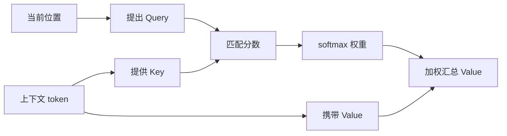
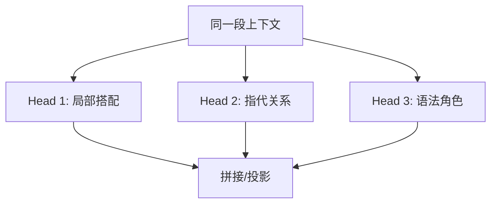

import AttentionFlowFigure from '@/components/deep-learning-figures/AttentionFlowFigure.astro';
import AttentionHeatmapFigure from '@/components/deep-learning-figures/AttentionHeatmapFigure.astro';

注意力机制可以理解成带权重的信息汇总。当前位置不是只看一个词，而是给 [context](https://www.aihero.dev/ai-coding-dictionary/context) 中的每个位置分配权重，再把这些位置的信息加权求和。

在 Transformer 里，注意力通常写成 Query、Key、Value：

| 名称 | 直观含义 |
| --- | --- |
| Query | 当前位置想找什么。 |
| Key | 每个位置提供的索引标签。 |
| Value | 每个位置真正携带的信息。 |

Query 和 Key 的相似度越高，对应 Value 的权重越大。

## 动机

序列里的一个 [token](https://www.aihero.dev/ai-coding-dictionary/token) 往往需要参考其他 [token](https://www.aihero.dev/ai-coding-dictionary/token) 才能理解。比如“它”指代谁、“学习”修饰什么、“not” 是否改变后面动词的含义，都依赖 [context](https://www.aihero.dev/ai-coding-dictionary/context)。

注意力机制提供了一种可微的查找方式：

```text
当前位置提出查询 -> 和上下文位置匹配 -> 按权重汇总信息
```

这个机制很适合替代“只靠固定窗口”或“只靠单一隐藏状态”的序列建模方法。



## Q/K/V 流程

<AttentionFlowFigure />

## 最小 scaled dot-product attention

```python
def scaled_dot_product_attention(q, k, v, mask=None):
    """用 PyTorch-like 公式表达缩放点积注意力。"""
    dim = q.size(-1)
    scores = q @ k.transpose(-2, -1) / dim ** 0.5

    if mask is not None:
        scores = scores.masked_fill(mask == 0, float('-inf'))

    weights = F.softmax(scores, dim=-1)
    output = weights @ v
    return output, weights


def make_causal_mask(seq_len):
    """创建下三角 mask：当前位置只能看自己和左侧 token。"""
    return tril(ones(seq_len, seq_len)).unsqueeze(0)
```

这就是注意力的核心。真实 Transformer 会把输入先分别投影成 Q、K、V，再做多头注意力、残差连接和 LayerNorm。

## 注意力热力图

下面这个朴素热力图展示一个位置如何给 [context](https://www.aihero.dev/ai-coding-dictionary/context) 分配权重。颜色越深，权重越大。

<AttentionHeatmapFigure />

## 张量形状

假设 batch 为 `B`，序列长度为 `T`，每个 [token](https://www.aihero.dev/ai-coding-dictionary/token) 的表示维度为 `D`：

| 张量 | 形状 | 说明 |
| --- | --- | --- |
| `q` | `[B, T, D]` | 每个位置的查询向量。 |
| `k` | `[B, T, D]` | 每个位置的键向量。 |
| `v` | `[B, T, D]` | 每个位置的值向量。 |
| `scores` | `[B, T, T]` | 每个位置对每个位置的相似度。 |
| `weights` | `[B, T, T]` | softmax 后的注意力权重。 |
| `output` | `[B, T, D]` | 加权汇总后的新表示。 |

## 直观理解

### Query 是问题，Key 是索引，Value 是内容

可以把一段 [context](https://www.aihero.dev/ai-coding-dictionary/context) 想成一个小型资料库。当前 [token](https://www.aihero.dev/ai-coding-dictionary/token) 的 Query 像是在问“我需要哪类信息”；每个 [context](https://www.aihero.dev/ai-coding-dictionary/context) [token](https://www.aihero.dev/ai-coding-dictionary/token) 的 Key 像是目录索引；Value 才是真正要取回的内容。

### softmax 为什么必要

`q @ k.T` 得到的是任意实数分数。softmax 把它们变成非负、总和为 1 的权重。这样输出就可以解释成对 Value 的加权平均：

```python
weights = softmax(scores)
output = weights @ values
```

### Multi-head 不是重复劳动

一个注意力头只能在一个表示子空间里匹配关系。多头注意力让 [model](https://www.aihero.dev/ai-coding-dictionary/model) 并行学习不同关系：有的头可能更关注局部搭配，有的头可能更关注长距离指代，有的头可能关注语法角色。



## 限制

- 注意力热力图有解释价值，但不能直接等同于 [model](https://www.aihero.dev/ai-coding-dictionary/model) 真正的因果解释。
- 自注意力的计算量随序列长度近似平方增长，长 [context](https://www.aihero.dev/ai-coding-dictionary/context) 会变贵。
- 注意力只是一层的信息汇总机制，Transformer 的能力还来自残差、归一化、MLP、[training](https://www.aihero.dev/ai-coding-dictionary/training) 数据和优化。

## 阅读更多

回到 [GPT 是什么？直观讲解 Transformer](../gpt-transformer/)，可以把注意力机制重新放进完整 Transformer block 中理解。

## 小结

- 注意力权重来自 Query 和 Key 的相似度。
- softmax 把任意分数变成可解释的权重分布。
- Value 是真正被汇总的信息。
- causal mask 让语言[model](https://www.aihero.dev/ai-coding-dictionary/model) 不能看未来。
- multi-head attention 让 [model](https://www.aihero.dev/ai-coding-dictionary/model) 并行学习多种关系，而不是重复做同一件事。
