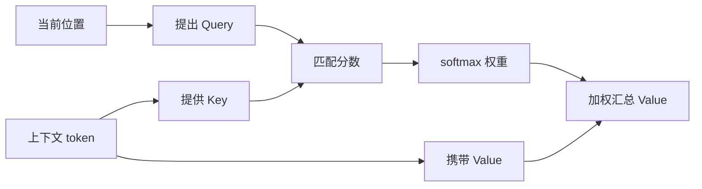
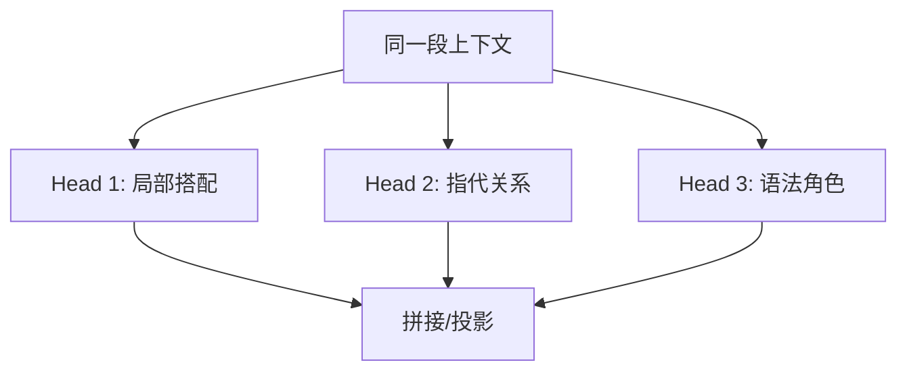

注意力机制可以理解成带权重的信息汇总。当前位置不是只看一个词，而是给上下文中的每个位置分配权重，再把这些位置的信息加权求和。

在 Transformer 里，注意力通常写成 Query、Key、Value：

| 名称 | 直观含义 |
| --- | --- |
| Query | 当前位置想找什么。 |
| Key | 每个位置提供的索引标签。 |
| Value | 每个位置真正携带的信息。 |

Query 和 Key 的相似度越高，对应 Value 的权重越大。

## 动机

序列里的一个 token 往往需要参考其他 token 才能理解。比如“它”指代谁、“学习”修饰什么、“not” 是否改变后面动词的含义，都依赖上下文。

注意力机制提供了一种可微的查找方式：

```text
当前位置提出查询 -> 和上下文位置匹配 -> 按权重汇总信息
```

这个机制很适合替代“只靠固定窗口”或“只靠单一隐藏状态”的序列建模方法。



## Q/K/V 流程

<svg class="dl-figure" viewBox="0 0 920 360" role="img" aria-labelledby="qkv-title">
  <title id="qkv-title">Q K V 注意力流程</title>
  <defs>
    <marker id="arrow-qkv" markerWidth="10" markerHeight="10" refX="8" refY="3" orient="auto">
      <path d="M0,0 L0,6 L9,3 z" fill="#2f5f9f"></path>
    </marker>
  </defs>
  <rect x="50" y="140" width="140" height="70" rx="8" class="dl-box"></rect>
  <text x="120" y="181" text-anchor="middle" class="dl-label">Token 表示</text>
  <line x1="198" y1="175" x2="270" y2="85" class="dl-arrow" marker-end="url(#arrow-qkv)"></line>
  <line x1="198" y1="175" x2="270" y2="175" class="dl-arrow" marker-end="url(#arrow-qkv)"></line>
  <line x1="198" y1="175" x2="270" y2="265" class="dl-arrow" marker-end="url(#arrow-qkv)"></line>
  <rect x="285" y="50" width="110" height="60" rx="8" class="dl-token"></rect>
  <rect x="285" y="145" width="110" height="60" rx="8" class="dl-token"></rect>
  <rect x="285" y="240" width="110" height="60" rx="8" class="dl-token"></rect>
  <text x="340" y="86" text-anchor="middle" class="dl-label">Q</text>
  <text x="340" y="181" text-anchor="middle" class="dl-label">K</text>
  <text x="340" y="276" text-anchor="middle" class="dl-label">V</text>
  <line x1="405" y1="80" x2="520" y2="140" class="dl-arrow" marker-end="url(#arrow-qkv)"></line>
  <line x1="405" y1="175" x2="520" y2="160" class="dl-arrow" marker-end="url(#arrow-qkv)"></line>
  <rect x="535" y="115" width="140" height="70" rx="8" class="dl-box-accent"></rect>
  <text x="605" y="145" text-anchor="middle" class="dl-label">QK 相似度</text>
  <text x="605" y="169" text-anchor="middle" class="dl-small">softmax 成权重</text>
  <line x1="682" y1="150" x2="760" y2="245" class="dl-arrow" marker-end="url(#arrow-qkv)"></line>
  <line x1="405" y1="270" x2="760" y2="270" class="dl-arrow" marker-end="url(#arrow-qkv)"></line>
  <rect x="775" y="228" width="110" height="70" rx="8" class="dl-box"></rect>
  <text x="830" y="258" text-anchor="middle" class="dl-label">加权求和</text>
  <text x="830" y="282" text-anchor="middle" class="dl-small">输出新表示</text>
</svg>

## 最小 scaled dot-product attention

```python
def scaled_dot_product_attention(q, k, v, mask=None):
    """用 PyTorch-like 公式表达缩放点积注意力。"""
    dim = q.size(-1)
    scores = q @ k.transpose(-2, -1) / dim ** 0.5

    if mask is not None:
        scores = scores.masked_fill(mask == 0, float('-inf'))

    weights = F.softmax(scores, dim=-1)
    output = weights @ v
    return output, weights


def make_causal_mask(seq_len):
    """创建下三角 mask：当前位置只能看自己和左侧 token。"""
    return tril(ones(seq_len, seq_len)).unsqueeze(0)
```

这就是注意力的核心。真实 Transformer 会把输入先分别投影成 Q、K、V，再做多头注意力、残差连接和 LayerNorm。

## 注意力热力图

下面这个朴素热力图展示一个位置如何给上下文分配权重。颜色越深，权重越大。

<svg class="dl-figure dl-compact-figure" viewBox="0 0 520 420" role="img" aria-labelledby="heatmap-title">
  <title id="heatmap-title">注意力权重热力图</title>
  <text x="270" y="35" text-anchor="middle" class="dl-label">行：当前 token，列：被关注 token</text>
  <g transform="translate(120 80)">
    <text x="-25" y="33" text-anchor="end" class="dl-small">我</text>
    <text x="-25" y="93" text-anchor="end" class="dl-small">喜欢</text>
    <text x="-25" y="153" text-anchor="end" class="dl-small">深度</text>
    <text x="-25" y="213" text-anchor="end" class="dl-small">学习</text>
    <text x="30" y="-18" text-anchor="middle" class="dl-small">我</text>
    <text x="90" y="-18" text-anchor="middle" class="dl-small">喜欢</text>
    <text x="150" y="-18" text-anchor="middle" class="dl-small">深度</text>
    <text x="210" y="-18" text-anchor="middle" class="dl-small">学习</text>
    <rect x="0" y="0" width="60" height="60" fill="#2f5f9f" opacity="0.90"></rect>
    <rect x="60" y="0" width="60" height="60" fill="#d9d9d9"></rect>
    <rect x="120" y="0" width="60" height="60" fill="#d9d9d9"></rect>
    <rect x="180" y="0" width="60" height="60" fill="#d9d9d9"></rect>
    <rect x="0" y="60" width="60" height="60" fill="#2f5f9f" opacity="0.30"></rect>
    <rect x="60" y="60" width="60" height="60" fill="#2f5f9f" opacity="0.75"></rect>
    <rect x="120" y="60" width="60" height="60" fill="#d9d9d9"></rect>
    <rect x="180" y="60" width="60" height="60" fill="#d9d9d9"></rect>
    <rect x="0" y="120" width="60" height="60" fill="#2f5f9f" opacity="0.15"></rect>
    <rect x="60" y="120" width="60" height="60" fill="#2f5f9f" opacity="0.35"></rect>
    <rect x="120" y="120" width="60" height="60" fill="#2f5f9f" opacity="0.85"></rect>
    <rect x="180" y="120" width="60" height="60" fill="#d9d9d9"></rect>
    <rect x="0" y="180" width="60" height="60" fill="#2f5f9f" opacity="0.20"></rect>
    <rect x="60" y="180" width="60" height="60" fill="#2f5f9f" opacity="0.25"></rect>
    <rect x="120" y="180" width="60" height="60" fill="#2f5f9f" opacity="0.70"></rect>
    <rect x="180" y="180" width="60" height="60" fill="#2f5f9f" opacity="0.55"></rect>
    <path d="M0 0 H240 V240 H0 Z" fill="none" stroke="#777"></path>
    <path d="M60 0 V240 M120 0 V240 M180 0 V240 M0 60 H240 M0 120 H240 M0 180 H240" stroke="#ffffff" stroke-width="2"></path>
  </g>
</svg>

## 张量形状

假设 batch 为 `B`，序列长度为 `T`，每个 token 的表示维度为 `D`：

| 张量 | 形状 | 说明 |
| --- | --- | --- |
| `q` | `[B, T, D]` | 每个位置的查询向量。 |
| `k` | `[B, T, D]` | 每个位置的键向量。 |
| `v` | `[B, T, D]` | 每个位置的值向量。 |
| `scores` | `[B, T, T]` | 每个位置对每个位置的相似度。 |
| `weights` | `[B, T, T]` | softmax 后的注意力权重。 |
| `output` | `[B, T, D]` | 加权汇总后的新表示。 |

## 直观理解

### Query 是问题，Key 是索引，Value 是内容

可以把一段上下文想成一个小型资料库。当前 token 的 Query 像是在问“我需要哪类信息”；每个上下文 token 的 Key 像是目录索引；Value 才是真正要取回的内容。

### softmax 为什么必要

`q @ k.T` 得到的是任意实数分数。softmax 把它们变成非负、总和为 1 的权重。这样输出就可以解释成对 Value 的加权平均：

```python
weights = softmax(scores)
output = weights @ values
```

### Multi-head 不是重复劳动

一个注意力头只能在一个表示子空间里匹配关系。多头注意力让模型并行学习不同关系：有的头可能更关注局部搭配，有的头可能更关注长距离指代，有的头可能关注语法角色。



## 限制

- 注意力热力图有解释价值，但不能直接等同于模型真正的因果解释。
- 自注意力的计算量随序列长度近似平方增长，长上下文会变贵。
- 注意力只是一层的信息汇总机制，Transformer 的能力还来自残差、归一化、MLP、训练数据和优化。

## 阅读更多

回到 [GPT 是什么？直观讲解 Transformer](../gpt-transformer/)，可以把注意力机制重新放进完整 Transformer block 中理解。

## 小结

- 注意力权重来自 Query 和 Key 的相似度。
- softmax 把任意分数变成可解释的权重分布。
- Value 是真正被汇总的信息。
- causal mask 让语言模型不能看未来。
- multi-head attention 让模型并行学习多种关系，而不是重复做同一件事。
