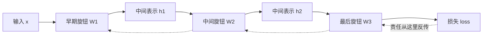
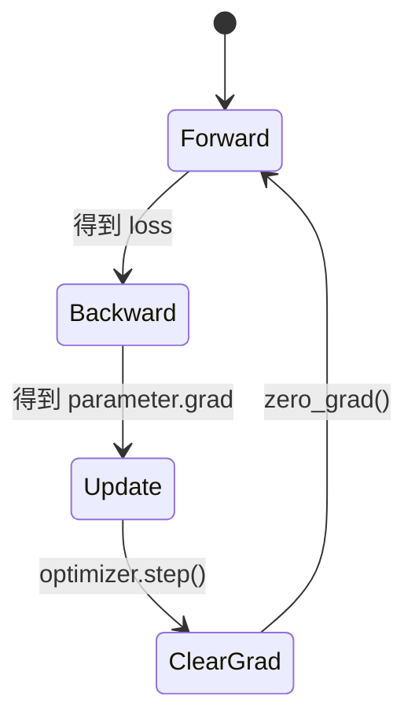
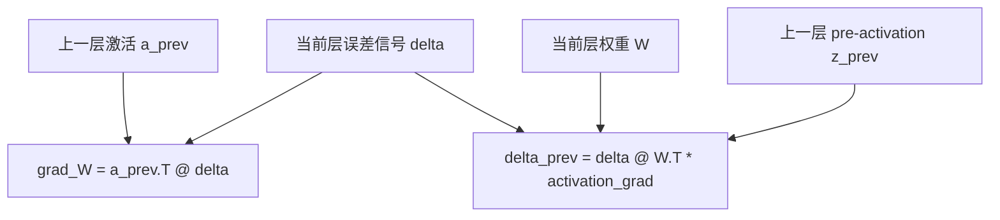

反向传播算法常被说成“神经网络学习的核心”，但这个说法容易让人误会。反向传播本身并不会让模型变聪明，它只回答一个非常具体的问题：

> 这次预测错了以后，网络里每一个旋钮应该承担多少责任？

这里的“旋钮”就是权重和偏置。梯度下降负责拧旋钮，反向传播负责告诉我们每个旋钮该往哪边拧、拧多少比较合理。

这篇笔记按 Wikipedia 条目的骨架重新组织，但内容改成适合学习笔记的版本：

- 动机：为什么多层网络需要反向传播。
- 概括：前向传播、误差反传、权重更新分别做什么。
- 算法：用 PyTorch-like 代码替代公式。
- 直观理解：把反向传播看成“责任分摊”和“复用中间结果”。
- 限制：它不保证找到全局最优，也依赖可微结构。
- 历史：从链式法则、自动微分到现代深度学习。

## 动机

先想一个只有一个旋钮的机器：

```python
prediction = knob * input
loss = (prediction - target) ** 2
```

如果预测太小，旋钮可能要调大；如果预测太大，旋钮可能要调小。一个旋钮时，责任很容易判断。

神经网络麻烦在于旋钮很多，而且它们不是并排放着，而是串成一条长链：

```python
h1 = relu(x @ W1 + b1)
h2 = relu(h1 @ W2 + b2)
y_hat = h2 @ W3 + b3
loss = cross_entropy(y_hat, y)
```

`W3` 离损失最近，比较容易分到责任；`W1` 离损失很远，它先影响 `h1`，`h1` 再影响 `h2`，`h2` 再影响输出，输出再影响损失。

反向传播的动机就是：不要为每个旋钮从头算一遍责任，而是从最终损失开始，把责任沿着计算路径一次性传回去。



## 概括

一个训练步骤可以拆成三个动作：先算错在哪里，再把责任传回去，最后更新旋钮。

### 第 1 阶段：激励传播

激励传播就是 forward pass。输入从第一层开始，逐层产生中间激活，最后得到预测和损失。这里的“激励”可以理解成每一层被输入点亮后的状态。

```python
# PyTorch-like 公式代码，不强调可直接运行
a0 = x
z1 = a0 @ W1 + b1
a1 = relu(z1)
z2 = a1 @ W2 + b2
a2 = relu(z2)
logits = a2 @ W3 + b3
loss = cross_entropy(logits, target)
```

这一阶段不仅要得到 `loss`，还要保留必要的中间值，例如 `a0`、`z1`、`a1`、`z2`。反向传播不是凭空算梯度，它要回头查看这些“路过的脚印”。

### 第 2 阶段：误差反传

误差反传从损失开始，问一个递归问题：

> 如果这个节点的输出稍微变化一点，最终损失会怎么变？

每个节点只需要知道两件事：后一层传回来的责任，以及自己这个小函数的局部变化率。

```python
upstream = grad_from_next_layer
local = derivative_of_this_operation
grad_to_previous = upstream * local
```

这就是链式法则的程序版。

### 第 3 阶段：权重更新

权重更新通常包括三步：

```python
loss.backward()          # 反向传播：计算每个参数的梯度
optimizer.step()         # 优化器：用梯度更新参数
optimizer.zero_grad()    # 清空梯度：准备下一轮
```

这里容易混淆：`backward()` 不直接“学习”，它只是把梯度填到每个参数的 `.grad` 字段里；真正改变权重的是 `optimizer.step()`。



## 算法

### 一个最小计算图

<svg class="dl-figure" viewBox="0 0 720 320" role="img" aria-labelledby="bp-title">
  <title id="bp-title">前向传播和反向传播计算图</title>
  <defs>
    <marker id="arrow-bp" markerWidth="10" markerHeight="10" refX="8" refY="3" orient="auto">
      <path d="M0,0 L0,6 L9,3 z" fill="#2f5f9f"></path>
    </marker>
    <marker id="arrow-bp-back" markerWidth="10" markerHeight="10" refX="8" refY="3" orient="auto">
      <path d="M0,0 L0,6 L9,3 z" fill="#b35c23"></path>
    </marker>
  </defs>
  <rect x="44" y="96" width="104" height="58" rx="8" class="dl-box"></rect>
  <text x="96" y="131" text-anchor="middle" class="dl-label">x</text>
  <rect x="44" y="194" width="104" height="58" rx="8" class="dl-box"></rect>
  <text x="96" y="229" text-anchor="middle" class="dl-label">w, b</text>
  <rect x="252" y="136" width="156" height="78" rx="8" class="dl-box-accent"></rect>
  <text x="330" y="169" text-anchor="middle" class="dl-label">pred</text>
  <text x="330" y="194" text-anchor="middle" class="dl-small">w x + b</text>
  <rect x="536" y="136" width="156" height="78" rx="8" class="dl-box"></rect>
  <text x="614" y="169" text-anchor="middle" class="dl-label">loss</text>
  <text x="614" y="194" text-anchor="middle" class="dl-small">(pred - y)^2</text>
  <line x1="150" y1="124" x2="242" y2="162" class="dl-arrow" marker-end="url(#arrow-bp)"></line>
  <line x1="150" y1="222" x2="242" y2="190" class="dl-arrow" marker-end="url(#arrow-bp)"></line>
  <line x1="416" y1="175" x2="526" y2="175" class="dl-arrow" marker-end="url(#arrow-bp)"></line>
  <path d="M536 230 C430 286, 250 282, 150 244" fill="none" class="dl-back-arrow" marker-end="url(#arrow-bp-back)"></path>
  <path d="M536 121 C430 62, 252 64, 151 109" fill="none" class="dl-back-arrow" marker-end="url(#arrow-bp-back)"></path>
  <text x="316" y="48" class="dl-small dl-blue">前向：计算值</text>
  <text x="316" y="302" class="dl-small dl-orange">反向：传回梯度</text>
</svg>

这张图里只有一个线性单元，但它已经包含了反向传播的关键结构：每个节点都知道自己在前向阶段算出了什么，也知道在反向阶段如何把上游梯度传给自己的输入。

### 符号表

| 符号 | 在代码里的样子 | 含义 |
| --- | --- | --- |
| `a_l` | `activation` | 第 `l` 层输出，也就是下一层的输入。 |
| `z_l` | `pre_activation` | 激活函数之前的线性结果。 |
| `W_l` | `weight` | 第 `l` 层权重矩阵。 |
| `b_l` | `bias` | 第 `l` 层偏置。 |
| `delta_l` | `grad_z` | 损失对 `z_l` 的梯度，也可理解为这一层收到的误差信号。 |

### 反向传播的核心递推

下面的代码不是为了训练一个模型，而是把公式写成 PyTorch 风格。读它时只看两件事：`delta` 如何往前传，`grad_W` 如何由上一层激活和当前层误差信号组成。

```python
# forward：保存每层需要的中间量
z1 = x @ W1 + b1
a1 = relu(z1)
z2 = a1 @ W2 + b2
a2 = relu(z2)
loss = criterion(a2, target)

# backward：从最后一层往前传误差信号
delta2 = grad(loss, z2)
grad_W2 = a1.T @ delta2
grad_b2 = delta2.sum(dim=0)

delta1 = (delta2 @ W2.T) * relu_grad(z1)
grad_W1 = x.T @ delta1
grad_b1 = delta1.sum(dim=0)
```

其中最值得记住的是这两行：

```python
grad_W_l = a_prev.T @ delta_l
delta_prev = (delta_l @ W_l.T) * activation_grad(z_prev)
```

第一行回答“当前层权重该怎么改”，第二行回答“上一层应该承担多少误差责任”。



### PyTorch 自动做了什么

真实 PyTorch 代码通常不会手写这些递推：

```python
loss = model(x).loss_against(target)
loss.backward()

for parameter in model.parameters():
    parameter -= lr * parameter.grad
```

这段代码背后，autograd 会根据前向计算建立动态计算图；当 `loss.backward()` 被调用时，它按图的反方向执行链式法则，把每个叶子参数的梯度累计到 `.grad`。

## 数学推导

### 链式法则的程序化版本

反向传播可以看成反复使用链式法则。对一个两层网络：

```python
a1 = f(x @ W1 + b1)
a2 = g(a1 @ W2 + b2)
loss = L(a2, y)
```

如果想知道 `W1` 对 `loss` 的影响，路径是：

```text
W1 -> z1 -> a1 -> z2 -> a2 -> loss
```

链式法则告诉我们，整条路径上的局部变化率要相乘。反向传播的技巧不是发明了新的求导法，而是把公共路径的结果缓存下来，避免为每个权重重新走一遍完整路径。

### 为什么从后往前

如果从前往后问“某个早期参数会怎样影响后面所有节点”，需要追踪许多分叉路径。对于大网络，这会很快爆炸。

从后往前则更经济：先知道损失对输出的梯度，再逐层把这个误差信号传回去。每一层只需要两类信息：

| 信息 | 来源 | 作用 |
| --- | --- | --- |
| 上游梯度 | 后一层传回来的 `delta` | 告诉当前层输出对最终损失有多重要。 |
| 本地导数 | 当前层前向时缓存的 `z` 或 `a` | 告诉当前层内部的局部变化率。 |

二者相乘，就是链式法则。

## 实际范例

### 标量例子

先看一个只有一个权重的例子。它像 Karpathy 在 micrograd 里常用的那种玩具标量图：小到可以手算，但结构和大模型是一回事。

```python
x = tensor(2.0)
y = tensor(5.0)
w = tensor(1.0, requires_grad=True)
b = tensor(0.0, requires_grad=True)

pred = w * x + b
loss = (pred - y) ** 2
loss.backward()
```

前向阶段：

```text
pred = 1 * 2 + 0 = 2
loss = (2 - 5)^2 = 9
```

反向阶段可以口算：

```text
d loss / d pred = 2 * (pred - y) = -6
d pred / d w = x = 2
d pred / d b = 1

d loss / d w = -6 * 2 = -12
d loss / d b = -6 * 1 = -6
```

梯度为负，说明如果增大 `w` 和 `b`，损失会下降。这和直觉一致：当前预测 `2` 太小，目标是 `5`。

### 矩阵例子

神经网络里通常不是一个样本、一个权重，而是一批样本和矩阵参数：

```python
# B: batch size, D: input dim, H: hidden dim
x.shape      == [B, D]
W.shape      == [D, H]
b.shape      == [H]
z = x @ W + b
a = relu(z)
```

如果反向阶段已经得到 `delta = d loss / d z`，那么：

```python
grad_W = x.T @ delta      # [D, B] @ [B, H] -> [D, H]
grad_b = delta.sum(dim=0) # [B, H] -> [H]
grad_x = delta @ W.T      # [B, H] @ [H, D] -> [B, D]
```

这三行就是许多深度学习框架底层反复执行的模式。

## 反向传播缓存了什么

| 节点 | 前向时的值 | 反向时需要的东西 |
| --- | --- | --- |
| `prediction = w * x + b` | 预测值 | `x`、`w`、上游梯度 |
| `loss = (prediction - y) ** 2` | 损失值 | `prediction - y` |
| 参数 `w` | 当前权重 | `loss` 对 `w` 的梯度 |
| 参数 `b` | 当前偏置 | `loss` 对 `b` 的梯度 |

PyTorch 的 autograd 会记录这些计算关系。调用 `backward()` 时，它沿着图反向执行局部梯度计算，并按链式法则把它们乘起来。

## 直观理解

### 学习作为一个优化问题

训练模型就是在参数空间里找一个点，使损失尽量低。反向传播不负责决定“去哪一个低点”，它只告诉优化器当前位置的坡度。

可以把流程想成：

```text
模型当前参数 -> 产生预测 -> 产生损失 -> 反向传播算坡度 -> 优化器走一步
```

如果梯度下降是“下山策略”，反向传播就是“测量脚下坡度的仪器”。它不替你选择远方目的地，只告诉你脚下附近哪边更低。

### 运用类比理解梯度下降法

在多层网络里，输出层最容易知道自己错在哪里；隐藏层并没有直接目标。反向传播的作用，就是把输出层的错误逐层分摊给隐藏层：

```text
最终损失
  -> 输出层：哪个 logit 影响最大
  -> 隐藏层 2：哪些隐藏特征造成了这个 logit
  -> 隐藏层 1：哪些早期特征造成了隐藏层 2
  -> 输入附近：哪些低级表示应该调整
```

这种“责任分摊”不是人类解释意义上的责任，而是链式法则意义上的敏感度。

## 和梯度下降的关系

```text
forward      : 用当前参数得到预测和损失
backward     : 计算每个参数的梯度
optimizer.step: 用梯度更新参数
zero_grad    : 清掉旧梯度，准备下一轮
```

更像 PyTorch 的训练循环可以写成：

```python
for batch in data:
    loss = model(batch).loss

    loss.backward()      # 计算梯度
    optimizer.step()     # 根据梯度更新参数
    optimizer.zero_grad()
```

这段代码的重点不是 API，而是分工：`backward` 是微分，`step` 是优化。

## 限制

### 不保证全局最优

深度网络的损失曲面通常不是凸函数。梯度下降加反向传播只能沿当前梯度方向移动，不保证找到全局最低点。实际训练能成功，往往依赖初始化、优化器、学习率调度、归一化、残差连接和大量工程经验。

### 梯度可能消失或爆炸

反向传播沿着层层链式法则相乘。如果许多局部导数都小于 1，梯度可能越传越小；如果许多局部导数都大于 1，梯度可能越传越大。这就是深层网络早期训练困难的重要原因之一。

### 需要可微结构

反向传播依赖局部导数。ReLU 在 0 点不可导，但工程上可以选一个约定的次梯度；真正麻烦的是离散采样、硬判断、外部工具调用这类不可微操作。现代模型训练会用各种替代目标、松弛技巧或强化学习方法绕过这些问题。

### 内存开销不小

为了反向传播，前向阶段要缓存中间激活。模型越深、序列越长、batch 越大，缓存越贵。训练大模型时，activation checkpointing、混合精度和并行策略都和这个问题有关。

## 历史

### 前史

反向传播的数学核心是链式法则。作为自动微分的一种形式，它和更广义的 reverse-mode automatic differentiation 有密切关系。神经网络里的反向传播可以看成把这个思想应用到多层可微函数组合上。

### 现代反向传播

现代神经网络语境下，反向传播在 1980 年代因多层感知机训练而广为人知。后来它和更强的硬件、更大的数据集、更稳定的初始化与优化技术结合，成为深度学习训练的基础工具。

## 注释

- 本文把 `loss` 和 `cost` 都翻译成损失；有些资料会区分单样本 loss 和全数据集 cost。
- 本文里的代码是 PyTorch-like 公式代码，重点是表达张量关系，不承诺直接运行。
- 反向传播常被口语化地等同于“训练神经网络”，但严格说它只是梯度计算部分。

## 参见

- [梯度下降法](../gradient-descent/)
- [神经网络的结构](../neural-network-structure/)
- [GPT 是什么？直观讲解 Transformer](../gpt-transformer/)

## 参考文献

- Wikipedia: [Backpropagation](https://en.wikipedia.org/wiki/Backpropagation)
- D2L: [前向传播、反向传播和计算图](https://zh.d2l.ai/chapter_multilayer-perceptrons/backprop.html)
- Michael Nielsen: Neural Networks and Deep Learning
- Goodfellow, Bengio, Courville: Deep Learning

## 外部链接

- 3Blue1Brown: What is Backpropagation Really Doing?
- Stanford CS231n: Backpropagation, Neural Networks 1

## 关于本条目

这篇不是百科条目，也不是完整数学证明。它的定位是“学习用地图”：先建立正确分工，再把公式翻译成 PyTorch 风格的张量操作，最后知道哪些细节以后需要继续查。

## 阅读更多

下一步建议读 [GPT 是什么？直观讲解 Transformer](../gpt-transformer/)。Transformer 的训练依然依赖反向传播，但它的模型结构会把注意力、残差连接、LayerNorm 和 MLP 组合起来。

## 小结

- 反向传播是链式法则在计算图上的实现。
- 梯度是“损失对参数的敏感度”。
- `backward()` 后，梯度保存在参数的 `.grad` 里。
- 梯度默认会累加，所以训练循环里要清空梯度。
