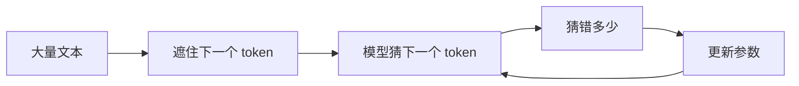
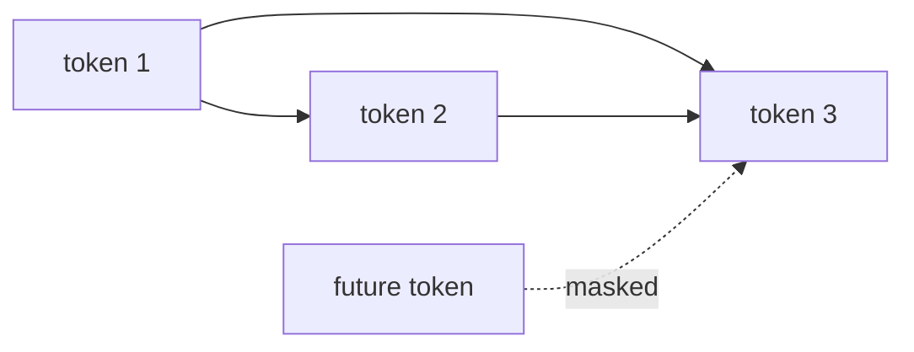

GPT 可以先理解成一个做下一个 token 预测的语言模型：

```text
给定前面的 token，预测下一个 token
```

例如：

```text
我 喜欢 深度 -> 学习
```

GPT 的底层结构是 Transformer。它不像传统循环网络那样把信息一个位置一个位置往后传，而是让每个 token 通过注意力机制直接汇总前面相关 token 的信息。

## 动机

语言模型的核心任务可以非常朴素：根据已经出现的上下文，预测下一个 token。只要这个任务做得足够好，模型就会学到语法、事实、风格、推理模式和代码模式的统计结构。

GPT 里的 “G” 是 generative，“P” 是 pre-trained，“T” 是 Transformer。直观地说：

| 部分 | 含义 |
| --- | --- |
| Generative | 它可以一个 token 接一个 token 生成文本。 |
| Pre-trained | 它先在大量文本上预训练，再按需要微调或对齐。 |
| Transformer | 它使用注意力机制处理序列。 |



从第一性原理看，GPT 没有一开始就需要被解释成“会聊天的智能体”。更朴素的解释是：

```text
文本里有规律 -> 模型被迫预测下一个 token -> 预测错误变成梯度 -> 参数吸收这些规律
```

当数据、模型和算力都变大时，这个简单目标会吸收越来越多语言和世界知识的统计结构。这也是为什么宏观上经常说 deep learning 的关键现象是 scale。

## 下一个 token 预测

<svg class="dl-figure" viewBox="0 0 920 260" role="img" aria-labelledby="next-token-title">
  <title id="next-token-title">输入序列和目标序列错开一位</title>
  <defs>
    <marker id="arrow-next" markerWidth="10" markerHeight="10" refX="8" refY="3" orient="auto">
      <path d="M0,0 L0,6 L9,3 z" fill="#2f5f9f"></path>
    </marker>
  </defs>
  <text x="80" y="82" class="dl-label">输入</text>
  <rect x="150" y="50" width="110" height="58" rx="8" class="dl-token"></rect>
  <rect x="280" y="50" width="110" height="58" rx="8" class="dl-token"></rect>
  <rect x="410" y="50" width="110" height="58" rx="8" class="dl-token"></rect>
  <rect x="540" y="50" width="110" height="58" rx="8" class="dl-token-muted"></rect>
  <text x="205" y="86" text-anchor="middle" class="dl-label">我</text>
  <text x="335" y="86" text-anchor="middle" class="dl-label">喜欢</text>
  <text x="465" y="86" text-anchor="middle" class="dl-label">深度</text>
  <text x="595" y="86" text-anchor="middle" class="dl-small">不输入</text>
  <text x="80" y="182" class="dl-label">目标</text>
  <rect x="150" y="150" width="110" height="58" rx="8" class="dl-token-muted"></rect>
  <rect x="280" y="150" width="110" height="58" rx="8" class="dl-token"></rect>
  <rect x="410" y="150" width="110" height="58" rx="8" class="dl-token"></rect>
  <rect x="540" y="150" width="110" height="58" rx="8" class="dl-token-accent"></rect>
  <text x="205" y="186" text-anchor="middle" class="dl-small">不预测</text>
  <text x="335" y="186" text-anchor="middle" class="dl-label">喜欢</text>
  <text x="465" y="186" text-anchor="middle" class="dl-label">深度</text>
  <text x="595" y="186" text-anchor="middle" class="dl-label">学习</text>
  <line x1="205" y1="112" x2="325" y2="145" class="dl-arrow" marker-end="url(#arrow-next)"></line>
  <line x1="335" y1="112" x2="455" y2="145" class="dl-arrow" marker-end="url(#arrow-next)"></line>
  <line x1="465" y1="112" x2="585" y2="145" class="dl-arrow" marker-end="url(#arrow-next)"></line>
</svg>

训练时，输入和目标序列错开一位。模型在每个位置都要预测下一个 token。

## 一个极小语言模型骨架

```python
class TinyLanguageModel(nn.Module):
    """用 PyTorch-like 代码表达 next-token language model 的核心公式。"""

    def __init__(self, vocab_size, embed_dim):
        """定义 token 表示和词表预测两个映射。"""
        self.embedding = nn.Embedding(vocab_size, embed_dim)
        self.output = nn.Linear(embed_dim, vocab_size)

    def forward(self, token_ids):
        """把 token id 变成每个位置的下一个 token 分数。"""
        embedded = self.embedding(token_ids)
        logits = self.output(embedded)
        return logits


def make_toy_batch():
    """展示输入序列和目标序列为什么要错开一位。"""
    token_ids = tensor([[1, 2, 3, 4]])
    inputs = token_ids[:, :-1]
    targets = token_ids[:, 1:]
    return inputs, targets
```

这个模型还不是 Transformer，因为它没有注意力层。它只展示语言建模的训练目标：每个位置输出一个词表大小的分数向量。

## Transformer 的流水线

<svg class="dl-figure" viewBox="0 0 920 300" role="img" aria-labelledby="transformer-title">
  <title id="transformer-title">GPT 风格 Transformer 流水线</title>
  <defs>
    <marker id="arrow-tr" markerWidth="10" markerHeight="10" refX="8" refY="3" orient="auto">
      <path d="M0,0 L0,6 L9,3 z" fill="#2f5f9f"></path>
    </marker>
  </defs>
  <rect x="45" y="105" width="125" height="80" rx="8" class="dl-box"></rect>
  <text x="108" y="138" text-anchor="middle" class="dl-label">Token</text>
  <text x="108" y="164" text-anchor="middle" class="dl-small">离散 id</text>
  <line x1="178" y1="145" x2="238" y2="145" class="dl-arrow" marker-end="url(#arrow-tr)"></line>
  <rect x="250" y="105" width="135" height="80" rx="8" class="dl-box"></rect>
  <text x="318" y="138" text-anchor="middle" class="dl-label">Embedding</text>
  <text x="318" y="164" text-anchor="middle" class="dl-small">向量表示</text>
  <line x1="393" y1="145" x2="453" y2="145" class="dl-arrow" marker-end="url(#arrow-tr)"></line>
  <rect x="465" y="85" width="160" height="120" rx="8" class="dl-box-accent"></rect>
  <text x="545" y="126" text-anchor="middle" class="dl-label">Transformer</text>
  <text x="545" y="154" text-anchor="middle" class="dl-small">Attention + MLP</text>
  <text x="545" y="180" text-anchor="middle" class="dl-small">重复多层</text>
  <line x1="633" y1="145" x2="693" y2="145" class="dl-arrow" marker-end="url(#arrow-tr)"></line>
  <rect x="705" y="105" width="145" height="80" rx="8" class="dl-box"></rect>
  <text x="778" y="138" text-anchor="middle" class="dl-label">Logits</text>
  <text x="778" y="164" text-anchor="middle" class="dl-small">预测下个 token</text>
</svg>

## Causal mask

GPT 只能看当前位置及其左边的上下文，不能偷看未来 token。这靠 causal mask 实现。

<svg class="dl-figure dl-compact-figure" viewBox="0 0 420 340" role="img" aria-labelledby="mask-title">
  <title id="mask-title">Causal mask 下三角矩阵</title>
  <text x="210" y="32" text-anchor="middle" class="dl-label">1 表示可见，0 表示被遮住</text>
  <g transform="translate(70 60)">
    <rect x="0" y="0" width="56" height="56" class="dl-cell-on"></rect>
    <rect x="56" y="0" width="56" height="56" class="dl-cell-off"></rect>
    <rect x="112" y="0" width="56" height="56" class="dl-cell-off"></rect>
    <rect x="168" y="0" width="56" height="56" class="dl-cell-off"></rect>
    <rect x="0" y="56" width="56" height="56" class="dl-cell-on"></rect>
    <rect x="56" y="56" width="56" height="56" class="dl-cell-on"></rect>
    <rect x="112" y="56" width="56" height="56" class="dl-cell-off"></rect>
    <rect x="168" y="56" width="56" height="56" class="dl-cell-off"></rect>
    <rect x="0" y="112" width="56" height="56" class="dl-cell-on"></rect>
    <rect x="56" y="112" width="56" height="56" class="dl-cell-on"></rect>
    <rect x="112" y="112" width="56" height="56" class="dl-cell-on"></rect>
    <rect x="168" y="112" width="56" height="56" class="dl-cell-off"></rect>
    <rect x="0" y="168" width="56" height="56" class="dl-cell-on"></rect>
    <rect x="56" y="168" width="56" height="56" class="dl-cell-on"></rect>
    <rect x="112" y="168" width="56" height="56" class="dl-cell-on"></rect>
    <rect x="168" y="168" width="56" height="56" class="dl-cell-on"></rect>
    <text x="28" y="35" text-anchor="middle" class="dl-small">1</text>
    <text x="84" y="35" text-anchor="middle" class="dl-small">0</text>
    <text x="140" y="35" text-anchor="middle" class="dl-small">0</text>
    <text x="196" y="35" text-anchor="middle" class="dl-small">0</text>
    <text x="28" y="91" text-anchor="middle" class="dl-small">1</text>
    <text x="84" y="91" text-anchor="middle" class="dl-small">1</text>
    <text x="140" y="91" text-anchor="middle" class="dl-small">0</text>
    <text x="196" y="91" text-anchor="middle" class="dl-small">0</text>
    <text x="28" y="147" text-anchor="middle" class="dl-small">1</text>
    <text x="84" y="147" text-anchor="middle" class="dl-small">1</text>
    <text x="140" y="147" text-anchor="middle" class="dl-small">1</text>
    <text x="196" y="147" text-anchor="middle" class="dl-small">0</text>
    <text x="28" y="203" text-anchor="middle" class="dl-small">1</text>
    <text x="84" y="203" text-anchor="middle" class="dl-small">1</text>
    <text x="140" y="203" text-anchor="middle" class="dl-small">1</text>
    <text x="196" y="203" text-anchor="middle" class="dl-small">1</text>
  </g>
</svg>

## 组件表

| 组件 | 作用 |
| --- | --- |
| Tokenizer | 把文本切成 token，并映射成 id。 |
| Embedding | 把离散 id 变成连续向量。 |
| Position | 给模型位置信息，否则同一组 token 的顺序会丢失。 |
| Causal self-attention | 让当前位置汇总左侧上下文。 |
| MLP | 对每个位置的表示做非线性变换。 |
| Logits | 对词表中每个候选 token 给出分数。 |

## 直观理解

### 为什么不是从左到右手动传状态

RNN 会把一个隐藏状态从左传到右。Transformer 则让每个位置直接和其他可见位置建立联系。这样做的好处是并行度更高，也更容易建模长距离关系。

### 为什么需要位置

注意力本身看的是一组向量之间的关系。如果不加入位置信息，模型很难区分“我喜欢深度学习”和“学习深度喜欢我”的顺序差异。因此 Transformer 必须把 token 内容和位置信息结合起来。

### 为什么需要 mask

GPT 的训练目标是预测下一个 token。如果第 3 个位置能看到第 4 个 token，任务就泄漏答案了。causal mask 的作用是让每个位置只能使用当前位置及之前的信息。



## 限制

- 这篇只解释 GPT 的主干结构，没有展开 tokenizer、预训练数据、对齐、采样策略和 KV cache。
- Transformer 能捕捉上下文关系，但不等于它拥有可靠事实库。
- next-token prediction 是训练目标，不是所有智能行为的完整解释。

## 阅读更多

下一章读 [注意力机制](../attention/)，重点拆开 Transformer 里最关键的 `Q @ K.T -> softmax -> weights @ V`。

## 小结

GPT 的核心任务很简单：预测下一个 token。Transformer 的价值在于，它让每个位置能直接从上下文中取信息，而 causal mask 保证模型训练时不能看未来。
