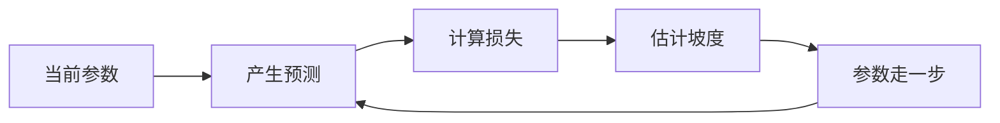
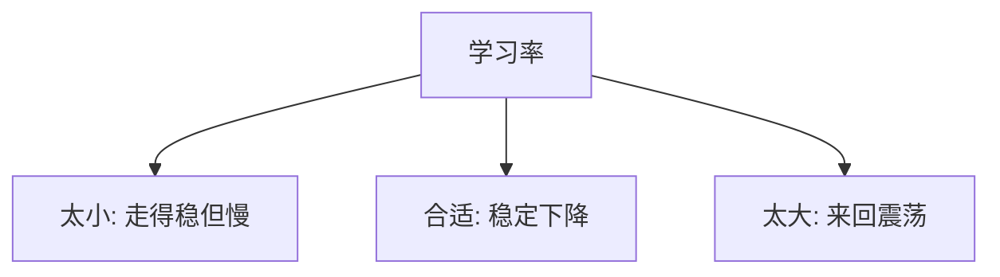

import GradientDescentPathFigure from '@/components/deep-learning-figures/GradientDescentPathFigure.astro';
import LearningRateComparisonFigure from '@/components/deep-learning-figures/LearningRateComparisonFigure.astro';

[training](https://www.aihero.dev/ai-coding-dictionary/training) 神经网络时，我们先定义一个损失函数。损失越小，[model](https://www.aihero.dev/ai-coding-dictionary/model) 越接近目标。梯度下降的想法很直接：梯度指向损失上升最快的方向，所以参数更新时往梯度的反方向走。

```text
新参数 = 旧参数 - 学习率 * 梯度
```

学习率决定每一步走多远。太小会慢，太大会跳过低点甚至震荡。

## 动机

神经网络有大量参数。我们不可能手工指定每个权重应该是多少，只能定义一个目标：让预测和真实答案之间的损失尽可能小。

梯度下降把学习问题改写成优化问题：

```text
找到一组参数，使 loss(parameters) 尽量小
```

这里的关键不是“[model](https://www.aihero.dev/ai-coding-dictionary/model) 像人一样理解了数据”，而是“参数被不断调整，使 [training](https://www.aihero.dev/ai-coding-dictionary/training) 目标下降”。



## 损失曲线上的下降路径

<GradientDescentPathFigure />

## 用一个权重拟合直线

下面的例子只有一个参数 `w`，目标是学到 `y = 2x`。

```python
def gradient_descent_step(w, x, y, lr):
    """用 PyTorch-like 写法表达一次梯度下降更新。"""
    prediction = w * x
    loss = mean((prediction - y) ** 2)

    grad_w = grad(loss, w)
    w_next = w - lr * grad_w

    return w_next, loss
```

这段代码里，`loss.backward()` 负责计算 `w.grad`。更新参数时使用 `torch.no_grad()`，因为“修改参数”本身不应该被记录进计算图。

## 学习率对比

<LearningRateComparisonFigure />

## 关键操作

| 代码 | 作用 |
| --- | --- |
| `requires_grad=True` | 告诉 PyTorch 这个张量需要梯度。 |
| `loss.backward()` | 从损失开始反向计算梯度。 |
| `with torch.no_grad()` | 更新参数时不要记录计算图。 |
| `w.grad.zero_()` | 清空梯度，避免下一轮累加旧梯度。 |

## 直观理解

### 学习率像步长

学习率不是越大越好。它控制的是“相信当前梯度到什么程度”。梯度只描述当前位置附近的坡度，如果一步走太远，新的位置可能已经不适用原来的局部信息。



### 批量、随机和小批量

| 方法 | 每次用多少数据算梯度 | 特点 |
| --- | --- | --- |
| Batch gradient descent | 全部 [training](https://www.aihero.dev/ai-coding-dictionary/training) 集 | 稳定但贵。 |
| Stochastic gradient descent | 一个样本 | 便宜但噪声大。 |
| Mini-batch gradient descent | 一小批样本 | 深度学习里最常见。 |

小批量方法不是数学上最干净的版本，但工程上最实用：它既能利用矩阵计算，又能引入适度噪声，帮助 [training](https://www.aihero.dev/ai-coding-dictionary/training) 从某些糟糕区域走出来。

## 限制

- 梯度下降依赖学习率，学习率不合适会慢或不稳定。
- 非凸损失没有全局最优保证。
- 梯度只看局部方向，不理解任务语义。
- 深层网络还会遇到梯度消失、梯度爆炸和病态曲率。

## 阅读更多

下一章读 [反向传播算法](../backpropagation/)：梯度下降假设我们已经拿到梯度，而反向传播解释这些梯度如何被高效算出来。

## 小结

梯度下降是“怎么用梯度更新参数”，不是“怎么计算梯度”。计算梯度由下一章的反向传播完成。
