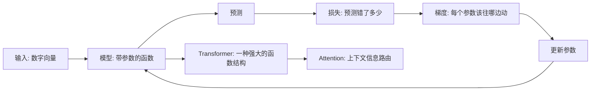

import TrainingLoopFigure from '@/components/deep-learning-figures/TrainingLoopFigure.astro';

这个 topic 从最小的神经网络开始，一路走到 Transformer 和注意力机制。它不是百科目录，也不是公式速查表；更像 [model](https://www.aihero.dev/ai-coding-dictionary/model) 主题下的一条从第一性原理出发的学习路线：

> 如果我们只允许自己使用“数字、函数、误差、微调”这几个概念，能不能一步步走到 GPT？

这里的代码不追求“复制粘贴即可 [training](https://www.aihero.dev/ai-coding-dictionary/training) 一个 [model](https://www.aihero.dev/ai-coding-dictionary/model)”。更准确地说，代码是公式的替代写法：用 PyTorch 的张量、矩阵乘法、`backward`、`softmax` 等操作，把数学关系写成更容易读的程序片段。

## Topic Map

## 词条

阅读顺序固定为五个词条：

1. [神经网络的结构](./neural-network-structure/)：神经网络是一串带参数的函数组合。
2. [梯度下降法](./gradient-descent/)：[training](https://www.aihero.dev/ai-coding-dictionary/training) 是在损失曲面上调整参数。
3. [反向传播算法](./backpropagation/)：反向传播负责高效计算每个参数的梯度。
4. [GPT 是什么？直观讲解 Transformer](./gpt-transformer/)：GPT 用 Transformer 做 [next-token prediction](https://www.aihero.dev/ai-coding-dictionary/next-token-prediction)。
5. [直观解释注意力机制，Transformer 的核心](./attention/)：注意力是带权重的信息汇总。

## 读法

每章都按同一条路径组织：

| 部分 | 作用 |
| --- | --- |
| 直觉 | 先解释这个机制解决什么问题。 |
| 图解 | 用朴素图形把数据流、参数流或梯度流画出来。 |
| PyTorch 代码 | 保留一个最小可运行骨架，代码尽量短。 |
| 形状表 | 把张量维度写清楚，减少“能跑但不理解”。 |
| 边界 | 说明这个简化版本没有覆盖什么。 |

## 写作约定

专题里的代码有三种层次：

| 类型 | 目的 | 是否必须能直接运行 |
| --- | --- | --- |
| 公式代码 | 用 PyTorch 风格写出公式和数据流。 | 不要求。 |
| 骨架代码 | 展示 `Module`、[training](https://www.aihero.dev/ai-coding-dictionary/training) 循环、attention 函数的大形状。 | 基本能读懂即可。 |
| 实验代码 | 以后如果加入图像生成或小实验，会单独标注依赖和运行方式。 | 需要能复现。 |

当前版本主要采用前两种。这样读者不会被环境、依赖、随机数和 [training](https://www.aihero.dev/ai-coding-dictionary/training) 细节打断，可以把注意力放在概念本身。

## 第一性原理主线

深度学习可以从一个很小的问题出发：

> 我们有一个函数，它会犯错。能不能用错误本身告诉函数怎么改？

这句话拆开就是五篇 article：

| Article | 第一性问题 | 最小 [tool](https://www.aihero.dev/ai-coding-dictionary/tool) |
| --- | --- | --- |
| 神经网络的结构 | 什么样的函数可以被调整？ | 矩阵乘法 + 非线性 |
| 梯度下降法 | 如果函数错了，参数往哪边动？ | 损失曲线 + 反方向更新 |
| 反向传播算法 | 参数很多时，梯度怎么高效算？ | 链式法则 + 计算图 |
| GPT / Transformer | 处理语言时，函数结构该长什么样？ | [token](https://www.aihero.dev/ai-coding-dictionary/token) + 位置 + block |
| 注意力机制 | 一个 [token](https://www.aihero.dev/ai-coding-dictionary/token) 如何从 [context](https://www.aihero.dev/ai-coding-dictionary/context) 取信息？ | Q/K/V + softmax |

## 两个学习视角

| 视角 | 对这个 topic 的影响 |
| --- | --- |
| Karpathy 式 | 从一个小标量、一个小字符 [model](https://www.aihero.dev/ai-coding-dictionary/model)、一个小计算图开始，把东西搭出来。 |
| Scale 式 | 不把单个 trick 神化；深度学习真正厉害的是同一套 [training](https://www.aihero.dev/ai-coding-dictionary/training) 机制能随数据、算力和 [model](https://www.aihero.dev/ai-coding-dictionary/model) 规模继续变强。 |

所以这里会同时保留两个层次：每篇 article 先用小例子讲清楚机制，再说明它在大 [model](https://www.aihero.dev/ai-coding-dictionary/model) 里扮演什么角色。

<TrainingLoopFigure />

Transformer 只是这条主线上的一种强大 [model](https://www.aihero.dev/ai-coding-dictionary/model) 结构。先把“参数如何学习”讲清楚，再看注意力机制，理解成本会低很多。

## 可视化约定

这个 topic 里的图分三类：

| 图形 | 用途 |
| --- | --- |
| 流程图 | 解释数据、损失、梯度、参数更新的方向。 |
| 矩阵图 | 解释 batch、权重、attention score、mask 的形状。 |
| 小型状态图 | 把复杂概念拆成几个离散阶段，例如 forward/backward/update。 |

图的目标是减少文字，不是增加装饰。读者应该能只看图和伪代码，就复述出本页的大意。

## 参考资料

这个专题参考了 [D2L 动手学深度学习](https://zh.d2l.ai/index.html) 的学习顺序，也吸收了 Andrej Karpathy 从 micrograd 到 GPT 的“从零搭出来”式讲法，以及 Sam Altman 对 deep learning scaling 的宏观观察。正文是面向这个博客重新组织的学习笔记，不是原文摘录。
