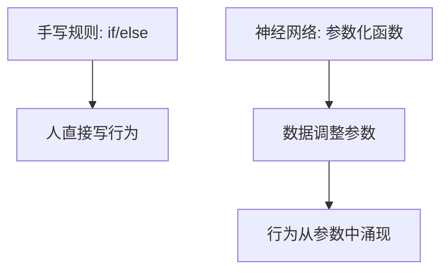

import MinimalMlpFigure from '@/components/deep-learning-figures/MinimalMlpFigure.astro';
import NeuronComputationFigure from '@/components/deep-learning-figures/NeuronComputationFigure.astro';

神经网络可以先理解成一串函数组合：

```text
输入 x -> 线性变换 -> 非线性激活 -> 线性变换 -> 输出
```

一层网络负责把输入换到新的表示空间，多层网络把这种变换重复多次。参数就是网络要学习的权重和偏置；激活函数让这些层组合后不再只是一个大的线性函数。

## 动机

传统程序通常由人写规则：如果条件 A 成立，就执行动作 B。神经网络换了一种路线：人只规定[model](https://www.aihero.dev/ai-coding-dictionary/model) 的大致结构和[training](https://www.aihero.dev/ai-coding-dictionary/training) 目标，具体规则藏在参数里，由数据来调整。


一个网络可以先看成三层意思：

| 层次 | 问的问题 | 对应代码 |
| --- | --- | --- |
| 函数 | 输入如何变成输出？ | `y = model(x)` |
| 参数 | 哪些数字可以被学习？ | `W`、`b` |
| 结构 | 这些函数如何组合？ | `Linear -> ReLU -> Linear` |

这也是为什么神经网络适合放在深度学习专题第一章：它先回答“我们到底在 [training](https://www.aihero.dev/ai-coding-dictionary/training) 什么”。

## 从单个神经元开始

<NeuronComputationFigure />

如果没有激活函数，多层线性层叠起来仍然等价于一层线性层。ReLU、Sigmoid 这类激活函数的作用，是让 [model](https://www.aihero.dev/ai-coding-dictionary/model) 能表达弯曲边界和更复杂的模式。

## 一个最小 MLP

这里的代码更像结构公式，不强调复制粘贴运行：

```python
class TinyMLP(nn.Module):
    """用两层线性变换和一次非线性激活表示一个最小 MLP。"""

    def __init__(self):
        """定义参数化函数的组合顺序。"""
        self.input_to_hidden = nn.Linear(2, 8)
        self.hidden_to_output = nn.Linear(8, 1)

    def forward(self, x):
        """把输入点映射成一个二分类概率。"""
        hidden = relu(self.input_to_hidden(x))
        score = self.hidden_to_output(hidden)
        probability = sigmoid(score)
        return probability
```

这个 [model](https://www.aihero.dev/ai-coding-dictionary/model) 的输入是二维点，输出是一个 0 到 1 之间的概率。此时它还没有[training](https://www.aihero.dev/ai-coding-dictionary/training)，所以输出只是随机初始化参数下的结果。

## 层结构

<MinimalMlpFigure />

## 张量形状

| 位置 | 张量形状 | 含义 |
| --- | --- | --- |
| 输入 `x` | `[batch, 2]` | 每个样本有两个特征。 |
| 第一层输出 | `[batch, 8]` | 每个样本被映射成 8 个隐藏特征。 |
| 第二层输出 | `[batch, 1]` | 每个样本得到一个分类分数。 |
| Sigmoid 后 | `[batch, 1]` | 分数被压到 0 到 1 之间。 |

## 直观理解

### 参数不是规则，而是规则的压缩表示

[training](https://www.aihero.dev/ai-coding-dictionary/training) 完成后，网络不会显式写出“如果 x1 大于某个值就怎样”。它只是保存大量权重。每个权重本身不一定有清晰语义，但所有权重组合起来，会形成一个从输入到输出的复杂函数。



### 激活函数改变表达能力

如果只有线性层：

```python
out = x @ W1 @ W2 @ W3
```

这仍然可以合并成一个大的线性变换：

```python
out = x @ W_total
```

加入激活函数后，合并就不成立了：

```python
out = relu(relu(x @ W1) @ W2) @ W3
```

这就是深度网络能够表示复杂边界的原因之一。

## 限制

- 网络结构只是能力上限，不代表一定学得好。
- 参数越多，越需要数据、正则化和验证集。
- 图里的节点连线很直观，但真实网络更多是矩阵运算，不是一个个节点手动计算。

## 阅读更多

下一章读 [梯度下降法](../gradient-descent/)，重点从“[model](https://www.aihero.dev/ai-coding-dictionary/model) 是什么”转到“参数如何被更新”。

## 小结

- 神经网络是函数组合，不是手写规则集合。
- `nn.Linear` 保存权重和偏置，`ReLU` 引入非线性。
- [training](https://www.aihero.dev/ai-coding-dictionary/training) 前的网络只是随机函数；[training](https://www.aihero.dev/ai-coding-dictionary/training) 会通过损失和梯度调整参数。
