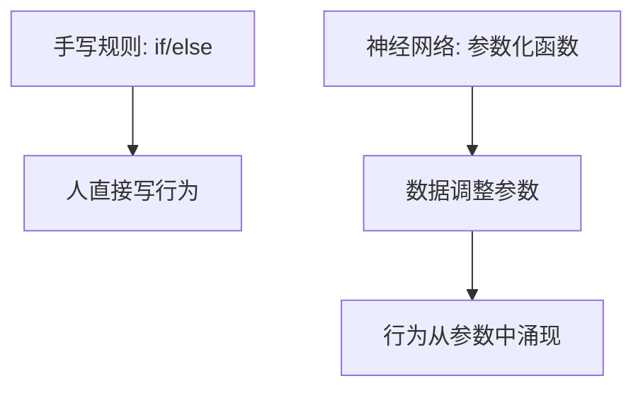

神经网络可以先理解成一串函数组合：

```text
输入 x -> 线性变换 -> 非线性激活 -> 线性变换 -> 输出
```

一层网络负责把输入换到新的表示空间，多层网络把这种变换重复多次。参数就是网络要学习的权重和偏置；激活函数让这些层组合后不再只是一个大的线性函数。

## 动机

传统程序通常由人写规则：如果条件 A 成立，就执行动作 B。神经网络换了一种路线：人只规定模型的大致结构和训练目标，具体规则藏在参数里，由数据来调整。


一个网络可以先看成三层意思：

| 层次 | 问的问题 | 对应代码 |
| --- | --- | --- |
| 函数 | 输入如何变成输出？ | `y = model(x)` |
| 参数 | 哪些数字可以被学习？ | `W`、`b` |
| 结构 | 这些函数如何组合？ | `Linear -> ReLU -> Linear` |

这也是为什么神经网络适合放在深度学习专题第一章：它先回答“我们到底在训练什么”。

## 从单个神经元开始

<svg class="dl-figure" viewBox="0 0 920 260" role="img" aria-labelledby="neuron-title">
  <title id="neuron-title">单个神经元的计算流程</title>
  <defs>
    <marker id="arrow-neuron" markerWidth="10" markerHeight="10" refX="8" refY="3" orient="auto">
      <path d="M0,0 L0,6 L9,3 z" fill="#2f5f9f"></path>
    </marker>
  </defs>
  <circle cx="95" cy="85" r="32" class="dl-node"></circle>
  <text x="95" y="91" text-anchor="middle" class="dl-label">x1</text>
  <circle cx="95" cy="175" r="32" class="dl-node"></circle>
  <text x="95" y="181" text-anchor="middle" class="dl-label">x2</text>
  <line x1="130" y1="85" x2="315" y2="120" class="dl-arrow" marker-end="url(#arrow-neuron)"></line>
  <line x1="130" y1="175" x2="315" y2="140" class="dl-arrow" marker-end="url(#arrow-neuron)"></line>
  <text x="218" y="84" class="dl-small">乘以 w1</text>
  <text x="218" y="184" class="dl-small">乘以 w2</text>
  <rect x="330" y="82" width="220" height="96" rx="8" class="dl-box"></rect>
  <text x="440" y="122" text-anchor="middle" class="dl-label">w1 x1 + w2 x2 + b</text>
  <text x="440" y="150" text-anchor="middle" class="dl-small">线性组合</text>
  <line x1="560" y1="130" x2="665" y2="130" class="dl-arrow" marker-end="url(#arrow-neuron)"></line>
  <rect x="680" y="82" width="150" height="96" rx="8" class="dl-box-accent"></rect>
  <text x="755" y="122" text-anchor="middle" class="dl-label">activation</text>
  <text x="755" y="150" text-anchor="middle" class="dl-small">非线性</text>
</svg>

如果没有激活函数，多层线性层叠起来仍然等价于一层线性层。ReLU、Sigmoid 这类激活函数的作用，是让模型能表达弯曲边界和更复杂的模式。

## 一个最小 MLP

这里的代码更像结构公式，不强调复制粘贴运行：

```python
class TinyMLP(nn.Module):
    """用两层线性变换和一次非线性激活表示一个最小 MLP。"""

    def __init__(self):
        """定义参数化函数的组合顺序。"""
        self.input_to_hidden = nn.Linear(2, 8)
        self.hidden_to_output = nn.Linear(8, 1)

    def forward(self, x):
        """把输入点映射成一个二分类概率。"""
        hidden = relu(self.input_to_hidden(x))
        score = self.hidden_to_output(hidden)
        probability = sigmoid(score)
        return probability
```

这个模型的输入是二维点，输出是一个 0 到 1 之间的概率。此时它还没有训练，所以输出只是随机初始化参数下的结果。

## 层结构

<svg class="dl-figure" viewBox="0 0 920 360" role="img" aria-labelledby="mlp-title">
  <title id="mlp-title">两层 MLP 的结构</title>
  <defs>
    <marker id="arrow-mlp" markerWidth="10" markerHeight="10" refX="8" refY="3" orient="auto">
      <path d="M0,0 L0,6 L9,3 z" fill="#2f5f9f"></path>
    </marker>
  </defs>
  <g class="dl-layer">
    <circle cx="90" cy="130" r="24" class="dl-node"></circle>
    <circle cx="90" cy="220" r="24" class="dl-node"></circle>
    <text x="90" y="70" text-anchor="middle" class="dl-label">输入层</text>
    <text x="90" y="135" text-anchor="middle" class="dl-small">x1</text>
    <text x="90" y="225" text-anchor="middle" class="dl-small">x2</text>
  </g>
  <g class="dl-layer">
    <circle cx="330" cy="80" r="24" class="dl-node-accent"></circle>
    <circle cx="330" cy="140" r="24" class="dl-node-accent"></circle>
    <circle cx="330" cy="200" r="24" class="dl-node-accent"></circle>
    <circle cx="330" cy="260" r="24" class="dl-node-accent"></circle>
    <text x="330" y="35" text-anchor="middle" class="dl-label">隐藏层</text>
  </g>
  <g class="dl-layer">
    <circle cx="610" cy="170" r="28" class="dl-node"></circle>
    <text x="610" y="70" text-anchor="middle" class="dl-label">输出层</text>
    <text x="610" y="176" text-anchor="middle" class="dl-small">p</text>
  </g>
  <path d="M115 130 C185 90, 245 80, 305 80" class="dl-thin"></path>
  <path d="M115 130 C185 125, 245 140, 305 140" class="dl-thin"></path>
  <path d="M115 130 C185 160, 245 200, 305 200" class="dl-thin"></path>
  <path d="M115 130 C185 205, 245 260, 305 260" class="dl-thin"></path>
  <path d="M115 220 C185 105, 245 80, 305 80" class="dl-thin"></path>
  <path d="M115 220 C185 155, 245 140, 305 140" class="dl-thin"></path>
  <path d="M115 220 C185 205, 245 200, 305 200" class="dl-thin"></path>
  <path d="M115 220 C185 245, 245 260, 305 260" class="dl-thin"></path>
  <path d="M355 80 C435 110, 515 150, 582 170" class="dl-thin"></path>
  <path d="M355 140 C435 150, 515 164, 582 170" class="dl-thin"></path>
  <path d="M355 200 C435 190, 515 176, 582 170" class="dl-thin"></path>
  <path d="M355 260 C435 235, 515 195, 582 170" class="dl-thin"></path>
  <line x1="675" y1="170" x2="815" y2="170" class="dl-arrow" marker-end="url(#arrow-mlp)"></line>
  <text x="840" y="176" class="dl-label">类别概率</text>
</svg>

## 张量形状

| 位置 | 张量形状 | 含义 |
| --- | --- | --- |
| 输入 `x` | `[batch, 2]` | 每个样本有两个特征。 |
| 第一层输出 | `[batch, 8]` | 每个样本被映射成 8 个隐藏特征。 |
| 第二层输出 | `[batch, 1]` | 每个样本得到一个分类分数。 |
| Sigmoid 后 | `[batch, 1]` | 分数被压到 0 到 1 之间。 |

## 直观理解

### 参数不是规则，而是规则的压缩表示

训练完成后，网络不会显式写出“如果 x1 大于某个值就怎样”。它只是保存大量权重。每个权重本身不一定有清晰语义，但所有权重组合起来，会形成一个从输入到输出的复杂函数。



### 激活函数改变表达能力

如果只有线性层：

```python
out = x @ W1 @ W2 @ W3
```

这仍然可以合并成一个大的线性变换：

```python
out = x @ W_total
```

加入激活函数后，合并就不成立了：

```python
out = relu(relu(x @ W1) @ W2) @ W3
```

这就是深度网络能够表示复杂边界的原因之一。

## 限制

- 网络结构只是能力上限，不代表一定学得好。
- 参数越多，越需要数据、正则化和验证集。
- 图里的节点连线很直观，但真实网络更多是矩阵运算，不是一个个节点手动计算。

## 阅读更多

下一章读 [梯度下降法](./gradient-descent/)，重点从“模型是什么”转到“参数如何被更新”。

## 小结

- 神经网络是函数组合，不是手写规则集合。
- `nn.Linear` 保存权重和偏置，`ReLU` 引入非线性。
- 训练前的网络只是随机函数；训练会通过损失和梯度调整参数。
